本文首先介绍会 Gen1、Gen2 和 Gen3 之间的关系，然后介绍 PCIe 逻辑物理层的具体实现。
# 1. Physical Layer Overview
物理层位于外部物理链路和数据链路层之间的接口底层，它将来自数据链路层的数据包转换为串行化的比特流（bit stream），该比特流按时钟发送到所有 Lanes 上。
接收逻辑将比特流反序列化成符号流（Symbol Stream），重组成数据包，并将 TLP 和 DLLP 转发到数据链路层上。
- Transmitter：Packet -> Symbol Stream -> Bit Stream
- Receiver: Bit Stream -> Symbol Stream -> Packet

Figure 11-1: PCIe Port Layers

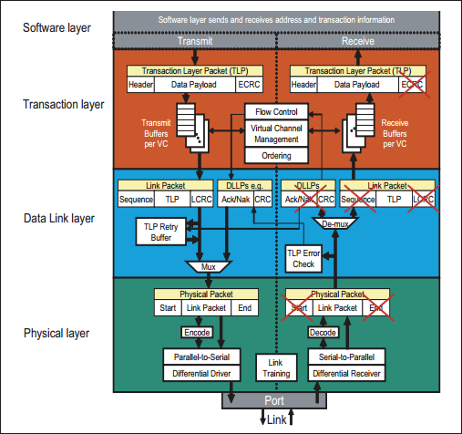

PCIe 物理层主要完成编解码（8b/10b for Gen1&Gen2, 128b/130b for Gen3 and later）、扰码与解扰码、串并转换、差分发送与接收、链路训练等功能。

PCIe Spec 将物理层分为两个部分——逻辑子层和电气子层，如下图所示：

Figure 11-2: Logical and Electrical Sub-Blocks of the Physical Layer

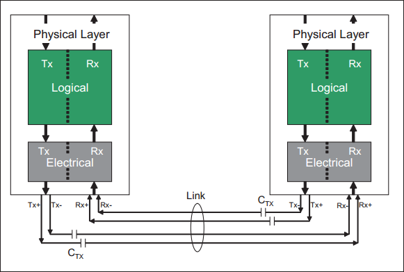

PCIe 物理层实现了一对收发差分对，因此可以实现全双工的通信方式。需要注意的是，PCIe Spec 只是规定了物理层需要实现的功能、性能与参数等，至于如何实现这些却并没有明确的说明。也就是说，厂商可以根据自己的需要和实际情况，来设计 PCIe 的物理层。本文以 Mindshare 书中的例子来简要的介绍 PCIe 的物理层逻辑部分，可能会与其他的厂商的设备的物理层实现方式有所差异，但是设计的目标和最终的功能是基本一致的。
## 1.1 Transmit Logic Overview
物理层逻辑子层的发送端部分结构图如下图所示：

Figure 11-3: Physical Layer Transmit Details

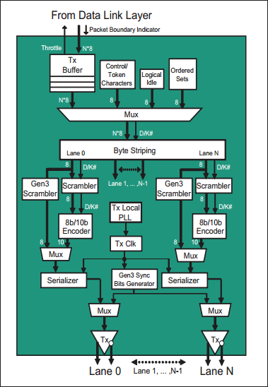

数据链路层数据包首先进入缓冲区。buffer 作用：延迟 DLLPs 数据包流，以配合 Mux 在数据流中插入内容，如 Control/Token Characters、Logical Idle、Ordered Sets。
- Gen1、Gen2 插入控制字符和数据字符，用于标记数据包边界以及创建  Ordered Sets。为了区分这两种字符，Mux 为其对应上一个 D/K# 位（Data or "Kontrol"）。
   - Ordered Sets：链路训练、链路管理、时钟容差补偿、更改链路功耗等。标识数据包边界或者 Ordered Set 的控制字符和数据字符。
- Gen3 没有控制字符，在每 128 bit（16 bytes） 前插入 2-bit Sync Header，以区分当前是 Data Block、Ordered Set Block。
   - Data Block：TLP or DLLP related bytes

Byte Striping 将来自 Mux 封装成帧的并行数据按照一定的规则分配到各个 lane 上，随后进行扰码（Scrambler）、编码（Encoder）、串行化（Serializer），然后差分发送对发送。
- 一个字节传输到一条 lane 上，下个字节传输到下一条 lane 上，然后所有 lanes 同时传输。

扰频器 Scrambler：将伪随机码异或到字节上以加扰数据（伪随机码可预测，接收器能恢复）。开始和结束帧字节不被加扰。加扰消除比特流中的重复模式，降低 EMI 噪音。
- 扰码器重置：周期性（解决发送端、接收端不同步）
   - Gen1、Gen2，检测到 COM 字符执行初始化。
   - Gen3 检测到 EIEOS ordered set。Gen3 使用 24 位扰频器，因此有旁路，并绕过 8b/10b编码器。

编码：
- Gen1、Gen2 使用 8b/10b 编码，将加扰 8b 字符（Character）编码成 10b 字符（Symbol）。
   - 目的：在比特流中创建密度足够高的 1->0、0->1的转换，使接收器在其锁相环（Phase Lock Loop, PLL）协助下重建接收时钟。
   - 用于定时离开发送器的串行数据比特流时钟不在线路上传输，该接收时钟才用于入站的数据包。
   - Character：8bit unencoded byte，Symbol：10bit encoded ouput of the 8b/10b logic。
- Gen3 使用 Sync Bit Generator 为每 16 字节块（128b）添加 2 位 Sync Header。

最后 Symbols 序列化成比特流通过差分链路发送。
## 1.2 Receive Logic Overview

Figure 11-4: Physical Layer Receive Logic Details

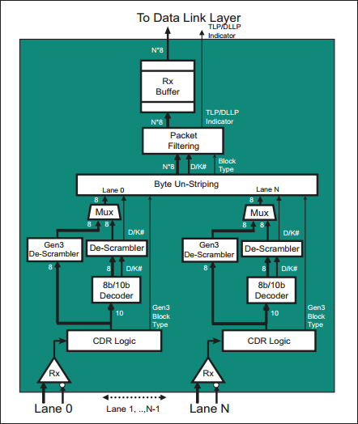
Clock and Data Recovery (CDR)：基于比特流恢复出时钟和数据信号。
- Elastic Buffer：用于时钟的容差补偿，即调整两个时钟之间微小的时钟频率变化（发送端时钟、接收端本地生成时钟）
8b/10b Decoder：将 10b 符号（Symbol）转换回 8b 字符（Character）。
De-Scrambler：去除加扰数据包
Byte Un-Striping：字节反拆分，将每条 lane 字节反拆分形成串行字节流

# 2. Transmit Logic Details（Gen1、Gen2）
## 2.1 Tx Buffer
- 接收来自 TLP、DLLP 的数据。DLLP 会使用一个“Control”信号指明数据包的开始和结束，这样物理层可以向数据包附加开始和结束成帧字符。
- “Throttle”信号调节 DLLP 数据包流，防止填满发送缓冲区。
## 2.2 Mux and Control Logic

Figure 11-6: Transmit Logic Multiplexer

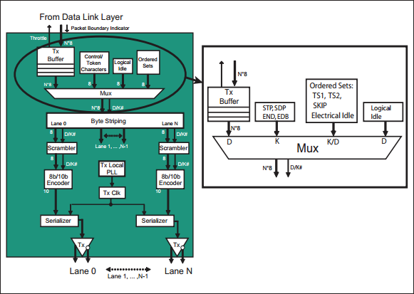
4 种 Mux 的输入内容及其何时被选通：
- Tx Buffer：当 DLLP 需要发送数据包时，Mux 选通数据包的字符流。此时 D/K# 信号被驱动为高电平。
- Start and End characters：控制字符（STP、SDP、END、EDB）被附加到每个 TLP/DLLP 的开始和结束位置，使帧字符接收器能轻易检测到数据包开始和结束。此时 D/K# 信号被驱动为低电平。
   - STP：开始 TLP 字符
   - SDP：开始 DLLP 字符
   - END：End Good
   - EDB：End Bad

Figure 11-7: TLP and DLLP Packet Framing with Start and End Control Characters

- Ordered Sets：用于物理层链路管理，如链路训练、时钟容差补偿等。它以 COM 字符开始，后接其他 K/D 字符。其长度以 4 字节对齐（DW）。使用 ordered sets 的场景：
   - 链路训练阶段在链路发送 TS1、TS2 有序集。Error recovery, initiating events (such as Hot Reset), or exit from low-power states 后会出现链路训练。
   - Mux 固定间隔（周期性）插入 SKIP ordered set，以接收端进行时钟容差补偿。
   - Electrical Idle state，告知接收端置电气空闲状态。
   - 快速训练序列（Fast Training Sequence, FTS）有序集：链路电源从 L0s 低功耗状态改为 L0 工作电源状态，接收器使用该有序集来重新同步 PLL 与发送时钟。
- Logical Idle：使链路上有信号转换，从而使接收端 PLL 能够与发送时钟保持时钟同步，维持比特锁定。逻辑空闲序列发送 00h，由 D 字符组成，因此 D/K# 信号为高电平。
> - PCIe 设置了多种链路电源状态，可以在某些条件下实现节能。这些状态分别是：L0、L1、L2 和 L3，它们代表功耗逐步更低，但需要更长的恢复时间使链路恢复到 L0 的完全运行状态。 
> - L0s 状态只能在硬件控制下进入，而 L1 状态可以由硬件或软件启动。由于 L0s 和 L1 可以由硬件控制，因此规范将它们称为 ASPM（Active State Power Management）状态。

## 2.3 Byte Striping（for Wide Links）
> 字节拆分可置于 scrambler、8b/10b encoder 前或后：
> - 置前：某 lane 出错可定位并禁用，重新 training
> - 置后：减小物理尺寸，但无法定位出错的 lane。（scrambler、encoder 只有一个）

lanes 使用的数量在链路训练阶段配置。

Figure 11-8: x1 Byte Striping

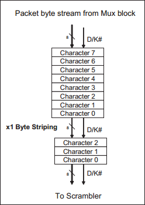

Figure 11-9: x4 Byte Striping

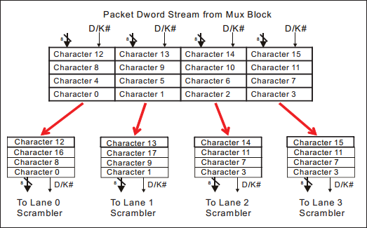

Figure 11-10: x8 Byte Striping with DWord Parallel Data

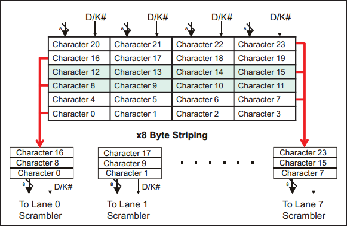

## 2.4 Packet Format Rules
通过字节拆分逻辑后，TLP 或 DLLP 字符流被拆分到各条 lane 上。本节描述用于字节拆分数据包的规则，该规则使数据包被正确地拆分到各 lane 上。

**General Rules：**
- 每个数据包总长度（含开始和结束字符）必须是 4 character 的倍数，也就是 4 字节对齐（DW）。
- TLPs 以 STP 开始，END or EDB 结束
- DLLPs 以 SDP 开始，END 结束，并且为 8 character 长（6 character + SDP + END）
- Logical Idle 后，STP、SDP character 必须从 lane0 开始。如果不是 Logical Idle 后发送数据包，STP、SDP 以 4 character 对齐从被 4 整除的 lane 开始。
- 对于多 lane 的情况，ordered sets、logical idle 序列必须在所有通道上发送。
- 违反规则可能作为接收器作为报告给数据链路层

Figure 11-11: x1 Packet Format

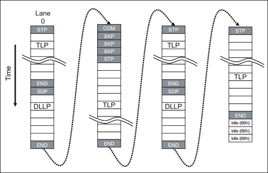

x4：STP/SDP 总在 lane0，END/EDB 总在 lane3。（因为 packet 总是以 4 字节对齐）

Figure 11-12: x4 Packet Format

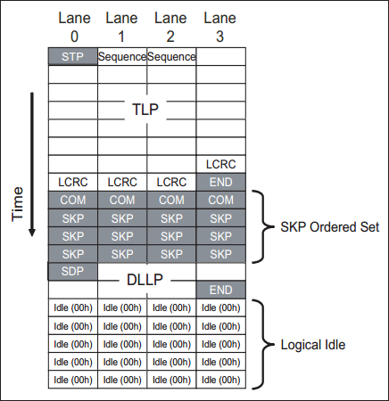

x8：如果数据包不在最后一条通道上结束，并且没有更多数据包，需要 END/EDB 之后的通道中发送 PAD 字符，保持链路校准。（显然 END/EDB 需在 lane 号为除 4 余 3 的 lane上）

Figure 11-13: x8 Packet Format

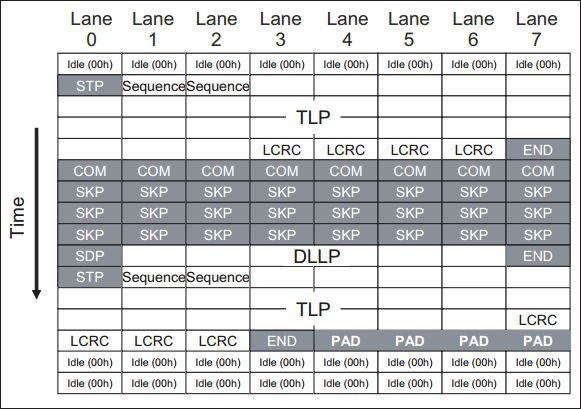

## 2.5 Scrambler
经字节拆分后，发送的数据包在 lane 上进行传输，物理层为每条 lane 设计一个扰频器。
目的：消除发送数据流中的重复模式，降低 EMI 噪音和串扰（crosstalk）噪音。
- 重复模式会导致大量能量集中在离散频率上，容易生成大量 EMI 噪音。

控制字符（K character）不会被加扰，当收到 COM 字符时重置 scrambler
发送端的扰码器（Scrambler）有一个 16-bit 的线性反馈寄存器（Linear Feedback Shift Register, LFSR），其实现了以下这个多项式：
$G(X) = X^{16} + X^{5} + X^4 + X^3 + 1$
具体功能框架图如下图所示：

Figure 11-14: Scrambler

扰码器需要遵循的规则：
- 不同 Lane 的扰码器必须同步操作
- 只作用于 TLP 和 DLLP 中的 D 字符以及逻辑空闲字符（00h），不作用于 K 字符和 Ordered Set 字符，包括Ordered Set 中 D 字符（如 TS1、TS2等）
- 兼容性测试字符（Compliance Pattern Character）不被扰码
- COM 字符不被扰码，并将发送端和接收端扰码器 LSFR 同时初始化伪 FFFFh。
- 扰码器默认使能，PCIe Spec 允许将其临时禁止，以用于调测试

## 2.6 8b/10b Encoding
### 编码目的
- 在数据中嵌入时钟：创建足够多的信号变化，以使接收器使用 PLL 重建时钟。如图所示，没有转换的 8-bit 00h 转变为 10b 后有 5 次转换，这些转换使接收器 PLL 与发送电路时钟保持同步：
   - 有限长度，确保信号线不会长时间保持在高电平或低电平状态
   - 有限长度，确保最大限度减少接收器 PLL 中的频率漂移。

Figure 11-15: Example of 8-bit Character 00h Encoding

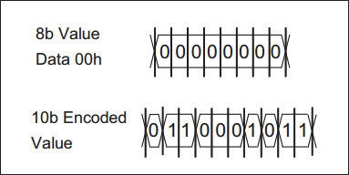

- 维持 DC 平衡：保持所发送的 0 和 1 的数目尽可能相同，从而将发送比特流上的 DC 平衡保持为信号阈值电压的一半，这在电容和变压器耦合电路中非常重要。
   - 确保接收到的信号没有任何 DC 分量，降低比特间干扰的可能性：信号不能正确地从一个逻辑电平切换到另一个逻辑电平。
- 提高错误检测：10 bit 能表示 1024 种编码，而实际上需要表达 256 （$2^8$）个字符。为了保持 DC 平衡，每个字符使用两个编码来表示，此时仍然还剩 512 种编码未使用。若传输错误导致某位改变，使其成为非法编码（剩余的 512 种编码），其可以立即被识别。
> 主要缺点：传输性能下降 20%，发送 10-bit，只接收 8-bit 有用位。
### Properties of 10-bit Symbols
8b/10 编码并不是直接将 8-bit 编码成 10-bit，而是分为 5-to-6 bit 和 3-to-4 bit 两部分。
- DC 平衡：1 的平均数目等于 0的数目
- 比特流不会包含超过 5 个连续的 1 或 0
- 每个 10-bit Symbol 包含：
   - 4 个 0，6 个 1，或
   - 6 个 0，4 个 1，或
   - 5 个 0，5 个 1
- 10-bit Symbol 分为 6-bit 和 4-bit 两部分：
   - 6-bit 部分包含的 1 或 0 不多于 4 个
   - 4-bit 部分包含的 1 或 0 不多于 3 个

一个 8-bit Character 和 D/k# 信号一起被提交给 8b/10b 编码器，编码器输出 10-bit Symbol 和一个当前的运行不一致（Current Running Disparity, CRD）符号（表示链路自初始化传输的 1 和 0 的总数）。
### Character Notation
8b/10b 转换查找表使用特殊的标记来代表 8-bit 字符，下图展示将 8-bit 数据转换成其等同标记的步骤：
1. 将字符分成 3-bit 和 5-bit 两部分
2. 对调两个子块位置
3. 为每个子块创建等值十进制
4. Dxx.y 代表数据字符，Kxx.y 代表控制字符，其中 xx 为 5-bit 十进制值，y 为 3-bit 十进制值。

Figure 11-16: 8b/10b Nomenclature

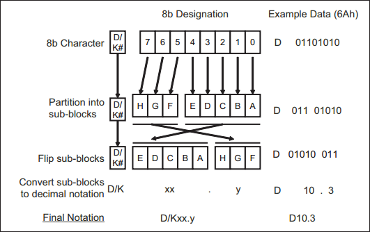

### Disparity（不一致）
不一致指的是 10-bit Symbol 中 1 和 0 的数目的不一致，以协助维持 DC 平衡。
- 10-bit Symbol 中 0 比 1 多，该符号为负；1 比 0 多，为正；1 和 0 数目相等，为中性。
- 大多数字符都编码为带有 + 或 - 差异性 Symbol，有些字符仅编码为中性。

CRD（Current Running Disparity），1 bit，反映自链路初始化以来所发送的 1 和 0 的总数差异。
- 指出当前链路发送的 1 和 0 是否平衡
- CRD 的初始状态可以是正或负
- 编码每个新字符后（Charecter -> Symbol），CRD 要么保持不变（Symbol 中性不一致），要么变为相反（Symbol 具有正负不一致）。
### Encoding Precedure
新的输出 Symbol 基于 incoming character、D/K#、CRD 生成。
新的 CRD 值根据 Symbol 的不一致性生成，并且用于下一个 Character 的编码。

Figure 11-17: 8-bit to 10-bit (8b/10b) Encoder

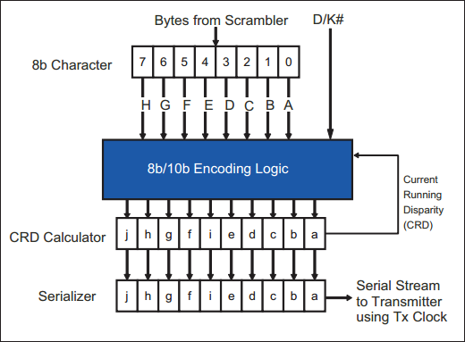

Figure 11-18: Example 8b/10b Encodings

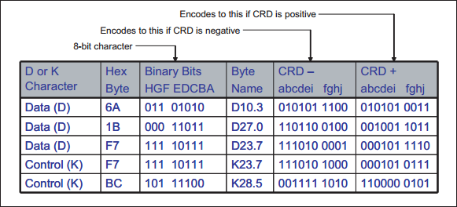

### Example Transmission

Figure 11-19: Example 8b/10b Transmission

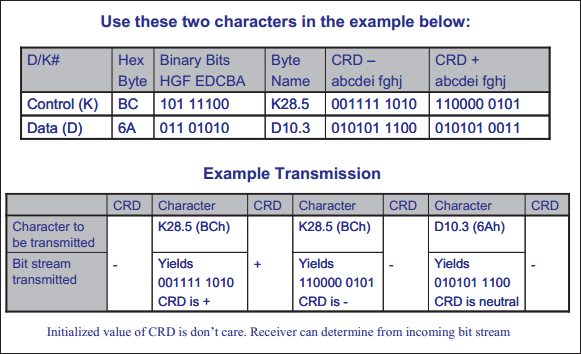
上图说明传输两个 K28.5 和一个 D10.3 Character 的例子。
- CRD 初始值为负，K28.5 生成的 Symbol 具有正差异性，CRD 反转为正
- K28,5 生成的 Symbol 具有负差异性，CRD 反转为负
- D10.3 生成的 Symbol 具有中性差异性，CRD 维持不变

### Control Character
控制字符通常用于链路管理

| ** Character Name ** | ** 8b/10b Name ** | ** Description **                              |
| -------------------- | ----------------- | ---------------------------------------------- |
| COM                  | K28.5             | 任何 Ordered Set 的第一个 Character；Rx 用它在训练期间实现符号锁定 |
| PAD                  | K23.7             | Packet 填充                                      |
| SKP                  | K28.0             | SKP ordered set，用于时钟容差补偿                       |
| STP                  | K27.7             | Start of a TLP                                 |
| SDP                  | K28.2             | Start of a DLLP                                |
| END                  | K29.7             | End of Good Packet                             |
| EDB                  | K30.7             | End of a bad or nullified TLP                  |
| FTS                  | K28.1             | L0s 低功耗状态切换到 L0                                |
| IDL                  | K28.3             | 将链路置于电气空闲                                      |
| EIE                  | K28.7             | 将链路恢复到 L0 之前发送的退出电气空闲有序集的一部分                   |

- COM：有序集（物理层通信）通信时的第一个 Symbol，其编码极具辨识度：2个同极性的位开始，后接 5 个相反极性的位（110000 00101 或 001111 1010）。这对链路训练特别有用，能便于接收器锁定传入的 Symbol Stream。
- EDB： Switch 希望使当前整个数据包无效时插入。当 Switch 使用 "cut-through mode" 转发数据包时，不需要缓冲整个上层数据包，而是直接转发。当发现某个数据包有错时，整个上层数据包会以 EDB 结束，并将 LCRC 反转，以使无效。
### Ordered Sets
有序集通常用于链路双方物理层之间的通信，其可以被认为 lane 管理数据包。Gen1、Gen2 中 ordered set 始终以 COM 字符开头，并且在所有 lane 中复制同时发送，同时这能用于接收端 verify alignment 和 de-skewing。ordered sets 用于链路训练（link training）、时钟容差补偿（clock tolerance compensation）和更改链路电源状态等。
- TS1 and TS2 Ordered Set (TS1OS/TS2OS)。 用于链路初始化和训练，供链路双方实现位锁定和 Symbol 锁定、协商链路速率和链路宽度，以及与链路操作相关的其他变量。
- Electrical Idle Ordered Set (EIOS)。 发送器希望切换至较低功耗链路状态时发送此 Symbol 给接收端。EIOS 由四个 Symbol 组成：COM 后加 3 个 IDL。
- Electrical Idle Exit Ordered Set (EIEOS)。退出电气空闲链路状态所需的较低频率序列。重复使用 K28.7 控制字符使比特流传输的形式为 5 个 1 后跟 5 个 0。
- FTS Ordered Set (FTSOS)。 发送端发送最小数量（training 阶段确定）的 FTS，以使链路从 L0s 返回 L0 状态。接收端通过检测 FTS，识别链路正在退出电气空闲状态，并通过它们恢复位和 Symbol 锁定。FTS 组成：COM + 3个 FTS
- SKIP 有序集。所有通道定期发送 SKIP，以使接收时钟容差补偿逻辑补偿两个时钟之间的变化，这两个时钟一个是发送设备使用的时钟，用以定时输出串行比特流，另一个时钟是接收端的本地时钟。接收端在 Elastic Buffer 中添加或删除 SKIP，防止缓冲区上/下溢。
## 2.7 Serializer（并行到串行转换器）

Figure 11-17: 8-bit to 10-bit (8b/10b) Encoder

每个 lane 的 8b/10b 编码器为串行器提供数据，串行器按位顺序对 Symbol 进行时钟计时，最低有效位 (a) 先移出，最高有效位 (j) 最后移出。8b/10b 编码器以 250 MHz 频率将 Symbol 定时输出到转换器 Serializer，Serializer 以 2.5 GHz 的频率定时输出串行比特流。

## 2.8 Differential Driver
差分驱动器使用 NRZ 编码将比特流发送到线路上。NRZ  意味着没有使用特殊或中间电压，每个比特位都用一个电压电平表示，不考虑前一位的电平状态，如高电平表示1，低电平表示 0。

Figure 11-2: Electrical Sub-Block of the Physical Layer

每个 lane 由 Tx+、Tx- 和 Rx+、Rx- 四组信号线组成，为了表述方便此处去除接收端和发送端，统一用 D+、D- 表示：D+ 高电平、D- 低电平表示传出 1，D+ 低电平、D- 高电平表示传输 0。

## 2.9 Transmit Clock (Tx Clock)
每个 lane 的串行输出被发送时钟信号定时输出到差分驱动器。发送时钟的频率必须精确到时钟频率的 +/- 300 ppm 之内。该时钟每 1666 个时钟周期可相位偏移一个时钟，因此需要时钟补偿定时传输 SKIP。
注意：该发送时钟与物理层本地时钟不同，物理层是从外部时钟源接收时钟的（外设卡和系统板上的 PCIe 可能使用系统板提供的时钟）。在物理层内部 PLL 的帮助下，将该外部时钟乘以一个系数就是本地时钟，它的运行频率远低于发送时钟频率，其用于定时各个物理层逻辑，如字节拆分逻辑、扰频器、8b/10b 编码器、缓冲器。
> 在PCI Express（PCIe）中，PLL 表示相位锁定环路（Phase-Locked Loop）。PLL 是一种电路设计中常用的技术，用于生成具有特定频率和相位关系的时钟信号。在PCI Express 接口中，PLL 起到了同步时钟信号的作用。
> 具体来说，PCIe 使用 PLL 来生成与基础时钟频率相关的时钟信号，以确保高速数据传输和同步。PLL的基本原理是通过反馈控制方式使输出时钟与参考时钟保持固定的相位和频率关系。这样可以确保在整个系统中各个部件之间存在良好的时钟同步。

## 2.10 发送逻辑其他内容
### 逻辑空闲序列
为保持接收端 PLL 不漂移，需在不发送 TLP、DLLP 或 PLP 时发送逻辑空闲序列。该序列具有如下属性：
- 由 8-bit 数据字符组成，其值为 00h
- 所有通道同时发送该序列
- 逻辑空闲序列需要加扰、8b/10b 编码，且定时发送 SKIP 有序集
- 接收端很容易区分逻辑空闲序列和其他数据包，因为逻辑空闲序列出现在数据包成帧内容外部（STP/SDP、END/EDB 外部）。
### 时钟补偿
接收端接收 Symbol Stream 时，有时需要在流中添加或删除某个 Symbol，以便补偿发送端与接收端之间的时钟频率变化。
> 接收端从传入的比特流中恢复时钟，并使用它来锁存数据位，但是该恢复的时钟与接收端的内部时钟不同步，并且在某个阶段后（de-scrambler、byte un-striping 等）它必须开始使用自己的内部时钟对数据进行计时。即使发送端和接收端有一个可选的公共外部参考时钟，但最多也只能生成一个在所需频率的指定容差范围内的内部时钟。
> 因此当恢复的时钟与内部时钟不同步时，需要在两个时钟频率之间进行时钟补偿。

这个可添加或删除的 Symbol 使用 SKIP ordered set，由一个 COM Symbol + 3 个 SKP Symbol 组成。
SKIP 添加规则：
- 在 1180~1538 个 Symbol 时钟内周期性添加。（Gen1 2.5GT/s，a Symbol time = 4ns; Gen2 5.0GT/s，2ns）
- 仅允许添加在数据包边界外，不能中断数据包。如果数据包已经在传输，则 SKIP 可以延迟发送。（the largest TLP size = 4k，4096 Symbol time）
- SKIP 与其他 ordered set、logical idle 一样，必须同时在所有 lane 上发送。（有需要时用 PAD 填充）
- 低功率链路状态期间，复位用于安排发送 SKIP ordered set 的所有计数器。
- Compliance Pattern 期间不传送 SKIP
> Compliance Pattern：PCIe 兼容性模式，用于验证和测试 PCIe 设备的兼容性。PCIe兼容性模式涉及使用特定的测试模式和数据传输模式，以确保PCIe设备符合PCIe规范的要求，能够与其他PCIe设备和主机系统正常通信。

# 3. Receive Logic Details
接收端首先要从 lane 中获得 0 或 1，通过 Differential Receiver 实现。然后需要实现位锁定，以恢复 Rx 时钟，按照一定时钟进行位输出。没有进行 Symbol 锁定前比特流只是比特，没有任何信息，此时接收逻辑还需要从比特流中识别到 Symbol，以恢复数据。

Figure 11-21: Physical Layer Receive Logic Details (Gen1 and Gen2 Only)

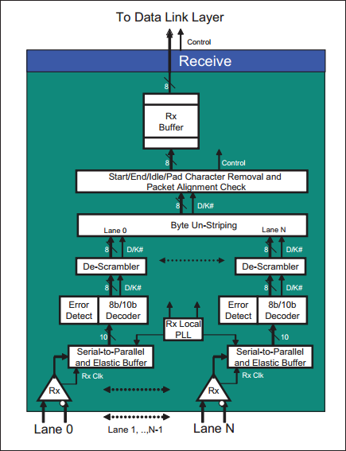

## 3.1 Differential Receiver
差分接收器，检测 lane 的峰值电压差，确定该差值代表 1 还是 0。若峰值差 < 某阈值，则认为信号不存在，并认为链路处于电气空闲状态，此时接收器不会选通其输入信号，防止检测出错误。

Figure 11-22: Receiver Logic's Front End Per Lane

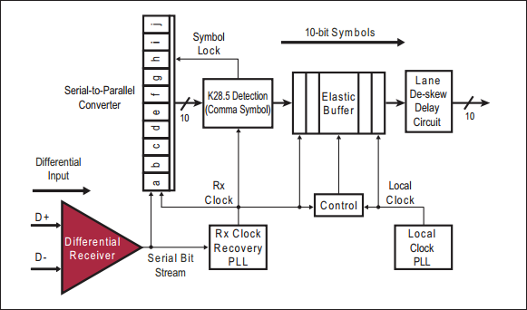

## 3.2 Rx Clock Recovery
接收器电路使用 PLL（锁相环）从输入的比特流中的数据位转换生成 Rx 时钟。该恢复时钟的频率与 Tx 发送时钟频率相同。
Rx 时钟用于将输入的串行数据流定时输入到反串行器（Serial-to-Parallel Converter）中。反串行器所产生的 10-bit Symbol 定时输入到弹性缓冲区（Elastic Buffer）中。
需要注意的是，此时还有一个本地时钟，本地时钟用于将 Elastic Buffer 中 Symbol 定时输出到 8b/10b 解码器。
### Bit Lock
8b/10b 编码方案保证输出的数据流包含频繁的逻辑转换，接收器的 PLL 使用这些转换创建与 Tx 时钟同步的 Rx 时钟。当接收端锁定 Tx 时钟频率时，称为实现“位锁定”(Bit Lock)。

链路训练（Link Training）期间，发送端会发送一系列 TS1、TS2 ordered sets，接收端可以使用其中的位转换实现位锁定。在正常的数据传输期间，必须保持链路上有足够的转换，以便接收端保持位锁定。

当停止数据包发送，将链路至于低功率状态（如 L0s）时，接收端 PLL 会逐渐丢失时钟同步，此时发送端需要发送电气空闲有序集（EIOS）来告知接收端不选通其输入，避免错误检测电路将此视为错误。

当发送端准备将链路从 L0s 状态唤醒时，会发送特定数量的 FTS ordered set，接收端使用这些 Symbol 来重新获得 Bit Lock 和 Symbol Lock（下一节）。因为链路只是短时间处于 L0s 状态，接收端 PLL 不会完全丢失与 Tx 时钟的同步，因此只需要少量 FTS，唤醒延迟短，但链路处于 L1 状态时，链路可能会重新训练，唤醒时间会更长。

## 3.3 Deserializer（Serial-to-Parallel Converter）
每条 lane 上的比特流数据通过 Rx 时钟被定时输入到该 lane 的反串行器（deserializer, serial-to-parallel converter）。Rx 时钟除以 10 所得的时钟将生成的 10-bit Symbol 定时输入到弹性缓冲区（Elastic Buff）。
### Symbol Lock
接收端接收到比特流时，它只是比特，没有信息，因此接收端必须从中找出 Symbol 流的开头和结尾，COM 字符用于此目的。COM 字符是任何 ordered sets 传送时的第一个字符。
COM 字符编码包含 2 个同极性位，后跟 5 个相反极性位（0011111010b or 1100000101b），使其极易检测（扰码器只作用于 Data 字符和逻辑空闲字符 00h）。
当检测到 COM 后，接收端知道下一位是下一个 Symbol 的第一位，实现符号锁定（Symbol Lock）。
## 3.4 Receiver Clock Compensation Logic
链路双方的时钟不需要完全精准相同，可以有 +/- 300ppm 的差异，它们之间最大的差异可能是 600 ppm，这一差异将使每 1666 个时钟会相差一个 Symbol 时钟。在链路训练完之后，Tx 时钟和 Rx 时钟将完全一致，但本地时钟和 Tx/Rx 时钟会存在这个差异。因此在 Rx 时钟和 本地时钟两者转换阶段需要进行时钟补偿，以实现数据同步。
### Elastac Buffer
弹性缓冲区用于补偿接收时钟和本地时钟之间的频率差异。从比特流中恢复的 Rx 时钟定时将 Symbol Stream 输入到弹性缓冲区中，本地时钟定时将缓冲区 Symbol 输出。
当 Rx 时钟和本地时钟频率存在差异时，可以通过在弹性缓冲区删除/添加 SKIP Symbol 来实现时钟补偿。
发送端每 1180~1538 Symbol 时间发送一个 SKIP 有序集。如果正好在第 1538 个 Symbol 时间边界处开始传输一个最大的 TLP（协商确定），就需要推迟发送这个 SKIP 有序集。两个 SKIP 最大 Symbol 数量计算公式：
$n = 1538 + (maximum packet payload size + 28)$
> 28 = header (16B) + 可选 ECRC (4B) + LCRC (4B) + 序列号(2B) + STP(1B) + END(1B)

## 3.5 Lane-to-Lane Skew
单 lane 不存在相位偏移问题。多 lane 时所有通道在 Tx 时钟下同时发送 Symbol，但无法保证各个 lane 中的 Symbol 同时抵达接收端。多 lane 产生 lane 间相位偏移的可能原因：
- 发送端与接收端电气驱动差异
- 印刷电路板阻抗变化
- lane 线路长度不匹配

当数据包被拆分成比特流从各 lane 发送到接收端时，接收端必须去除各 lane 之间的相位偏移，该过程成为链路相位补偿，也叫链路偏移校正。具体实现上通常通过 Ordered Set 实现，因为 COM 会同时发送到所有 lane 上，那么最早到的 COM 会被延迟，直到所有 lane 都匹配。

Link Training 阶段使用 TS1 或 TS2 执行链路相位补偿功能，退出 L0s 期间使用 FTS 有序集完成。
可以通过调整输入信号的模拟延迟线（analog delay）完成，也可以在弹性缓冲区（Elastic Buff）完成，在缓冲区可以将时间差由本地时钟转化为 Symbol 时钟。

Figure 11-23: Receiver's Link De-Skew Logic

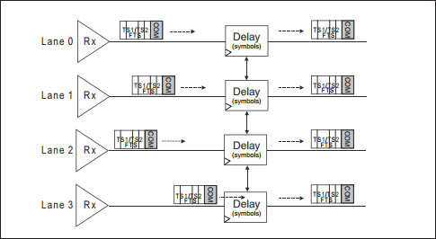
如果一个 lane 的 Symbol 处于时钟边沿，另一个 lane 的不是，则可以简单延迟先到达的 COM，使其对齐。

不同 PCIe 版本对偏移的容忍程度不同，通常都是整数倍个时钟周期。

Table 11-3: Allowable Receiver Signal Skew

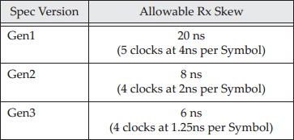
Gen3 没有 COM 字符，但仍可以通过 ordered set 提供时序对齐。

所有 lane 需要一个明确的模式执行去偏移，这可以通过有序集实现，因为其会同时发送至所有 lane。SKIP 有序集通常周期性发送，通过检测它的偏移情况，防止因温度或电压的变化造成偏移不同。如果使温度或电压造成持久性的差异性偏差，链路需要切换到 Recovery LTSSM 状态以纠正。如果数据包发生过程中发生偏移，会引发接收器错误并可能丢弃数据包。
## 3.6 8b/10b Decoder
每条 lane 都有一个 8b/10b 解码器，由弹性缓冲区（Elastic Buffer）向其输入数据。解码器有两个查找表（D 表和 K 表），用于将 10-bit Symbol 流解码成 8-bit 字符和 D/K# 信号。
- 如果在 D 表中匹配，则为数据字符，D/K# 驱动为高电平
- 如果在 K 表中匹配，则为控制字符，D/K# 驱动为低电平

Figure 11-24: 8b/10b Decoder per Lane

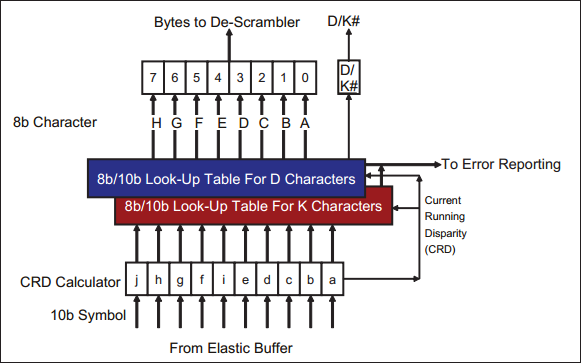

### Disparity Error and Code violation
解码器根据接收的首个字符不一致来初始化不一致值，同时 CRD 会作相应的目前总状态的记录。当当前 Symbol 具有中性不一致时，CRD值应该保持不变，当当前 Symbol 具有正/负不一致时，CRD 值应该变成相反极性，若没有，则检测到不一致错误。

Figure 11-25: Example of Delayed Disparity Error Detection

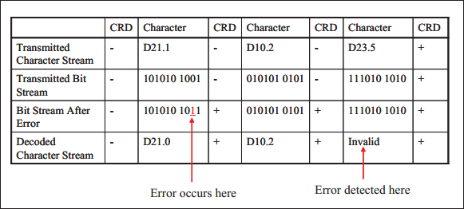
代码违规检测根据发送端 8b/10b 编码规则来检测，若违规则报错。

## 3.7 Descrambler
8b/10b 解码器将数据输入至去扰频器
- 只对 TLP/DLLP 以及逻辑空闲序列相关数据字节去扰
- 不对 K 字符、有序集 ordered set 、兼容性测试字符去扰
- 检测到 COM 字符会将 LFSR 重置初始化为 FFFFh
去扰频器默认处于启用状态，spec 允许调测试时禁用。
## 3.8 Byte Un-striping

Figure 11-26: Example of x8 Byte Un-Striping

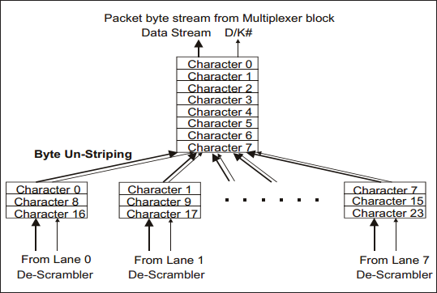
字符流从各 lane 经去扰频器后被反拆分到单个字节流中，该字节流被输入到过滤器逻辑中。过滤器逻辑会去除逻辑空闲序列、控制字符（STP/SDP/END/EDB/PAD）和有序集，将 TLP/DLLP 以及表示包开始和结束的边界字符输入至接收缓冲区。

## 3.9 Filter and Packet Alignment Check
byte un-striping 逻辑输出的串行字节流包含 TLP、DLLP、Logical Idle、Control characters 以及其他 Ordered Set。其中，Logical Idle、Control characters 以及其他 Ordered Set 将在传至上一层之前被消除，只留下 TLP 和 DLLP。此时发送至 Rx Buffer 的是剩下 TLP、DLLP 以及每个数据包开始和结束指示符。

## 3.10 Receiver Buffer（Rx Buffer）
Rx Buffer 保存删除开始和结束 Charecter 后的 TLP、DLLP，准备发送至数据链路层，该接口协议规范中没有约束。

# 4. Physical Layer Error Handling
物理层错误将被认为接收器错误报告给数据链路层。规范规定了必须检测的错误和可选错误。
必选错误：
- 8b/10b 解码错误：一致性检查、规则编码检查
可选错误：
- loss of Symbol lock
- Elastic Buffer 上/下溢
- lane 去偏移错误，lane deskew errors
- 数据包格式与通用规则不一致

如果物理层向 DLLP 报告一个接收器错误，那么 DLLP 会丢弃当前接收的 TLP 并释放为该 TLP 分配的存储资源，并发送 NAK DLLP，这样接收端从缓冲区重放 TLP。DLLP 也可以让物理层进行链路重新训练（链路恢复）。
如果实现了 PCI Express 扩展高级错误功能寄存器集，则接收器错误会设置可纠正错误状态寄存器中的接收器错误状态位。如果启用，设备可以向 Root Complex 发送 ERR_COR（可纠正错误）消息。
