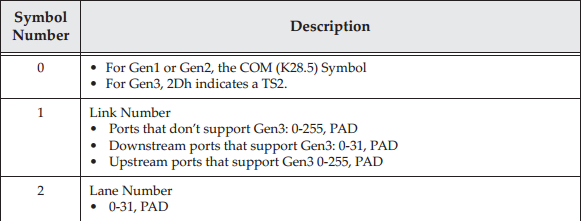
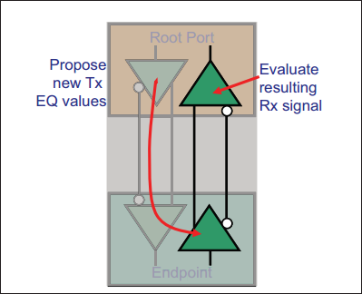
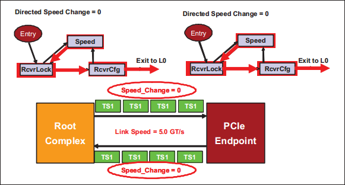
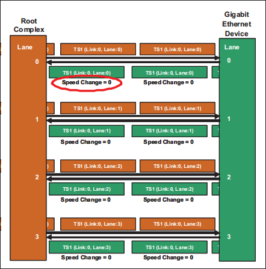

本章描述物理层的链路训练和状态机（Link Training and Status State Machine, LTSSM）：
- 链路的初始化过程是链路从通电或复位到链路达到完全运行的 L0 状态，在此期间发生正常的数据流量。
- 链路电源管理状态 L0s、L1、L2 和 L3 以及状态转换。
- 阐述恢复状态，在此期间的位锁定、符号（Symbol）锁定或块锁定。
- 链路带宽管理的链路速度和位宽变化。

# 1. Overview
链路初始化和训练是由物理层控制的，基于硬件（非软件）的过程。该过程配置和初始化设备的链路和端口，使链路上能进行正常的数据报文通信。

Figure 14-1: Link Training and Status State Machine Location

如图 14-1 所示，完整的训练过程在复位后由硬件自动启动，并由 LTSSM（链路训练和状态机）管理。在链路初始化和训练过程中包括了几项步骤，先简单介绍下它们并引入一些术语：
- **Bit Lock**：链路训练开始时，接收端时钟尚未与输入信号的发送时钟同步，无法可靠地对输入位进行采样。在链路训练期间，接收端 CDR（Clock and Data Recovery）逻辑使用传入的比特流作为时钟参考信号来重新创建发送端的时钟。一旦从比特流中恢复了时钟，就可以说接收端完成了 bit lock，然后能够对输入的数据位进行采样。
- **Symbol Lock**：对于 8b/10b 编码，下一步是获取 Symbol Lock。同 bit lock 类似，虽然接收端现在可以识别各个位，但不知道 10 bit Symbol 的边界在哪里。当发送端与接收端交换 TS1 和 TS2 时，接收端在比特流中搜索可识别的模式来检测。最直接的是 Gen1/2 中的 COM，其是特殊的编码方式，易于识别。识别到 COM 后，接收端不仅定位到两个 Symbol 的边界，也定位到两个有序集的边界。
- **Block Lock**：对于 128b/130b 编码，该过程与 Symbol Lock 略有不同，此时没有 COM 字符。接收端通过其他容易识别的标识来找到边界。在 Gen3 中通过使用 EIEOS（Exectrical Idle Exit Ordered Set） 来定位，其使用 00h 和 FFh 字节交替模式。它定义了块边界，因为根据协议，当该有序集结束后，下一个 Block 必须紧随其后开始。
- **Link Width**：具有多 lane 的 PCIe 设备可以使用不同的链路宽度。例如，具有 x2 端口的设备可以与 x4 端口的设备相连。在链路训练期间，两个设备的物理层会测试链路，并将链路宽度设为彼此支持的最大值。
- **Lane Reversal**：多通道设备端口上的通道从 0 开始按递增顺序编号。通常一个设备端口的 lane0 连到对端设备 lane0，lane1 连 lane1，以此类推。然后有时希望能在逻辑上反转通道编号，以简化布线，使走线不必交叉，如图 14-2。只要一台设备支持通道编号反转功能，就可颠倒 lane 的连接关系。Spec 不强制要求支持此功能，因此电路板设计人员需要验证至少一个连接设备支持此功能，才能颠倒通道顺序布线。

Figure 14-2: Lane Reversal Example (Support Optional)

- **Polarity Inversion**：两个设备的 D+、D- 差分对也可以根据需要反转，以使电路板布局布线更容易。每个接收端 lane 必须单独检查差分信号连接情况，并在极性翻转的情况下，在训练期间根据需要自动纠正，如图 14-3 所示。接收端通过检测输入 TS1 和 TS2 的 Symbol 6~15 来实现这一点。如果接收端在 TS1 中收到了 D21.5 而不是 D10.2，或者在 TS2 中收到 D26.5 而不是预期的 D5.2，则代表当前通道差分对极性反转，必须纠正。与 lane 反转不同，极性反转的支持是强制的。

 Figure 14-3: Polarity Inversion Example (Support Required) 

- **Link Data Rate**：在复位后，链路初始化和训练状态机会先使用默认的 Gen1 速率，以实现向后兼容。如果链路宣称可以实现更高速率，那么训练过程中会通告双方自己支持的最高速率，并且在训练完成后，LSTTM 会自动重新进行一次过程更短的训练，以将链路速率改为双方都支持的最高速率。
- **Lane-to-Lane De-skew**：走线长度变化和其他因素会导致多 lane 链路的并行比特流在不同时间到达接收端，这一问题称为信号偏斜（signal skew）。接收端需要通过延迟较早到达的通道，来补偿通道间信号抵达时间差异，以对齐比特流（Gen1 允许到达时间有 20 ns 的差异）。这使得电路设计人员摆脱了有时难以创建等长走线的限制。

# 2. Ordered Sets in Link Training
## 2.1 General
不同类型的 Ordered Sets：
- TS1/2 Ordered Set
- Electrical Idle Ordered Set ( EIOS)
- FTS Ordered Set (FTSOS)
- SKP Ordered Set (SOS)
- Electrical Idle Exit Ordered Set (EIEOS)
TS1/2 在训练过程中很重要，Gen1/2 下其格式如图 14-4 所示

Figure 14-4: TS1 and TS2 Ordered Sets When In Gen1 or Gen2 Mode

Gen3 模式如图 14-5 所示

Figure 14-5: TS1 and TS2 Ordered Sets When In Gen3 Mode

## 2.2 TS1 and TS2 Ordered Sets
正如上节如中描述的，TS1/2 由 16 个 Symbol 组成。在 LTSSM(Link Training and Status State Machine) 的 Polling、Configuration and Recovery states 状态期间，通信双方会交换 TS1/2。为了便于描述，PAD character 用于描述填充字符：Gen1/2 表示 K23.7，Gen3 由 data byte F7h 表示。

table 14-1 总结了 TS1 的内容摘要，其详细描述如下：
- Symbol 0:
	- Gen1/2，任何 Ordered Set 第一个 Symbol 是 K28.5(COM)。能用来实现 Symbol Lock 和 lane 间 de-skewing。
	- Gen3，块前两位 2-bit 是 Sync Header，表中未给出该两位。其后第一个 Symbol 标明是哪种 Ordered Set，TS1 是 1Eh，TS2 是 2Dh。
- Symbol 1 (Link #)：链路编号，在 Polling 状态下，该字段使用填充字符 PAD 填充，其他状态为被分配的编号（Link Number）
- Symbol 2 (Lane #)：通道编号，在 Polling 状态下，该字段使用填充字符 PAD 填充，其他状态下为被分配的编号（Lane Number）
- Symbol 3 (N_FTS)：表示当前速率下，接收方从 L0s 电源状态退出返回 L0 状态所需要接收的的快速训练序列（Fast Training Sequence, FTS）数量。在退出 L0s 状态时，发送端至少会发送 N_FTS 个 FTS。此过程所需的时间取决于所需的 FTS 数量以及当前的链路速率。举例来说，Gen1 速率下 4ns/Symbol，如果需要 200 FTS，那么就是 $200 FTS * 4 Symbols per FTS * 4ns/Symbol = 3200ns$。如果在发送端置位了扩展同步位（Extended Synch bit），则需要发送 4096 个 FTS，旨在为外部链路观测工具提供足够的时间以获取位和 Symbol 锁定。
- Symbol 4 (Rate ID)：设备报告其所支持的数据速率，以及一些提供给由硬件发起的带宽更改功能的信息。所有设备必须支持 Gen1，且在复位后链路始终自动从 Gen1 速率开始，以便向后兼容旧设备。如果设备支持 Gen3，那么也需要支持 Gen2。除此之外，该符号中还包括的其他信息有：
	- Autonomous Change：
		- 该比特置为 1 ，表示任何请求带宽更改的请求都是基于电源管理方面的原因而发起。
		- 如果发出带宽改变请求时，该比特未置为 1，则表示在更高速率或更宽链路上检测到工作不稳定的情况，需要改变带宽（降低速率或者减小链路宽度）。
	- Selectable De-emphasis：
		- 上游端口（Upstream Ports）设置该域，表明 Gen2 de-emphasis 级别，具体如何选择取决于具体实现。在 `Recovery.RcvrCfg` 状态下，设备锁存接收到该域的值，存放在设备内部。（spec 中指出该值存储在 `select_deemphasis` 变量中）
		- 下游端口（Downstream Ports）和根节点端口（Root Ports）：在 `Polling.Compliance` 状态中，基于接收到的该比特值，设置 `select_deemphasis` 变量。在 `Recovery.RcvrCfg` 状态中，发送端在其 TS2 中设置该位，其值基于 `Link Control 2` 寄存器中的 `Selectable De-emphasis` 字段。由于该寄存器位是硬件初始化的，因此可以在上电阶段后通过固件配置恰当的值，或者将其硬件初始化值设置为一个保守但安全（Strapping）的数值。
		- 在 Gen2 的 Loopback 模式下，Slave（从）机的 de-emphasis 值由 Master 机发送的 TS1 中的该字段对应比特设置。
	- Link Upconfigure Capability：报告降位宽的链路在减少链路的宽度后，能否恢复到原来链路宽度。如果在 `Configuration.Complete` 状态中，双方设备都报告了自己有这个能力，那么会当作共识记录下来。如设置 `upconfigure_capable` 位。

Table 14-1: Summary of TS1 Ordered Set Contents

- Symbol 5 (Training Control)：交流链路双方的一些特殊情况，比如热复位、启用 Loopback、关闭链路、关闭扰码等。
- Symbols 6-9 (Equalization Control)：
	- 对于 Gen1/Gen2，Symbol 7-9 仅是 TS1/TS2 的标识符，Symbol 6 通常也只是标识符，此时 Symbol 6 的 bit 7 为 0。但如果该比特为 1，则代表这是从下游端口（DSP，面向下游的端口，如 Root Port）发送的 EQ TS1/TS2。其中EQ 标签表示均衡（Equalization），发送 EQ TS1/2 意味着链路速率将提升为 Gen3，此时上游端口（USP，面向上游的端口，如 Endpoint Port）需要知道当前使用的均衡参数。对于 EQ TS1/2，Symbol 6 提供给 USP 的信息包括发送端 Presets 和接收端预设集选择提示（ Presets  Hint）。支持 Gen3 的端口必须能接收任何 TS 类型（reqular or EQ），但不支持 Gen3 的端口不需要接收 EQ 类型。这些 Presets 的可能值会在后续列出。
	- 对于 Gen3，Symbol 6-9 提供均衡过程的 Preset 和 Coefficients。TS2 的 Symbol 6 的 bit 7（Request Equalization 域）现在被用于申请重新进行均衡。此时，Symbol 6 的 bit 6（Quiesce Guarantee 域）可能也需要被置起，表示只要重新均衡的速度够快，那么所耗费的时间不会导致诸如完成超时等问题（返回 L0s 1 ms 内）。在有些场景会使用到这个功能，如在使用均衡得到的设置时检测到了问题。DSP 可以使用 bit 6/7 要求 USP 来发起重新均衡的请求，并保证重新均衡不会带来副作用，尽管 USP 无需对此作出响应。后续会详细介绍链路均衡过程。
- Symbols 10-13：TS1 or TS2 标识符。
- Symbols 14-15 (DC Balance，发送 0/1 数量平衡)：
	- 对于 Gen1/2，这只是 TS1/TS2 标识符，因为 DC 均衡由 8b/10b 编码完成。
	- 对于 Gen3，这两个 Symbol 的数值取决于 Lane 的 DC 均衡需要。发送端的每个 Lane 必须独立追踪当前所有正在被发送的加扰后的 TS1 和 TS2 的实时 DC 均衡（Running DC Balance）情况。实时 DC 均衡（Running DC Balance）指发送的 1 和 0 之间的数量差，各个 lane 必须能够收发方向追踪 0 和 1 的数量差值，最大支持差值为 511。这些计数器在记满后保持不变，但是会更新差值减小的变化。如计数器记录到 1 比 0 多 511 个，此后无论发送多少个 1，计数器仍停留在 511，然后当有 0 时计数器会减少。当发送 TS1/TS2 时，Symbol 14、15 的数值由以下算法决定：
		- 如果在 Symbol 11 结束时，Running DC Balance value > 31，且 1 数量更多，那么 Symbol 14 = 20h, Symbol 15 = 08h。如果 0 更多，Symbol 14 = DFh, Symbol 15 = F7h。
		- 如果 Running DC Balance value > 15，Symbol 14 = the normal scrambled TS1 or TS2 identifier，Symbol 15 = 08h 以减少 DC Balance 中 1 的数量，或者 Symbol 15 = F7h 以减少 0 的数量。
		- 否则，将发送 normal TS1 or TS2 identifier 标识符符号。
	- 关于 Gen3 DC Balance 需要注意的事项：
		- DC 均衡计数器（The Running DC Balance）将在退出电气空闲状态时，或在一个数据块之后收到 EIEOS 时复位；
		- The DC Balance Symbols 将绕过加扰，以确保发送的是预期的符号。

Table 14-2: Summary of TS2 Ordered Set Contents

# 3. Link Training and Status State Machine(LTSSM)
## 3.1 General

Figure 14-6: Link Training and Status State Machine (LTSSM)

上图描述了 LTSSM 的高层次抽象结构。每个状态又划分为若干子状态。在基础复位（Fundamental Reset），即冷复位 (Cold Reset）和暖复位（Warm Reset)，或者热复位（Hot Reset）释放后，进入的第一个状态是 `Detect` 状态。

Cold Reset：
- 定义：冷复位是一种完全的重置，它将设备恢复到初始状态。这包括清除所有寄存器、状态和配置信息，类似于设备刚刚上电时的状态。
- 触发方式： 冷复位通常由硬件或系统引导过程中的固定电源控制（如物理电源开关）触发。
- 影响： 冷复位将导致设备重新进行完整的初始化，可能需要较长的时间来完成。
Warm Reset：
- 定义： 温复位是一种部分的重置，它不会清除所有设备的配置信息，而是保留一些初始化状态。
- 触发方式： 温复位通常由设备内部或系统软件发出的命令触发，而不涉及硬件电源的改变。
- 影响： 温复位相对较快，因为它不需要重新初始化所有的配置信息。
热复位（Hot Reset）：
- 定义： 热复位是一种特殊的复位类型，它允许PCIe设备在不中断总线上其他设备的通信的情况下进行重置。
- 触发方式： 热复位是通过发出特殊的控制命令来触发的，而不会中断总线上的其他设备。
- 影响： 热复位的目标是在不影响其他设备的通信的情况下重新初始化设备。

LTSSM 包含 11 个顶级状态，分别事：Detect, Polling, Configuration, Recovery, L0, L0s, L1, L2, Hot Reset, Loopback, and Disable。他们可以分为 5 类：
- 链路训练状态，Link Training states
- 重训练状态，Re-Training (Recovery) state
- 软件驱动的电源管理状态，Software driven Power Management states
- 主动电源管理状态，即硬件驱动的电源管理状态，Active-State Power Management (ASPM) states
- 其他状态
在任意复位释放后，LTSSM 即进入了链路训练状态（Link Training states），一切正常的话，会按照 Detect => Polling => Configuration => L0 的顺序跳转状态。待进入 L0 状态后，即可以进行正常的数据报文收发操作。

链路重新训练也称为恢复状态，进入该状态的原因有很多，如从低功耗链路状态恢复，或切换链路带宽（speed or width changes）。在恢复状态下，链路会重复类似于训练状态的操作，来解决链路中的问题，并最终回到 L0，这一正常工作状态。

设备中功耗（电源）管理软件可以将设备置于低功耗设备状态（D1, D2, $D3_{Hot}$ , $D3_{Cold}$ ），这样的操作会强制链路进入较低的电源管理链路状态（L1 or L2, Power Management Link state）。注意区分低功耗设备状态（low-power device state）和低功耗链路状态（low-power Link state）。

如果链路上长时间都没有报文需要发送，ASPM 硬件逻辑会使链路自动进入低功耗 ASPM 状态（L0s or ASPM L1）。

此外，软件可以直接使链路进入一些其他状态，Disabled, Loopback, or Hot Reset。这里统一称为其他状态。

## 3.2 Overview of LTSSM States
下面将简要描述 11 个顶级状态。
- **检测状态 Detect：** 复位释放后的初始状态。在此状态下，本方设备从电气特性的角度，检测链路对端设备是否存在。串行传输通常不用检测对端是否存在，但 Detect 状态便于测试。除了复位释放之外，还可以从许多其他 LTSSM 状态进入 Detect。
- **轮询状态 Polling：** 该状态下发送端以 Gen1 速率向对端发送 TS1/2，使用协议最低速率以实现对早期协议的向后兼容。便于接收端可以使用接收的 TS1/TS2 序列完成下述功能：
	- Achieve Bit Lock，位锁定
	- Acquire Symbol Lock or Block Lock，符号（Gen1/2）、块（Gen3）锁定
	- Correct Lane polarity inversion, if needed，校正通道极性反转
	- Learn available Lane rates，得知通道支持的速率
	- 根据需要进行合规性测试序列（Compliance test sequence）：当检测状态下检测到接收端，但没有返回任何流量，则可以理解为对端设备是一个测试负载（Test load）。此时，发送方会发送指定的合规性测试图样（Pattern）以方便测试。这项特性能够使测试设备快速验证电压、BER（Bit Error Ratio）、时序和其他参数是否在链路容差范围之内。
- **配置状态 Configuration：** 上游（Upstream）和下游（Downstream）组件以 Gen1 速率交换 TS1/2，以实现以下目标：
	- Determine Link width，协商决定链路宽度
	- Assign Lane numbers，为各通道指派编号
	- Optionally check for Lane reversal and correct it，检测通道是否需要顺序或者极性交换
	- Deskew Lane-to-Lane timing differences，补偿各个通道之间的偏斜
	- 该状态开始可以关闭加扰，此时可以进入 Disable 或者 Loopback 状态，并从 TS1/2 序列交换时达成共识的 N_FTS，即从 L0 状态转变到 L0s 状态所需的 FTS 有序集数量。
- **L0：** 链路全功能正常运行的状态，此时链路上会进行正常的 TLP、DLLP 报文和有序集交换。此状态下链路速率可以高于 Gen1，但只能在进入 Recovery 状态，经历一次链路速率变化程序之后，才能切换到更高的速率。
- **恢复状态 Recovery：** 当链路需要重新训练时进入此状态。在恢复状态中，会重新进行 Bit Lock and Symbol/Block Lock，锁定的过程和 Polling 状态中时相同，但通常此次花费时间更少。进入此状态的原因：
	- L0 状态中发生了错误
	- 从 L1 恢复到 L0 
	- 从 L0s 状态恢复到 L0 时，无法通过 FTS 序列重新完成训练。
- **L0s：** L0s 是一个由硬件控制的 ASPM 低功耗，其目的是在节省一定功耗的同时，能够快速恢复到 L0 状态。当链路一端在 L0 状态下发送 EIOS 序列时，会进入 L0s 状态。退出 L0s 状态时，会通过 FTS 序列来快速重新完成 Bit and Symbol/Block Lock。
- **L1：** 此状态比 L0s 有更大的节能效果，但恢复到 L0 时间比 L0s 更长。链路双方需要共同协商以进入到 L1，可以通过以下两种方式之一进入：
	- ASPM 控制下自动进入：当上游端口设备没有等待调度发送的 TLP/DLLP 报文时，硬件逻辑将自动与下游端口协商，一起将链路转为 L1 状态。如果下游端口同意，则链路进入 L1，否则上游端口将进入 L0s（if enabled）。
	- 另一种情况是功耗管理软件命令设备进入低功耗状态（$D1, D2, or D3_{Hot}$）。此时上游端口通知下游端口必须一起进入 L1 状态，下游端口会响应该通知，并进入 L1 状态。
- **L2：** 在此电源下，设备主电源被关闭以实现节约更大功耗。此时几乎所有逻辑都已关闭， $V_{aux}$ 电源仍可使用以供设备唤醒。拥有唤醒能力的上游端口可以发送低频 Beacon 信号，下游端口可以将其转发到 Root Complex，告知上层系统。通过 Beacon 信号或边带 WAKE# 信号，设备能够触发系统唤醒事件，使主电源恢复。（另外还有 L3 链路电源状态，它与 LTSSM 状态无关，L3 完全关闭且 $V_{aux}$ 不可用，无法唤醒）。
- **回环状态 Loopback：** 回环状态定义为一种测试状态，协议中没有详细定义接收方的行为（如接收方哪些逻辑会参与回环测试）。
	- 回环状态中基本行为：Loopback Master 发送 TS1 有序集给 Slave，并置位 TS1 训练控制（Training Control）字段中 Loopback bit。当接收方连续接收到 2 个 Loopback bit 置起的 TS1 序列后，进入回环状态，将接收到的任何内容都重新发送给发起方。发起方会检查接收到的内容，和先前发送的内容进行比较，如果内容经双方 8b/10b 编码（解码）后校验一致，说明链路可以通过环路验证，完整性没有问题。
- **禁用状态 Disable：** 此状态允许将链路配置为禁用状态，该状态下发送端处于电气空闲状态，接收端处于低阻抗状态。在某些情况下，比如链路变得不可靠或者对端设备被意外移除，此时 Disable 是表示这些意外情况的必要状态。另外，软件也可以通过链路控制寄存器 （Link Control register） 中的禁用比特（Disable bit），将设备配为禁用状态。设备被禁用后，会连续发送 16 个链路禁用比特（Disable Link bit）置位的 TS1 序列，其位于 TS1 的训练控制域（Training Control Field），通知接收方进入禁用状态。
- **热复位 Hot Reset：** 软件可以通过置位 Bridge Control 寄存器中的 Secondary Bus Reset bit 来复位链路。软件配置后，桥的下游端口（Downstream Port）会发送训练控制域（Training Control Field）热复位（Hot Reset）比特置位的 TS1 序列。（详情可见原文 P837 页的 "Hot Reset (In-band Reset)" 节）。当接收端收到两个连续置位了 Hot Reset bit 的 TS1 时，它必须复位自身设备。

## 3.3 Introduction, Examples and State/Substates
本章的剩余内容会对每个 LTSSM 状态进行介绍和讨论。基于每种状态不同的复杂度，讨论会包括一些介绍，通用的背景知识，部分状态/次状态还会有相应的示例。基于具体的需求，读者可以只浏览某个状态简介的部分，而跳过详细讨论的部分，本章组织结构完全支持读者这么做。

每个设备必须以 Gen1 速率执行初始链路训练。图 14-7 突出显示了初始训练中涉及的状态。能够支持更高速率的设备必须转换到 Recovery 状态，才能进行速率切换。

 Figure 14-7: States Involved in Initial Link Training at 2.5 Gb/s

# 4. Detect State
## 4.1 Introduction
图 14-8 展示了与 Detect 状态相关的两个子状态和状态跳变。Detect 状态下的链路行为是发送方不断检测链路对端是否有接收方存在。因为 Detect 只有 2 个次状态，行为比较简单，本节直接讨论两个次状态的细节，不再讨论 Detect 状态本身了。

Figure 14-8: Detect State Machine

## 4.2 Detailed Detect Substate
### 4.2.1 Detect.Quiet
该次状态是所有复位（除功能级复位外，Function Level Reset, FLR）或上电事件（Power-up）后的初始状态。并且协议规定必须在复位之后 20ms 内进入该状态。当其他状态无法正常进入下一个状态时，也会进入该次状态，这些状态包括 Disabled、Loopback、L2、Polling、Configuration、Recovery。Detect.Quiet 次状态属性如下所示：
- 发送端以电气空闲的状态启动（此时 DC commom mode voltage 不需要在通常规定范围内）
- 目标数据速率为 Gen1 的 2.5GT/s。如果进入此状态时不是 Gen1 速率，则 LTSSM 必须在此子状态内等待 1ms，然后再将速率切换为 Gen1。
- 物理层的状态位为 0 时（LinkUp = 0），向数据链路层表示链路尚未就绪。LinkUp 状态位是一个内部信号（在标准配置空间中找不到），其还可以标识物理层是否完成链路训练（LinkUp = 1），从而通知数据链路层和流控逻辑（Flow Control）开始初始化。（参见 P223 页 “FC Initialization Sequence” 一节）。
- 任何先前的均衡（Eq., Euqalization）状态会在置位 4 个 2-bit 链路状态寄存器后清除，他们分别是：Eq. Phase 1/2/3 Successful 以及 Eq. Complete。
- Variables：
	- 几个变量会在 Detect.Quiet 状态清楚：
		- directed_speed_change = 0b
		- upconfigure_capable=0b
		- equalization_done_8GT_data_rate=0b
		- idle_to_rlock_transitioned=00h
		- select_deemphasis 变量的处理方式取决于端口类型
			- 对于 Upstream 端口，变量的值由硬件指定
			- 对于 Downstream 端口，变量的值使用链路控制（Link Control 2）寄存器中保存的 selectable Preset/De-emphasis  的值
	- 由于上述变量从PCIe 2.0 协议之后开始引入，更早期协议的设备不存在这些值，对于这些设备来说，他们的行为相当于：
		- directed_speed_change=0b
		- upconfigure_capable=0b
		- idle_to_rlock_transitioned=FFh

Exit to "Detect.Active"：LTSSM 会在 12 ms 超时或者任意一个通道退出电气空闲有状态后，转入下一个次状态。

### 4.2.2 Detect.Active
该子状态从 `Detect.Quiet` 进入。在 Detect.Active 状态中，发送端通过将直流共模电压（DC common mode voltage）设置为一个合法范围内的任意电压值，然后改变它来测试每个 lane 上是否有接收端连接。其检测逻辑是观察每个 lane 电压充电所需时间的变化（电压变化速率），并将以与对照值比较。这个对照值一般是没有接收端连接的情况，如果有接收端连接，那么充电的速率会大大的降低，两者之间巨大的差异使检测结果十分容易观察到（详见 P460 "Receiver Detection"）。为了便于表示，下文中将本状态中检测到的接收端 lane 称为 检测完成的通道“Detected Lanes”。
- Exit to "Detect.Quiet"
	- 如果没有任何一个 lane 检测到接收端时，将返回到 `Detect.Quiet`。只要没有检测到接收端，状态机会一直每隔 12ms 在 Quiet、Active 两个次状态之间进行一个循环。
- Exit to "Polling.State"
	- 如果在所有 lane 上都正常检测到接收端，则进入下一状态 Polling。此时 lane 需要驱动协议规定的 0-3.6V（ $V_{TX-CM-DC}$）范围内直流共模电压（DC common voltage）。
- Special Case:
	- 如果设备只有部分 lane 检测到接收端（如 X4 设备连接到 X2 设备），那么会等待 12 ms 再进行一次检测。如果检测的结果仍然相同，那么进入到 Polling 状态，否则返回 `Detect.Quiet`。在 Polling 状态中，如果存在没有接收端的 lane，有两种可能的处理方式：
		1. 如果 lane 可以作为单独的 Link 运行（see "Designing Devices with Links that can be Merged"），则使用另一个 LTSSM 对这些 lane 重复检测过程。
		2. 如果不存在另一个 LTSSM，那么这些 lane 不会成为链路的一部分，必须设置为电气空闲状态。

# 5. Polling State
## 5.1 Introductin
LTSSM 进入轮询状态时，链路处于电气空闲状态，不过，轮询状态期间会在链路两端之间交换 TS1 和 TS2 有序集。**轮询状态的主要目的是使链路两端设备能够听懂对方在说什么**，也就是说两端设备需要在彼此传输的比特流上，建立 bit 和 Symbol 的锁定，并解决极性翻转（polarity inversion）恢复之类的事宜。在这些工作完成后，设备双方都能正确接收对方的 TS1/TS2 ordered sets。图 14-9 显示了 Polling 状态机的子状态。

Figure 14-9: Polling State Machine

## 5.2 Detailed Polling Substates
### 5.2.1 Polling.Active
**During Polling.Active**
一旦链路双方的共模电压稳定在发送余量域（Transmit Margin field）允许的范围内之后，发送端会发送至少 1024 个连续的 TS1 有序集。因为链路双方退出 `Detect` 状态的时刻可能不同，因此 TS1 命令序列的交换是不同步的。在 Gen1 速率下，发送 1024 个 TS1  花费时间是 $64\mu s$。

Active 状态下，有一些值得注意的事项：
- 必须在 TS1 序列的通道（Lane）和链路编号（Link number）字段中使用填充字符 PAD。
- 设备需要通告（advertise）自己所支持的所有速率，即使设备不打算使用这些速率。
- 接收端使用接收到的 TS1 序列实现 Bit Lock，然后 Gen1/2 实现 Symbol Lock，Gen3 实现 Block Alignment。

**Exit to "Polling.Configuration"**
在发送方发送完 1024 个 TS1 里最后一个 TS1 序列之后，如果所有检测到的 lanes 都收到了 8 个连续的训练序列（如果存在极性翻转的话，那么收到的就是训练序列的补集），并且这些训练序列满足以下条件之一的话，状态机进入 `Polling.Configuration` 状态：
- 接收到的 TS1 的 Link 和 Lane 字段都被设置为全填充字符（PAD），并且 `Compliance Receive` bit 设为 0b（bit 4 of Symbol 5）
- 接收到的 TS1  的 Link 和 Lane 字段都设置为 PAD，并且 `Loopback` bit 设为 1b（bit 2 of Symbol 5）
- 接收到的 TS2 的 Link 和 Lane 字段都设为 PAD
如果上述条件都不满足，那么在 24ms 的超时之后，在接收到某个 TS1 后，已经发送了至少 1024 个 TS1，只需要任意检测到的通道收到了 8 个 连续的TS1 或 TS2（或补集），且它们的 Lane、Link 编号是 PAD，并且满足以下条件之一（其实以下条件和超时前判断条件一致），那么状态机进入 `Polling.Configuration` 状态：
- 接收到的 TS1 的 Link 和 Lane 字段都被设为 PAD，并且 `Compliance Receive` bit 设为 0b（bit 4 of Symbol 5）
- 接收到的 TS1 的 Link 和 Lane 字段都被设为 PAD，并且 `Loopback` bit 设为 1b（bit 2 of Symbol 5）
- 接收到的 TS2 的 Link 和 Lane 字段都设为 PAD
如果在任何 lane 上都没有满足上述条件的情况出现，那么如果自从进入 `Polling.Active` 状态以来，有至少预定数量被检测到的 lane 上，还检测至少一次退出 `Electrical Idle` 的现象（这是为了防止一个或多个失效的发送端或接收端导致链路不能进行配置），那么也能进入到 `Polling.Configuration` 状态。此处提到的预定数量由具体实现决定，spec 1.1 中是必须检测到所有 lane 都退出 `Electrical Idle`。

**Exit to "Polling.Compliance"** 
如果 `Link Control 2` 寄存器中 `Enter Compliance` bit 被设为 1b，那么进入 `Polling.Compliance`。或者如果在进入 `Polling.Active` 状态之前，该比特已经被置位，那么将直接从 `Polling.Active` 状态进入到 `Polling.Compliance` 状态，不会在 `Polling.Active` 状态中发送任何 TS1 序列。

否则，等待 24ms 后，再次判断进入 `Polling.Compliance` 状态的条件：
- All Lanes 在进入 `Polling.Active` 状态后，都没有检测到对端退出 `Electrical Idle` 状态（意味着对端是一个被动测试负载，比如至少在一个 lane 上挂在了一个测试电阻，将强制使所有 lane 进入 `Polling.Compliance` 状态）
- 接收到 8 个连续的 TS1，其 Link、Lane 全被设为 PAD，并且 `Compliance Receive` bit 设为 1b（bit 4 of Symbol 5），且 `LoopBack` bit 设为 0b（2 bit of Symbol 5）

**Exit to "Detect State"** 
如果在 24ms 之后，没有满足进入 `Polling.Configuration` 状态，或者 `Polling.Compliance` 状态的条件，那么返回 `Detect` 状态。

### 5.2.2 Polling.Configuration
在 `Polling.Configuration` 状态中，发送方停止发送 TS1 序列，转而发送 TS2 序列，TS2 序列中的链路和通道 lane 字段仍然使用填充字段 PAD 填充。该状态中，发送方转而发送 TS2 的目的是通知链路对端设备，本方已经做好准备进入状态中的下一个状态。这是一种使链路双方设备同步 LTSSM 而设计的握手机制。双方设备都无法独自进入下一状态，除非链路双方设备都准备就绪。开始发送 TS2 序列是通知对端本方准备就绪的方式，所以一旦设备同时发送并且接收到 TS2 序列，代表双方和对端设备都已经就绪，设备可以进入下一状态。

**During Polling.Configuration** 
发送方在所有识别的 lane 上发送 TS2 序列，其链路和通道字段使用填充字段 PAD。并且发送方必须通知对端自己所支持的所有数据速率（Polling.Active 也要通知），即使是那些不打算使用的数据速率。此外，如果有需要的话，每个通道的接收方必须独立地恢复差分输入信号的极性。关于极性恢复的具体内容，参见原文 P506 页 “Overview” 小节。此外，Transmit Margin 字段必须重置为 000b。

**Exit to "Configuration State"** 
在任意通道上接收到 8 个连续的链路和通道（Lane）PAD 字段填充的 TS2 序列后，并且从接收到第一个 TS2 序列开始，已经发送了至少 16 个 TS2 序列后，退出 `Polling.Configuration` 状态进入 `Configuration` 状态。
	
**Exit to "Detect State"** 
如果上述条件在 48ms 的超时后仍未满足，将退出 `Polling.Configuration` 状态进入 `Detect` 状态。

**Exit to Polling.Speed(Non-existent substate)** 
此处讨论的情况是一项 1.0 协议历史中的预留设计，Polling 状态下属的次状态在协议 1.0 版本发布之后已经发生了改变。在当时，设计者觉得在未来新的，更快速率出现之后，有必要在 Polling 状态中尽可能快速地切换到最高速率。然后，更高的速率出现之后，设计者意识到相比在第一次静态配置状态中把速率配置到最高速率，不如动态地根据电源管理需求，动态地提高或者降低速率。由于在 Polling 阶段需要清除大量链路的相关配置，所以重新进入 Polling 状态进行动态速率调节是不适合的，因此动态速率调节的功能被移出了 Polling 阶段，而设置于 Recover 阶段中。具体可见图 14-10。

Figure 14-10: Polling State Machine with Legacy Speed Change

如今，LTSSM 在复位之后总是会将速率训练为 2.5 GT/s，哪怕支持更高的速率。在 LTSSM 状态机进入 L0 状态之后，一旦有更高的可用速率，状态机进入 Recovery 状态，并且尝试将速率训练为双方都支持的最高速率。双方可支持的最高速率会在双方交换的 TS1 和 TS2 序列中体现，所以任意一方都可以通过使用自身的状态机从 Recovery 状态，发起一次速率改变行为。协议中仍然会罗列 Polling.Speed 次状态，但会将其标注为不会进入（unreachable）的状态。

### 5.2.3 Polling.Compliance
`Polling.Compliance` 子状态用于测试。发送方会发送特定的码字组合（pattern），构建一种码间干扰和串扰接近最严重的场景，用于链路信号质量分析。在该子状态中，可以发送两类码字，分别是 Compliance Pattern 和 Modified Compliance Pattern。

**Compliance Pattern for 8b/10b** 
该码型由 4 个按顺序重复的符号组成：K28.5-、D21.5+、K28.5+ 和 D10.2-。其中 +/- 表示当前运行差异（current running disparity, CRD）。如果链路有多个通道，会在每个通道注入 4 个延时符号，其中 2 个注入在合规模式之前，2 个注入在之后，表 14-3 中用 D 表示。注意该符号不是同时注入，而是在上一个通道注入完成后，再在下一个通道注入，当延迟符号传播最后一个通道且注入完成后，从第 1 个通道起始位置继续。该移动传播符号能确保相邻通道的干扰，提供更好的测试条件。

Table 14-3: Symbol Sequence 8b/10b Compliance Pattern

**Compliance Pattern for 128b/130b** 
该码型由下述 36 块重复序列组成：
- 第一个块：同步头 01b，后接未加扰的 64 个 1，再接 64 个 0
- 第二个块：同步头 01b，后接 table 14-4 中未加扰内容，其中 P 表示使用的 Tx preset，~P 表示按位取反。
- 第三个块：同步头 01b，后接 table 14-5 中未加扰内容。
- 第四个块：EIEOS Block
- 后续 32 个块均是 Data Block，每一个块包含 16 个加扰的 IDL Symbol（00h）。

Table 14-4: Second Block of 128b/130b Compliance Pattern

Table 14-5: Third Block of 128b/130b Compliance Pattern

**Modified Compliance Pattern for 8b/10b** 
第二种合规模式增加了一个错误状态字段，用来记录在 `Polling.Compliance` 中接收端检测到的错误数量。

相比 `Compliance Pattern`，该种模式下码型由 8 个字符组成：K28.5-、D21.5+、K28.5+、D10.2-、ERR、ERR、K28.5-、K28.5+。2 个 error status 用来报告错误状态，并在最后增加 2 个 K28.5。

Table 14-6: Symbol Sequence of 8b/10b Modified Compliance Pattern

待补充...

# 6. Configuration State
设备初始化时，Configuration 状态在 2.5GT/s 速率下配置 Link、Lane 编号。Gen2/3 速率时，设备也可能从 Recovery 状态进入 Configuration 状态。此时状态转换的主要目的是为了进行多通道设备的链路位宽动态转换。动态转换仅支持 Gen1/2 速率的设备。详情见 P552 的 "Detailed Configuration Substates" 一节。

## 6.1 Configuration State - General
本状态主要目标是弄清楚设备端口（Port）和各个通道（Lane）的连接情况，以及为连接的 Lane 分配 Lane 编号。举例来说，对一个连接了 8 个 Lane 的端口来说，可能只有其中的 2 个 Lane 是可用的，再比如这些通道可以组合为多条链路，如组合成两个 x4 的链路（每个链路有 4 个通道），Configuration 状态的目的是为了搞清楚这方面的信息。另外，和其他状态不同的是，端口在此状态的行为区分为面向上游端口和面向下游端口两种情况，两类端口在 Configuration 状态中被定义为不同的角色。因此，在本状态中会分别讨论面向上游和下游通道的行为。

DSP（Downstream Port，向下游发送数据）端口在剩余的链路初始化过程中扮演”领导者“，而 USP（Upstream Port，向上游发送数据）端口的角色是”跟随者“。DSP 会为 USP 确定链路以及通道的编号，USP 则只是简单地重复他接收到的值给 DSP，除非出现了编号冲突的情况。我们会在本节后续内容中讨论这种意外情况。Configuration 状态中，双方设备交换的 TS1 序列中反映分配的链路以及通道编号，如图 14-13 红圈部分所示，这两个数值域在被分配具体的数值前，使用填充符号（PAD Symbol）作为占位符。

Figure 14-13: Link and Lane Number Encoding in TS1/TS2

## 6.2 Designing Devices with Links that can be Merged
设计者一般根据性能与成本的考虑，决定在一条链路上实现多少个通道。PCIe 链路支持多个窄链路聚合成一个更宽的链路，同样的，较宽的链路也可以拆分成多个窄链路。图 14-14 中是一个有一个上游端口和四个 x2 下游端口的 Switch。在本例中，这些通道可以组成两个 x4 的链路。值得注意的是，PCIe 协议要求每个端口必须有作为一个 x1 链路工作的能力。

Figure 14-14: Combining Lanes to From Wider Links(Link Merging)

如图左侧可见，Switch 内部包含 1 个面向上游的逻辑桥以及 4 个面向下游的逻辑桥。事实上，每个端口都需要一个逻辑桥。因此，交换机需要包含 4 个面向下游的逻辑桥，以支持 4 个面向下游的端口。然而，如果交换机如图右方式连接的话，那么剩下的两个逻辑桥就将不工作。在链路训练期间，每个 DSP 中的 LTSSM 将决定具体实现哪些其所支持的连接选项。

## 6.3 Configuration State --Training Examples
### 6.3.1 Introduction
在 Configuration 状态中，链路以及通道的编号工作由 DSP 作为”领导者“发起（比如根节点端口或者交换机面向下游端口）。而终端（Endpoint）以及交换机面向上游端口无法发起这一过程，只能作为”跟随着“响应。接下来将通过一些示例，来使相关概念更容易理解。

### 6.3.2 Link Configuration Example 1

Figure 14-15: Example 1 - Steps 1 and 2

如图 14-15 所示，这个例子中假定双方设备都只支持单个链路，但通道宽度可以是 x4, x2 或者 x1。通道编号分配在设备内部完成，必须从 0 开始连续编号。物理上的通道编号显示在图中所画的设备框内，而逻辑上的，或者说通告的（reported）通道编号，在 TS 有序集上反映。一般来说，逻辑和物理编号是一致的，但也不尽然。

**Link Number Negotiation** 
1. 本例中只支持一条链路，DSP（Downstream Port，向下游发送数据的端口）在所有通道上发送链路编号都为 'N' 的 TS1 有序集，这些 TS1 的通道编号都用 PAD 符号填充。
2. 在配置状态中，USP（Upstream Port）起初发送 Link、Lane 编号域都是 PAD 填充的 TS1，但在接收到 DSP 发送的 Link 编号不为 PAD 符号的 TS1 后，USP 在所有已连接的通道上回复 Link 编号同样是 'N'，通道编号用 PAD 符号填充的 TS1。基于 USP 的响应，DSP 的 LTSSM 识别到所有四个通道都发出了响应，并使用相同的链路编号 'N'，所以四个通道被配置为同一个链路。通道编号的值 ‘N’ 是一个由具体实现决定的值，这个值不会保存在任何协议定义的寄存器中，并且与端口编号等其他值无关。

Figure 14-16: Example 1 - Steps 3 and 4

**Lane Number Negotiation** 
3. DSP 开始在各个 Lane 上发送 Link 编号相同，但是为各 Lane 各自分配了 0, 1, 2, 3 通道编号的 TS1，如图 14-16 所示。
4. 接收到 Lane 编号不为 PAD 填充符号的 TS1 后，USP 在回复之前首先验证接收到的 Lane 编号和自身物理编号一致。在本例中，DSP 和 USP 的各个通道是正确连接的，编号验证无误，所以 USP 在各通道回复 DSP 的 TS1 中通道了自身的通道编号。当 DSP 接收到编号不为 PAD 符号的 TS1 后，将接收到的通道编号与发送的数值进行比较，如果他们匹配，则这一过程顺利完成。如果不匹配，那么需要采取后续措施，比如部分通道不匹配，而剩余通道匹配，那么链路宽度需要对应调整。如果通道间的连接顺序被颠倒了，那么需要 DSP 支持可选的通道顺序颠倒特性，因为这项特性是可选的，那么有可能会出现通道连接顺序被颠倒，确没有任何一方的设备有能力将其纠正。这是一项重要的电路板设计失误，此时链路配置可能将无法完成。

Figure 14-17: Example 1 - Steps 5 and 6 

**Confirming Link and Lane Numbers** 
5. 因为 DSP 在所有通道上接收到的 Link、Lane 编号和发送数值一致，所以 DSP 开始发送 TS2 序列表示自己已经准备好确认协商结果，并且转移到下一状态 L0，TS2 中的链路编号、通道编号和协商结果一致。
6. USP 在接收链路编号、通道编号和协商结果一致的 TS2 后，也开始发送 TS2 序列表示自己同样做好离开 Configuration 状态，转移到下一个状态 L0，这个过程如图 14-17 所示。
7. 双方端口在收到至少 8 个 TS2 以及至少发送 16 个 TS2 后，发送一些逻辑空闲数据后，转移状态到 L0。

### 6.3.3 Link Configuration Example 2
还是上节中那个有 4 个面向下游通道的设备，不同的是，这个例子中这个设备可以配置为单个 x4，或者配置为两个 x2 链路的组合，或者配置为 4 个 x1 链路的组合，甚至还可以是一个 x2 链路和两个 x1 链路的组合，如图 14-18 所示。

如果 4 个 lane 全部检测到接收端存在，并全部进入 Configuration，那么会有这么几种可能的连接：
- 一个 x4 链路
- 两个 x2 链路
- 一个 x2 链路和两个 x1 链路
- 四个 x1 链路
接下来描述的是协议中决定实施何种配置的一个示例方法。

 Figure 14-18: Example 2 - Step 1

**Link Number Negotiation** 
1. DSP 首先在每个 lane 上分配并通告（advertise）单独的 Link 编号。Lane 0 上的 Link 编号是 N，lane 1 上就是 N+1，并以此类推。如图 14-18 所示，图中的 Link 编号只是一个例子，实际上他们可以是不连续的数字。另外，此时 DSP 并不知道和它连接的对端设备情况，在这个过程中 DSP 将尽力去搞清楚每个 lane 可实现的连接方式。

Figure 14-19: Example 2 -  Step 2

2. 在收到 USP 返回的 TS1 序列后（如图 14-19 所示，4 个 lane 分成两组，分别有不同的 Link 编号），DSP 得到两个信息：所有四个 lane 都处于工作状态，并且它们分别连接到了两个 USP，意味当前 DSP 需要分为两个 DSP，每个 DSP 拥有 0、1 两个 lane，如图 14-20 所示。

**Lane Number Negotiation** 

Figure 14-20: Example 2 - Strps 3,4 and 5

3. 各个 Link 上的 Lane 编号会独立进行，不同他们的过程相同：DSP 会在发送的 TS1 中通告其分配给接收 Lane 的 Lane 编号。其中值得注意的是，此时 DSP 在 TS1 的 Link 编号中，对于链路所有的 Lane，只是简单地返回 USP 发送的 Link 编号值。左侧链路两个 Lane 收到的都是 N，右侧链路两个 Lane 收到的都是 N+2。
4. 在本例中，左侧链路的 DSP 和 USP 之间的 Lane 编号相对应，但右侧链路的 Lane 连接则是相反的，DSP 的 Lane0 连到了 USP 的 Lane1，另一条 Lane 也是颠倒连接的。USP 在接收到 TS1 后意识到了 Lane 连接颠倒的现象，如果 USP 支持 Lane 编号颠倒功能的话，它会在内部交换 Lane0 和 Lane1 的编号，从而返回给 DSP 的 TS1 中保持原本 DSP 提议的 Lane 编号不变，如图 14-20 所示。如果 USP 并不支持这项特性，那么它会在返回的 TS1 中通告自己的物理 Lane 编号情况（和 DSP 提议的 Lane 编号相反），这样一来 DSP 也能意识到这个问题，并有机会在 DSP 内部颠倒 Lane 的逻辑编号来解决这个问题。
	1. Lane 顺序颠倒是一项双方端口可选的特性。如果 USP 检测到 Lane 编号颠倒，并有能力颠倒自己 Lane 的逻辑编号，那么 USP 会在内部颠倒自己 Lane 的逻辑编号，并返回 Lane 编号不变的 TS1。这样一来，DSP 都不会意识到这个问题的存在。如果 USP 不支持这项功能，那么 DSP 会发现其接收到的 TS1 的 Lane 编号相比它发送的 TS1 是颠倒的。如果 DSP 支持这项特性，那么它会纠正自身 Lane 逻辑编号的顺序，并在 TS2 中发送纠正后的 Lane 编号做为确认。
5. DSP 在接收到 Link 编号和 Lane 编号与所通告的编号一致的 TS1 后，各个 DSP 端口独立开始发送 TS2，作为它们已经准备好使用协商值，并做好切换至 L0 状态。
6. USP 在收到 Link 和 Lane 编号没有变化的 TS2 后，也可以发送相同的 TS2 序列。
7. 双方端口在收到至少 8 个 TS2 以及至少发送 16 个 TS2 后，会发送一些逻辑空闲数据，然后转移状态到 L0。

### 6.3.4 Link Configuration Example 3: Failed Lane

最后讨论在配置的过程中，某个 lane 如果不能正常工作会发生什么。这个例子基于 USP 的 lane2 不能正常工作，如图 14-21 所示。需要注意的是这个 lane 没有严重到要断开物理连接，如果这么严重， DSP 将不会把它识别为接收端，并不会把它纳入链路。然而，即使 lane 的物理连接性没有问题，lane2 的接收端或者发送端将无法完成配置工作（可能两端都无法完成）。

在本例中，链路训练过程可能会显著变长，因为在大多数状态跳转过程中，都需要等待所有 lane 就绪，如果只是一部分 lane 就绪，剩下一些没有，那么就需要等待超时条件满足才能跳转状态。

接下来的步骤描述了 Configuration 状态机各个子状态的跳转，其处理这种异常情况的过程。

 Figure 14-21: Example 3 - Steps 1 and 2 

**Link Number Negotiation** 
1. 虽然 USP lane2 接收端存在问题，但 DSP 在进入 Configuration 状态后还是按照流程行事。DSP 在所有 lane 上发送 Link 编号为 'N'、lane 编号域填充 PAD 的 TS1 序列。
2. lane0、1、3 收到了 DSP 发送 Link 编号域为非填充值得 TS1，所以按照协议回复 DSP 相同的 TS1。然而，lane2 因为接收故障，没能收到 DSP 发送的 TS1，所以 lane2 发送端继续发送 Link 编号、Lane 编号都为填充字符的 TS1，如图 14-21 所示。
**Lane Number Negotiation** 
3. DSP 在收到 lane0、1、3 发送的带有相同链路编号的 TS1 后，开始等待 lane2 也完成同样的工作，直至超出协议规定的最大超时时间。如果此时 lane2 还是没有收到消息，那么 DSP 就会意识到这个链路只能被训练为 x2 宽度的链路。此时 DSP 会向 USP 通告给 lane0 和 lane1 分配的 lane 编号，而 lane2、lane3 上只发送 Link 编号和 Lane 编号都使用填充字符 PAD 的 TS1。
4. 当 USP 在 lane0、lane1 上收到有有效 lane 编号的 TS1，而 lane3 又变回了填充字符 PAD 时，USP 回复相同的 lane 编号，而其他 lane 开始（指 lane3，lane2 是继续发送）发送 Link、Lane 编号都使用填充字符 PAD 的 TS1，如图 14-22 所示。

Figure 14-22: Example 3 - Steps 3 and 4 

**Confirming Link and Lane Number**
5. 因为 lane0、lane 1 上收到的 TS1 的 Link、Lane 编号都与预期匹配，所以 DSP 准备结束此协商并开始发送具有相同 Link、Lane 编号的 TS2，并准备进入 L0 状态。而在其他的 lane 上，继续发送 Link、Lane 编号都是用填充字符 PAD 的 TS1。
6. USP 在收到 Link 编号、Lane 编号和协商结果一致的 TS2 后，也开始发送 TS2 序列表示同样做好离开 Configuration 状态，转移到下一个状态 L0。而在其他 Lane 上继续发送 Link、Lane 编号使用填充字符的 TS1，这个过程如图 14-23 所示。

Figure 14-23: Example 3 - Steps 5 and 6

7. 在双方端口收到至少 8 个 TS2 以及至少发送 16 个 TS2 后，会发送一些逻辑空闲数据，然后转移状态到 L0。其他未完成配置的通道，如本例中的 Lane2、Lane3，转为电气空闲状态，直到下一次 DSP 发起链路训练操作，这时会继续尝试正常的训练过程，以期故障排除并完成配置。
## 6.4 Detailed Configuration Substates
本小节将详细讨论 Configuration 各子状态，其图如 14-24 所示。

Figure 14-24: Configuration State Machine

### 6.4.1 Configuration.Linkwidth.Start
有两种情况会进入该状态，一种是 Polling 状态正常结束跳转，另一种是在 Recovery 状态中发现 Link 或 Lane 编号相较于之前发生了变化，因此无法正常完成 Recovery  状态的跳转。

**A. Downstream Lanes** 
<u>During Configuration.Linkwidth.Start</u>
DSP 作为链路的发起者，将在所有工作的 lanes 上发送 Link 编号不为 PAD 的 TS1 序列（仅在 LinkUp 标志尚未置起，以及链路宽度的配置尚未进行时）。此时 TS1 中 Link 编号为 non-PAD，而 Lane 编号仍为 PAD。协议对 Link 编号具体数值得唯一规定：如果设备支持多 Links，那么分配给不同 Link 的编号不能相同。Link 编号的数值是两个链路伙伴之间的本地值，软件无需追踪所有链路的编号数值，也没有必要使整个系统中的所有链路编号保持不同。

>- Linkup 置位：LTSSM 完成训练，物理层已经做好准备
> - upconfigure_capable 置位：降位宽链路能否恢复

如果 `upconfigure_capable` 标志被置为 1b，那么也会在不工作的 lane 上发送 TS1，只要这些 lane 曾经收到过两个连续的 Link、Lane 编号都为 PAD 的 TS1。
- 从 Polling 状态进入此子状态时，所有检测到接收端的 Lane 会被视为工作通道（Active Lane）
- 从 Recovery 状态进入此子状态时，所有历经 `Configuration.Complete` 状态的 Link 上的 Lane，都会被视作工作通道（Active Lane）
- DSP 必须在发送的 TS1 中通告自身所支持的所有速率，即使该端口不打算使用的速率。

**Crosslinks 交叉链路** ：对于支持交叉链路特性的 DSP 来说，当 LinkUp = 0b 时，需要在所有检测到接收端的 Lane 上至少发送 16~32 个 TS1，其中 Link 编号为 non-PAD，而 Lane 编号是 PAD。之后，DSP 将根据接收到的内容判断对端是否存在交叉链路。（该项内容与 USP 基本一致）

**Upconfiguring the Link Width 恢复链路宽度**：在 LinkUp = 1b 时，如果 LTSSM 想要恢复较大的链路宽度，那么会在所有当前工作的 Lane、想要激活的非工作 Lane 以及接收到 TS1 的 Lane 上，发送 Link、Lane 编号使用 PAD 填充的 TS1。当 DSP 在某个 Lane 上接收到两个连续的 TS1 回复后，延时 1ms，然后发送指定 Link 编号的 TS1。
- 在激活不工作的 Lane 时，发送端必须等待发送共模电压（Tx common mode voltage）稳定，才能退出电气空闲状态并开始发送 TS1。
- 对于组合为同一链路的 Lane，他们的 Link 编号必须相同。只能在支持多链路配置的不同链路之间分配不同的链路编号。

<u>Exit to "After a 24ms timeout if none of the other confitions are true"</u>
任何收到过至少一个 Link、Lane 编号均为 PAD 的 TS1 的 Lane，如果现在收到两个连续的 Link 编号有效，而 Lane 编号仍然为 PAD 的 TS1，那么 LTSSM 将退出至 `Configuration.Linkwidth.Accept` 子状态。

<u>Exit to "Configuratin.Linkwidth.Start"</u>
如果 DSP 接收到的第一批 TS1 中，Link 编号就已经不是 PAD 了，那么 DSP 通过这种现象可以意识到存在交叉链路（Crosslink），链路对端设备此时也是 DSP。针对这种情况，面向下游（Downstream）的 Lane 将转换为面向上游（Upstream） Lane，DSP 等待长度随机的超时时间后，重新进入 `Configuration.Linkwidth.Start` 状态，只不过此时该 Lane 将变成面向上游的 Lane。

这项特性支持链路双方都是 DSP 的情况，是一种可选配的特性。解决办法是将双方都从 DSP 转换成 USP，并为双方指定一个长度随机的超时。在超时结束后，将超时端口转换为 DSP。因为双方的超时时间长度是不同的，最终将有一个端口成为 DSP，而另一个端口仍然是 USP，这样一来训练就可以继续进行。超时时间长度必须是随机的，这样即使链路双方的端口实现完全相同，也不会出现死锁的情况。

如果支持交叉链路特性，那么在接收的 TS1 的链路编号从 PAD 转换到 non-PAD 的过程中，不允许出现 TS2 打断这个过程。

<u>Exit to "Disable State"</u>
如果端口收到更高层逻辑的指示，发送 Disable Link 比特置位的 TS1 或者 TS2，那么将退出至 Disable 状态。一般来说这个过程是由 DSP 发起的，但在可选支持 Crosslink 的场景中，这可能是由 USP 发起的。DSP 在收到连续两个 Disable 比特置位的 TS1 后，下一个状态将跳转为 Disable 状态。

<u>Exit to "Loopback State"</u>
如果支持 Loopback 的发送端受到更高逻辑的指示，发送 Loopback 比特置位的 TS1 或者 TS2，或者正在发送 TS1 的 lane 收到连续两个 Loopback 比特置位的 TS1 后，将退出至 Loopback 状态。任意发送 Loopback 比特置位的端口将变成 Loopback master，而收到他们的端口变成 Loopback slave。

<u>Exit to "Detect State"</u>
如果在 24ms 超时后，仍然没有任何满足有效跳转条件，那么退出至 Detect 状态。

**B. Upstream Lanes** 
<u>During Configuration.Linkwidth.Start</u>
USP（Upstream Port）在该状态是链路训练的响应者（follower），开始时发送 Link、Lane 编号为 PAD 的 TS1。USP 持续发送 TS1 直至收到 DSP 发送的 Link 编号不为 PAD 的 TS1。

USP 会在三类 Lane 上发送 Link、Lane 编号 为 PAD 的 TS1，分别是：
1. 所有工作通道（Active Lane）
2. USP 想要恢复链路宽度（upconfigure）而配置的 Lane
3. 所有曾接收到两个 Link、Lane 编号为 PAD 的 TS1 的非工作状态（inactive）Lane，当变量 `upconfigure_capable = 1` 时。

此外需注意：
- 从 Polling 状态进入此子状态时，所有检测到接收端的 Lane 会被视为工作通道（Active Lane）
- 从 Recovery 状态进入此子状态时，所有历经 `Configuration.Complete` 状态的链路上的 Lane，都会被视为工作通道（Active Lane）。如果此时的状态跳转不是由 LTSSM 超时触发的，那么此时发送方应该在 `Configuration` 状态中发送的 TS1 中置位 `Autonolous Change` 比特（Symbol 4, bit 6），表示发送方出于自身（Autonomous）原因想要改变链路宽度，从而进入 `Configuratrion` 状态。
- DSP 必须在发送的 TS1 中通告自身所有支持的速率，其中需要包括端口不打算使用的速率。

**Crosslinks 交叉链路** ：对于支持交叉链路特性的 USP 来说，当 LinkUp = 0b 时，需要在所有检测到接收端的 Lane 上至少发送 16~32 个 TS1，其中 Link、Lane 编号采用 PAD。之后，USP 将根据接收到的内容判断对端是否存在交叉链路。（该项内容与 DSP 基本一致）

<u>Exit to "After a 24ms timeout if none of the other confitions are true"</u>
如果一些 Lane 接收到了两个连续的 Link 编号有效，Lane 编号为 PAD 的 TS1，那么这个端口会进入 `Configuration.Linkwidth.Accept` 子状态，USP 选取其中一个接收到的 Link 编号作为这些 Lane 的 Link 编号，并在所有收到的 Link 编号非空的 TS1 的 Lane 上，回复采用该 Link 编号的 TS1，Lane 编号继续使用 PAD。对于剩下的 Lane，如果他们检测到了接收方，但是还没有收到 Link 编号，那么则发送 Link、Lane 编号都采用 PAD 的 TS1。

- 如果 USP 打算恢复链路宽度，LTSSM 首先等待下述两个条件满足任意一个：
	1. 在所有待激活的 Lane 上都接收到两个连续的 Link 编号有效，Lane 编号为 PAD 的 TS1；
	2. 任意一个待激活 Lane 进入本状态超过 1 ms。
	接着，USP 开始发送 Link 编号为选定的有效编号，Lane 编号为 PAD 的 TS1。
- 为了避免将链路宽度配置小于正常宽度，spec 建议如果在 multi-Lane Link 上发现某些 Lane 出现错误或者失去 Block Alignment 状态，那么延迟一段时间后再进行本过程。8b/10b 编码时等待至少 2 个 TS1，128b/130b 编码时至少等待 34 个 TS1，但任何情况下不要等待超过 1ms。
- 在激活不工作 Lane 后，发送端必须等待发送共模电压（Tx common mode voltage）稳定，才能退出电气空闲状态并开始发送 TS1。

<u>Exit to "Configuration.Linkwidth.Start"</u>
在等待 Crosslink 规定的超时时间后，发送 16-32 个 TS2，其中 Link、Lane 编号采用 PAD。之后，Upstream 链路转换为 Downstream 链路，下一个状态仍然是 `Configuration.Linkwidth.Start` 状态，但链路双方的角色反转。此情形用于支持 Crosslink 的情形，两个 USP 相连的情况，该过程允许其中一个 USP 转换成 DSP。

<u>Exit to "Disable State"</u>
如果下列条件中任意一项满足，那么退出至 Disable 状态：
- 任意正在发送 TS1 的 Lane 收到了 Disable link 比特为 1 的 TS1。
- 支持选配特性 Crosslink 时，所有 Lane 连续收到两个 Disable link 比特为 1 的 TS1，或者 Link 其中一方被高层软件关闭链路，使其在所有检测到接收方的 Lane 上发送的 TS1、TS2 中，置位 Disable link 比特。

<u>Exit to "Loopback State"</u>> 
*加粗部分为 USP 和 DSP 不同之处*
\如果支持 Loopback 的发送端收到更高层逻辑的指示，发送 Loopback 比特置位的 TS1 或者 TS2，或者**所有**正在发送**以及接收** TS1 的 Lane 收到连续两个 Loopback 比特置位的 TS1 后，将退出至 Loopback 状态。任意发送 Loopback 比特置位的端口将变成 Loopback master，而收到他们的端口将变成 Loopback slave。

<u>Exit to "Detect State"</u>
如果在 24ms 超时后，仍然没有满足任何有效跳转条件，那么退出至 Detect 状态。ha

### 6.4.2 Configuration.Linkwidth.Accept
此时，USP 正在其所有 Lane 上发送 TS1 进行回应，所有 Lane 上的 TS1 中 Link 编号保持一致。Link 编号来自于 DSP 的倡议，USP 直接在所有 Lane 的 TS1 中反应了该 Link 编号值。这样一来 DSP 通过计算有多少 Lane 响应了该 Link 编号值，明确 Link 宽度。接下来 DSP 需发起提议，为这些 Lane 指定各自的 Lane 编号。所以 DSP 作为训练的主导者（leader），继续发送 TS1 序列，此时各 Lane 的 TS1 中，Lane 编号为 DSP 设定的值，不再是 PAD。当然此时 Link 编号相同。

**A. Downstream Lanes**
<u>During Configuration.Linkwidth.Accept</u>
DSP 提议 Lane 编号值：如果一条 Link 可以由多个 Lane 组合合并，这些 Lane 都会受到两个连续的、Link 编号相同的 TS1，此时 DSP 会为它们发送 Link 编号一致，Lane 编号不同的 TS1。

<u>Exit to "Configuration.Lanenum.Wait"</u>
DSP 不会在 `Configuration.Linkwidth.Accept` 子状态长时间停留。一旦 DSP 收到了 USP 发送的必要数量的 TS1，明确了 Link 宽度后，DSP 会更新一些必须的内部状态，开始发送 Lane 编号不为 PAD 的 TS1，并立刻转为 Configuration.Lanenum.Wait 等待，等待 USP 确认 Lane 编号的分配。

**B. Upstream Lanes** 
<u>During Configuration.Linkwidth.Accept</u>
USP 从 DSP 提供的 Link 编号中选择其中一个，填充至所有 Lane 的 TS1 中，反馈发送给 DSP。这里所有 Lane 指的是那些接收 TS1 中 Link 编号不为 PAD 的 Lane。在所有剩余的 Lane 中，如果监测到对端接收方，但没有接收到有效 Link 编号的 Lane，将继续发送 Link、Lane 编号采用 PAD 的 TS1。

<u>Exit to "Configuration.Lanenum.Wait"</u>
USP 必须对 DSP 提出的 Lane 编号分配作出响应。如果一个 Link 可以由多个发送 Link 编号 non-PAD 的 TS1 的 Lane 合并组成，并且它们接收到了两个连续的 TS1，其中 Link 编号相等，Lane 编号为 non-PAD，那么 USP 应该在可行的情况下，发送 Lane 编号相同的 TS1 表示接受分配，或者在必要的时候回应不同的编号值提议（如应用 Lane 顺序翻转特性）。

### 6.4.3 Configuration.Lanenum.Wait
Lane 的编号方式，是从 0 到这条 Link 所支持的最大编号，如 x8 Link 的 Lane 编号为 0~7。端口需要支持 Link 所能容纳的最大 Lane 数，也需要支持至少一个 Lane。Lane 总是从 0 开始，并且连续编号不中断，如 x8 链路上有些 Lane 不工作，可以转而配置成 x4 Link，此时它必须使用 Lane 0~3。如果 Lane2 无法正常工作，无法使用 Lane 0，1，3，4 组成一个 x4 Link，因为它们的编号是不连续的。链路上任何剩余 Lane 必须发送 Link、Lane 编号都是用 PAD 的 TS1。该项限制对 DSP 和 USP 都有效。

为了避免将链路宽度配置小于正常宽度，SPEC 建议如果在 mutil-Lane Link 上发现某些 Lane 出现错误或者失去 Block Alignment 状态，那么延迟一段时间后再进行本过程。8b/10b 编码时等待至少 2 个 TS1，128b/130b 编码时至少等待 34个 TS1，但任何情况不要超过 1 ms.

<u>Exit to "Detect State"</u>
如果没有链路能够被配置（如 lane0 不工作，且 Lane 翻转没有启用时），或者所有 Lane 接收到两个连续的 TS1，其 Link、Lane 编号都为 PAD，那么在 2ms 之后触发超时，链路返回 Detect 状态。

**A. Downstream Lanes** 
<u>During Configuration.Lanenum.Wait</u>
在 `Configuration.Lanenum.Wait` 期间，DSP 会继续发送 Link、Lane 编号为 non-PAD 的 TS1，直至满足某个跳转到其他状态的条件。

<u>Exit to "Configuration.Lanenum.Accept"</u>
如果下述两个条件之一满足，那么将跳转到 `Configuration.Lanenum.Accept` 状态：
- 如果在所有 Lane 上都接收到连续两个 TS1，它们携带的 Link、Lane 编号都和 DSP 在这些 Lane 上发送的一致。
- 如果在任意一个检测到接收方的 Lane 上，接收到连续两个 TS1，它们的 Lane 编号和刚进入本状态时接收到的 TS1 中的数值不一致，并且至少有一些 Lane 接收到了有效的 Link 编号。SPEC 指出这种情况是通信双方达成了一致，确定了双方都能够接收的链路宽度。

<u>Exit to "Detect State"</u>
触发了上述的 2ms 超时事件，或者所有 Lane 接收到两个连续的 TS1，其 Link、Lane 编号都为 PAD。

**B. Upstream Lanes** 
<u>During Configuration.Lanenum.Wait</u>
在 `Configuration.Lanenum.Wait` 状态期间，USP 会继续发送 Link、Lane 编号为 non-PAD 的 TS1，直至满足某个跳转到其他状态的条件。

<u>Exit to "Configuration.Lanenum.Accept"</u>
如果下述两个条件之一满足，那么跳转到 `Configuration.Lanenum.Accept` 状态：
- 如果在所有 Lane 上都接收到连续两个 TS2。
- 如果在任意一个检测到接收方的 Lane 上，接收到连续两个 TS1，它们的 Lane 编号和刚进入本状态时接收到的 TS1 的数值不一致，并且至少有一些 Lane 接收到了有效的 Link 编号。协议指出这种情况是通信双方达成了一致，确定了双方都能够接收的链路宽度。

<u>Exit to "Detect State"</u>
触发了上述的 2ms 超时事件，或者所有 Lane 接收到两个连续的 TS1，其 Link、Lane 编号都为 PAD。

### 6.4.4 Configuration.Lanenum.Accept
**A. Downstream Lanes** 
<u>During Configuration.Lanenum.Accept</u>
DSP 已经在上一个状态中收到了 Link、Lane 编号为 non-PAD 的 TS1。在本状态中，DSP 必须决定是否能够按照 USP 返回的 Lane 编号顺序建立一条链路。下面列出了三种可能的状态跳变方式。

<u>Exit to "Configuration.Complete"</u>
如果 DSP 在所有 Lane 上都接收到连续两个 TS1，它们携带的 Link、Lane 编号都和 DSP 在这些 Lane 上发送的数值一致，那么代表 USP 同意了 DSP 通道的 Link、Lane 编号，DSP 随之进入 `Configuration.Complete` 状态。如果 DSP 接收到的 Lane 编号顺序与通告的顺序相颠倒，如果 DSP 支持 Lane 顺序颠倒，那么 DSP 同样进入 `Configuration.Complete` 状态，并采用接收到的，颠倒的 Lane 编号顺序。

值得注意的是，SPEC 指出 Lane 编号顺序颠倒的条件是限定的，只能 Lane0 接收到最大的 Lane 编号。因此 Lane 编号不能混编，必须按顺序 0~n-1 或者 n-1 ~ 0，不支持其他选项。

如果是从 Recovery 状态进入的 Configuration 状态，那么在配置过程中可能被要求改变带宽。如果这样，那么需要置位响应的状态标识位来标识需要改变带宽的原因。主要是系统需要报告带宽改变是因为链路可靠性问题导致的，还是因为硬件正在管理链路的电源状态导致的。状态标识位的几种情形如下所述：
- 如果带宽改变由 DSP 因为链路的可靠性问题发起，那么链路带宽管理状态比特（Link Bandwidth Management Status bit）设置为 1b；
- 如果带宽改变不是由 DSP 发起，而是因为 DSP 连续收到两个自主改变（Autonomous Change）比特位为 0b 的 TS1，那么链路带宽管理状态比特（Link Bandwidth Management Status bit）设置为 1b；
- 除此之外的链路带宽改变，链路自主带宽状态比特（Link Autonomous Bandwidth Status bit）置位为 1b。

<u>Exit to "Configuration.Lanenum.Wait"</u>
如果一条正在被配置的 Link 可以由一部分而不是全部的可用 Lane 组成，这些 Lane 都收到连续两个 TS1，其 Link 编号为相同有效数值，Lane 编号为 non-PAD。那么在这部分 Lane 上发送 Link 编号相同，Lane 编号重新编制的 TS1，旨在用更少数量的 Lane 来变成一条 Link。

新的 Lane 编号必须从 0 开始顺序递增，指派给 Link 所使用的 Lane。任何没有接收到 TS1 的 Lane 不能成为 Link 的一部分，并且中断 Lane 编号的递增。例如，对于 8 条 Lane，如果 Lane2 没有收到 TS1，那么这组 Lane 不能组成包括 Lane2 的链路。这样一来，不能组成 x8 或者 x4 的链路，只能组成 x2 或者 x1 的链路。剩下不使用的 Lane，必须在其上发送 Link、Lane 编号都为 PAD 的 TS1。

<u>Exit to "Detect State"</u>
如果没有链路可以被配置，或者所有 Lane 接收到两个连续的 TS1，其 Link、Lane 编号都为 PAD。

**B. Upstream Lanes** 
<u>During "Configuration.Lanenum.Accept"</u>
USP 在上一个状态中已经收到了 Link、Lane 编号为 non-PAD 的 TS1、TS2。在本状态中，USP 必须决定是否能够按照 DSP 提议的 Lane 编号顺序建立一条链路。下面列出了三种可能的状态跳变方式。

<u>Exit to "Configuration.Complete"</u>
如果 USP 在所有 Lane 上都接收到连续两个 TS2，它们携带的 Link、Lane 编号都和 USP 在这些 Lane 上发送的 TS1 中数值一致，那么 USP 进入 `Configuration.Complete` 状态。

<u>Exit to "Configuration.Lanenum.Wait"</u>
如果一条正被配置的 Link 可以由一部分可用 Lane 的子集组成，这些 Lane 都受到连续两个 TS1，其 Link 编号相同有效，Lane 编号为 non-PAD。那么在这部分 Lane 上发送 Link 编号相同，Lane 编号重新编制的 TS1，旨在使用更少数量的 Lane 来编成一条 Link，并跳转至 `Configuratin.Lanenum.Wait` 状态。

和 DSP 时的情形一样，新的 Lane 编号必须从 0 开始顺序递增。任何没有接收到 TS1 的 Lane 不能成为 Link 的一部分，并且不能中断 Lane 编号顺序递增。剩下不使用的 Lane，必须在其上发送 Link、Lane 编号都为 PAD 的 TS1。

<u>Exit to "Detect State"</u>
如果没有链路可以被配置，或者所有 Lane 接收到两个连续的 Link、Lane 编号都为 PAD 的 TS1。

### 6.4.5 Configuration.Complete
`Configuration.Complete` 是唯一的 TS2 序列交换的状态。正如前文讨论所述，TS2 交换是链路两端的设备间，互相确认已经准备好状态跳转的握手确认机制。这是对先前状态中 TS1 序列交换的 Link、Lane 编号的最终确认。

需要注意，SPEC 允许双方设备在进入本状态时，改变它们支持速率列表和链路宽度恢复能力（upconfigure capability），但一旦进入本状态后，这些设置就不再允许修改。因为设备进入本状态后将记录对方在 TS2 中通告的这些能力和设置，具体内容将在本节进行讨论。

**A. Downstream Lanes** 
<u>During "Configuration.Complete"</u>
在本状态期间，DSP 将发送 TS2 序列，其中 Link、Lane 编号与接收到的 TS1 中的内容相同。如果当前端口有一条使用 lane0 的 x1 链路，并支持增加链路宽度恢复（upconfigure），那么 DSP 将置位 TS2 序列中的 `Upconfigure Capability` 比特。

使用 8b/10b 编码时，必须在离开当前状态前完成 lane 间的去偏移（Lane de-skewing）。另外，如果所有配置中的 lane 都收到了两个连续的 TS2，其中关闭加扰（Disable Scrambling）比特设置为 1b，那么停止对编码进行加扰（scrambling）。发送这些 TS2 的端口也必须停止加扰。值得注意的是，在 128b/130b 编码模式时，无法关闭加扰，因为添加的扰码对信号完整性的帮助不可或缺。

DSP 在本状态中发送 TS2 序列，并接收观察对端返回的 TS2 序列。DSP 会记录接收的 TS2 中的 N_FTS 域数值，其表示对端退出 L0s 状态最少需要的 FTS 数量，以备后续使用。

<u>Exit to "Configuration.Idle"</u>
当所有发送 TS2 的 Lane 都接收到 8 个满足条件的 TS2 时，并且在接收到一个 TS2 后该 Lane 已经发送至少 16 个 TS2，状态机将跳转至下一个状态：Configuration.Idle。这些条件指的是所有接收到 TS2 中都携带有匹配的 Link、Lane 有效编号，匹配速率标识符（rate identifier）以及匹配的 Link Upconfigure Capability 比特。

如果设备支持 Gen1 2.5GT/s 以上的速率，那么它必须记录在任何已配置 Lane 上的速率标识符，这将覆写所有此前记录的值。`changed_speed_recovery` 是用于在 Recovery 状态中追踪速率变化的变量，此时清除为 0。

如果设备发送出的 TS2 中 `Link Upconfigure Capability = 1b`，并且接收到 8 个连续的该位设为 1 的 TS2 序列，那么此时 `upconfigure_capable` 变量将设为 1b，否则该变量清除为 0。

对于没有配置为 Link 一部分的 Lane，其将不再于当前的 LTSSM 相关联，并且必须设置为下述各种状态中的一种：
- 与新的 LTSSM 相关联
- 转为电气空闲状态
	- 这涉及一种特殊状态：这些未被配置的 Lane，曾在 L0 状态中被配为 Link 的一部分，并且从那之后 LinkUp 状态位一直被设为 1b。如果 Link 支持 upconfigure capable，那么它们仍然和原来的 LTSSM 相关联。对于这种情况，SPEC 建议这些 Lane 仍然保持打开对接收端的终结（termination）特性，因为在 upconfigured 之后，它们又会重新变成链路的一份子。如果不保持终结特性打开，那么在 LTSSM 从 `Configuration.Complete` 状态转为 `Recovery.RcvrCfg` 状态时，也需要再次打开。不过，如果这些 Lane 并非曾经是 Link 的一部分，那么它们无法通过该过程成为 Link 的一部分。
	- 对于可选配的 crosslink 特性，接收阻抗必须保持在  $Z_{RX-HIGH-IMP-DC-POS}$ 和 $Z_{RX-HIGH-IMP-DC-NEG}$ 之间。
	- 在 LTSSM 返回 Detect 状态后，这些 Lane 会重新和其关联。
	- 这些 Lane 在进入电气空闲之前无需发送 EIOS 序列，并且状态转变也并不一定发生在 Symbol or Ordered Set 边界上。
>在PCIe的串行通信中，终端电阻是一种电阻，通常放置在总线的两端，以确保信号的完整性和减小反射。对于PCIe lane，终端电阻有助于消除信号在传输线上反射回去，防止信号干扰和失真。当说 PCIe lane 保持对接收端的终结特性时，意味着在通信链路的接收端（receiver）附近，终端电阻被正确配置和保持。这确保了在数据传输过程中，信号在达到接收端时能够正确地终结，防止信号反射和其他电气问题。
>终端电阻的正确配置对于 PCIe 通信的稳定性和性能至关重要。这是通过物理层的协商和配置来完成的，以确保发送和接收端在通信链路的两端都有适当的终端电阻。这通常是由 PCIe 控制器或相关硬件自动完成的，但在某些情况下，可能需要手动配置以确保正确的终端电阻匹配。

**After a 2ms timeous:**
<u>Exit to "Configuration.Idle"</u>
如果变量 `idle_to_rlock_transitioned < FFh`，且当前速率为 8GT/s，那么接下来转入 `Configuration.Idle` 状态。

在这次状态跳变中，变量 `changed_speed_recovery` 清为 0。并且 `upconfigure_capable` 可能会被更新（非必须），当至少一个 Lane 上见到 8 个连续的 TS2 序列，它们都携带有匹配的 Link、Lane 编号 non-PAD，如果链路双方的 `Upconfig Capability` 比特都为 1，那么 `upconfigure_capable` 变量更新为 1b，否则清除为 0.

任何没有配置为 Link 一部分的 Lane将与当前的 LTSSM 不再有关联，其他所需的条件与上述列出的非超时时的条件一致。

<u>Exit to "Detect"</u>
在超时后，如果未满足上一段的条件，则转入 Detect 状态。

**B. Upstream Lanes** 
<u>During Configuration.Complete</u>
在 `Configuration.Complete` 期间，USP 将发送 TS2 序列，其中的 Link、Lane 编号与接收到的 TS2 中的内容相同。如果当前端口有一条使用 lane0 的 x1 Link，并支持增加 Link width 恢复（upconfigure），那么 USP 可以置位 TS2 序列中的 `Upconfigure Capability` 比特。

使用 8b/10b 编码时，必须在离开当前状态前完成 Lane 间的 de-skewing。另外，如果所有配置中的 Lane 都收到了两个连续的 TS2，其中关闭加扰（Disable Scrambling）比特设置为 1b，那么停止对编码进行加扰（scrambling）。发送这些 TS2 的端口也必须停止加扰。值得注意的是，在 128b/130b 编码模式时，无法关闭加扰，因为添加的扰码对信号完整性的帮助不可或缺。

USP 在本状态中从 DSP 接收 TS2 序列，USP 会记录接收到的 TS2 中的 N_FTS 域数值，其表示对端退出 L0s 状态必需的 FTS 数量，以备后续使用。

<u>Exit to "Configuration.Idle"</u>
当所有发送 TS2 的 Lane 都接收到 8 个满足条件的 TS2 时，并且在接收到一个 TS2 后该 Lane 已经发送至少 16 个 TS2 后，状态机将跳转至下一个状态：Configuration.Idle。这些条件指的是所有接收的 TS2 中都携带有匹配的 Link、Lane 编号（non-PAD），匹配的速率标识符（rate identifier），以及匹配的链路 `Upconfig Capability` 比特。

如果设备支持 2.5G T/s 以上的速率，那么它必须记录在任何已配置 Lane 的速率标识符上，并覆盖所有此前记录的数值。“changed_speed_recovery” 是用于在 Recovery 状态中追踪速率编号的变量，此时清除为 0。

任何没有配置为 Link 一部分的 Lane 将与当前的 LTSSM 不再有关联，并且必须设置为下述各种状态中的一种：
- 与新的 crosslink LTSSM 相关联（可选，如果支持 crosslink 特性）
- 转为电气空闲状态
	- 这涉及一种特殊状态：即这些未被配置的 Lane，曾在 L0 状态中被配为 Link 的一部分，并且从那之后 LinkUp 状态位一直被设为 1b。如果 Link 支持 upconfigure，那么它们仍然和原来的 LTSSM 相关联。对于这种情况，SPEC 建议这些 Lane 仍然保持打开对接收端的终结（termination）特性，因为在 upconfigured 之后，它们又会重新变成链路的一份子。如果不保持终结特性打开，那么在 LTSSM 从 `Configuration.Complete` 状态转为 `Recovery.RcvrCfg` 状态时，也需要再次打开。不过，如果这些 Lane 并非曾经是 Link 的一部分，那么它们无法通过该过程成为 Link 的一部分。
	- 接收阻抗必须保持在  $Z_{RX-HIGH-IMP-DC-POS}$ 和 $Z_{RX-HIGH-IMP-DC-NEG}$ 之间。
	- 在 LTSSM 返回 Detect 状态后，这些 Lane 会重新和其关联。
	- 这些 Lane 在进入电气空闲之前无需发送 EIOS 序列，并且状态转变也并不一定发生在 Symbol or Ordered Set 边界上。
	
**After a 2ms timeous:**
<u>Exit to "Configuration.Idle"</u>
如果变量 `idle_to_rlock_transitioned < FFh`，且当前速率为 8GT/s，那么接下来转入 `Configuration.Idle` 状态。

在这次状态跳变中，变量 `changed_speed_recovery` 清为 0。变量 `upconfigure_capable` 可能会被更新（非必须），当至少一个 Lane 上见到 8 个连续的 TS2 序列，它们都携带有匹配的 Link、Lane 编号 non-PAD，如果链路双方的 `Upconfig Capability` 比特都为 1，那么 `upconfigure_capable` 变量更新为 1b，否则清除为 0.

任何没有配置为 Link 一部分的 Lane将与当前的 LTSSM 不再有关联，其他所需的条件与上述列出的非超时时的条件一致。

<u>Exit to "Detect"</u>
在超时后，如果未满足上一段的条件，则转入 Detect 状态。
### 6.4.6 Configuration.Idle
<u>During Configuration.Idle</u>
在 `Configuration.Idle` 子状态中，发送方不断发送 Idle 数据，等待接收到足够数量的 Idle 数据后，将 Link 转为 L0 状态。此时，物理层向上层报告 Link 已经处于就绪状态（Linkup = 1b）

对于 8b/10b 编码而言，发送方在所有已配置的 Lane 上发送 Idle 数据，所谓 Idle 数据其实就是数值 0 经过加扰和编码之后的数值。

对于 128b/130b 编码而言，发送方在所有已配置 Lane 发送一个 SDS 有序命令集，后面紧接着发送 Idle 数据。Lane0 上的第一个 Idle 符号是数据流的第一个 Symbol。

<u>Exit to "L0 State"</u>
如果采用 8b/10b 编码方式，那么在全部已配置 Lane 上接收到 8 个连续 Symbol 周期 Idle 数据，并且在收到一个 Idle Symbol 后已经发送了 16 个 Symbol 周期的 Idle 数据后，进入 L0 状态。

如果采用 128b/130b 编码方式，那么在全部已配置 Lane 上接收到 8 个连续 Symbol 周期 Idle 数据，并且在收到一个 Idle Symbol 后已经发送了 16 个 Symbol 周期的 Idle 数据，并且不是在 `Configuration.Complete` 状态超时后下进入本状态，那么跳转至 L0 状态。

需要注意以下几点：
- 各 Lane 间的 de-skewing 必须在开始处理数据流之前完成
- Idle Symbol 必须在数据块内收到
- 如果此次由 Configuration 状态或者 Recovery 状态至 L0 状态的跳转，是软件通过置位链路控制寄存器（Link Control Register）中的重新训练链路（Retrain Link）比特触发的，那么 DSP 必须置位链路状态寄存器（Link Status Register）中的链路带宽管理（Link Bandwidth Management）比特，表示此次状态跳转不是由硬件发起的（autonomous）。
- 在进入 L0 状态前，将变量 `idle_to_rlock_transitioned` 清零。

**After a 2ms timeout:** （上述条件未满足）
<u>Exit to "Detailed Recovery Substates"</u>
如果变量 `idle_to_rlock_transitioned < FFh` ，那么下一个跳转状态是 Recovery（Recovery.Rcvrlock）。跳转后：
- 8.0 GT/s 时，变量 `idle_to_rlock_transitioned` 自增 1
- 2.5/5.0 GT/s 时，变量 `idle_to_rlock_transitioned` 设置为 FFh
- 注意：该变量记录勒因为配置过程没有起作用，从而导致状态机从 `Configuration.Idle` 状态跳转到 Recovery 状态的次数。这可能因为均衡设置不合适，或者当前选择的速率无法正常工作导致的，Recovery 状态内会采取措施尝试阶矩这些问题。该变量限制了从状态跳转至 Recovery 状态的尝试次数，从而避免了永久的无限循环。如果 Link 在 256 次尝试后（变量计数至 FFh）仍然没法正常工作，那么跳转回 Detect 状态重新开始，并希望这次能有更好的结果。
<u>Exit to "Detect State"</u>
否则，即 `idle_to_rlock_transitioned = FFh`时，跳转至 Detect 状态。

# 7. L0 State
L0 状态是链路的全功能正常工作状态，虽然刚进入此状态时处于逻辑空闲状态，但之后链路两端的设备会交换 TLP 和 DLLP。在链路训练完成后，会立刻达成 L0 状态。物理层此时通过 LinkUp 变量通知更高层的逻辑：链路已经准备就绪。此外变量 `idle_to_rlock_transitioned` 也复位为 00h。

<u>Exit to "Recovery State"</u>
如果本方设备提议改变链路速率或者宽度，或者对端设备已经进入 Recovery 或者电气空闲状态，表示提议发起链路链路速率或者宽度改变，那么状态机下一个状态是 Recovery 状态，下面介绍这 3 中情况。

## 7.1 Speed Change
SPEC 中提到了两种触发自动速率改变的情况。

第一种：链路双方都支持 2.5GT/s 以上速率，并且链路处于活跃状态时（DLLP 报告 DL_Active），或者链路一方通过 TS1/2 有序集请求速率转换。举个例子，如果对方声明支持更高的速率，并且软件通过使能重训练（Retrain Link，图 14-25）比特，并将目标速率 （Target Link Speed，图 14-26）设置为当前不同的速率，那么 DSP 会发起一次速率转换。

第二种：链路双方都支持 8GT/s 速率，并且一方打算进行 Tx 均衡。这两种条件下变量 `directed_speed_change` 都会被设为 1b，并且 `change_speed_recovery` 比特会被清除为 0b。

Figure 14-25: Link Control Register

Figure 14-26: Link Control 2 Register

如果链路对端在 `Configuration.Complete` 或者 `Recovery.RcvrCfg` 状态中从未通告过比 2.5GT/s 更高的速率，那么当前端口不会发起速率改变（也就是不会设置 `directed_speed_change` 变量）

## 7.2 Link Width Change
当变量 `upconfigure_capable` 设置为 1b 时，上层的逻辑（Upper layer）一般只会减少链路宽度，用于恢复链路的原始宽度。如果禁止硬件自主决定位宽（Hardware Autonomous Width Disable）比特被置为 1b，那么端口将只能通过减少链路宽度来解决可靠性问题。仅当链路对端伙伴通告其具有链路宽度恢复能力，并且链路宽度没有被配置为最大宽度时，上层逻辑才可以发起一次链路宽度增加操作。除了上述指导性建议以外，SPEC 中没有其他关于何时进行链路宽度改变的规定，因此该行为的细节取决于具体实现。

## 7.3 Link Partner Initiated
SPEC 中描述了三种链路伙伴发起链路改变的情形：
- 第一种：本方端口在链路上的所有 Lane 上检测或推断出电器空闲状态（见表 14-10，P596）,并且此前没有在任何 Lane 上接收到 EIOS 有序集。此时，端口可以选择留在 L0 状态或者进入 Recovery 状态。如果由此产生错误，那么端口可能通过置位 `Retrain Link`比特的方式进入 Recovery 状态。
- 第二种：本方端口在任何已配置的 Lane 上接收到 TS1/TS2 序列（128b/130b 编码时接收到 EIEOS），这表示对端已经进入 Recovery 状态。由于这两种情况都是由对端发起的，因此本方端口发送端被允许完成正在进行中的 TLP 或者 DLLP。
- 第三种：如果任何 Lane 上接收到了 EIOS 序列，表示对方已进行了电源状态转变，但是接收方不支持 L0s 并且没有进入到 L1 或者 L2，因此只能选择进入 Recovery 状态。

<u>Exit to "L0s State"</u>
在发送方发起进入 L0s 状态的请求后，或者接收方接收到 EIOS 序列后，进入 L0s 状态。此时发送方和接收方的 LTSSM 状态机状态可能是不同的，因为协议允许其中一方处于 L0s 状态，而另一方仍在 L0 状态。
- 发送方接收到上层逻辑进入 L0s 状态的指示后进入 L0s 状态，并在链路上发送 EIOS 发起改变请求。
- 接收方在任一通道上接收到 EIOS 后进入 L0s 状态。然而，如果接收方没有实现 L0s 状态，并且未被上层逻辑要求进入 L1 或者 L2 状态时，会被视作发生了一个问题，转而进入 Recovery 状态。

<u>Exit to "Rx_L0s.Entry"</u>
当链路伙伴被命令在链路上发起 L1 状态转移后，它会在所有 Lane 上发送一个 EIOS 序列（如果速率为 5.0 GT/s，那就发两个），并在任意 Lane 上接收到一个 EIOS 后，下一个跳转状态是 L1 状态。值得注意的是，链路进入 L1 状态之前需要链路双方都事先同意，因此需要一项 DLLP 握手机制保证双方都已经准备好进入 L1。关于 L1 状态的详情，可以参考原文 733 页的 “链路电源管理” 一节。

<u>Exit to "L2 State"</u>
当链路伙伴被命令在链路上发起 L2 状态转移后，它会在所有 Lane 上发送一个 EIOS 序列（如果速率为 5.0 GT/s，那就发两个），并在任意 Lane 上接收到一个 EIOS 后，下一个跳转状态是 L2 状态。值得注意的是，链路进入 L2 状态之前需要链路双方都事先同意，因此需要一项数据链路层握手机制保证双方都已经准备好进入 L2。关于 L2 状态的详情，可以参考原文 733 页的 ”链路电源管理“ 一节 （原书第 16 章）。

# 8. Recovery State
如果一切如预期一样顺利，那么链路可以在不进入 Recovery 状态的情况下，直接被训练进入 L0 状态。但是有两种情况下一定需要进入到 Recovery 状态：
- 第一种：如果在 Configuration.Idle 状态中没能成功接收到正确的 Symbol pattern，那么 LTSSM 会进入 Recovery 状态，尝试纠正链路中的信号质量问题，比如通过调整均衡参数的方式。
- 第二种：在链路以 2.5 GT/s 速率训练完成后，进入 L0 状态后，如果双方都支持更高的速率，那么 LTSSM 会进入 Recovery 状态，将速率调整为双方同时支持或者通告的最高速率。这种情况下，LTSSM 必须重新进行比特锁定和 Symbo/Block 锁定，以及链路间的 de-skew。
Link 编号、Lane 编号正常情况下需要保持不变，除非需要改变链路宽度。这种情况下 LTSSM 进入 Configuration 状态，重新进行链路宽度协商。

本章后续使用锁定（Lock）表示已经完成了 Bit/Symbol/Block 的锁定。接收端必须首先完成了这些锁定后，才能在链路上识别出有效的符号、序列以及报文。

## 8.1 Reasons for Entering Recovery State
1. 从 L1 状态退出时，必须进入 Recovery 状态重新训练，因为 SPEC 中，退出 L1 没有任何快速重新训练选项。
2. 从 L0s 状态退出时，如果接收方在规定的时间内，没能依靠 FTS 序列完成同步，那么也必须进入 Recovery 状态重新训练。
3. L0 状态中，下述情况需要进入 Recovery 状态：
	1. 初次训练完成后，打算将链路训练为更高的速率；
	2. 链路被上层逻辑要求改变速率或者宽度（可能因为功耗管理的需求，或者因为链路无法在当前速率或宽度下稳定工作）
	3. 软件通过写链路控制寄存器（Link Control Register）中的重训练字段（Retrain Link bit，P644 页图 14-71），触发链路重训练以尝试修复一些传输问题。
	4. 因为 Ack/Nak 协议出现诸如重放计数器翻转等错误事件，DLLP 自动控制物理层重新训练链路。
	5. 接收端在完成配置的链路上接收的 TS1/TS2 序列，从而获知到对端已经进入 Recovery 状态。
	6. 接收端在完成配置的链路上，在没有接收到 EIOS（Electrical Idle Ordered Set）序列的情况下检测到了电器空闲状态。

## 8.2 Initiating the Recovery Process
链路中的任意一方都可以通过向对端发送 TS1 序列来发起进入 Recovery 状态的请求。当一个 PCIe 端口接收到 TS1 时，他便获知对端已经进入了 Recovery 状态，随后其跟随对端进入 Recovery 状态。进入 Recovery 状态之后，本方端口也开始向对方回复 TS1 序列。双方接收端都通过对方的 TS1 序列完成锁定（如果需要的话），然后按照需求进入各个次状态。Recovery 各个次状态如图 14-27 所示。

Figure 14-27: Recovery State Machine

## 8.3 Detailed Recovery Substates
<u>During Recovery.RcvrLock</u>
在 Recovery.RcvrLock 状态期间，无论链路的速率是多少，发送方总是在所有已配置 Lane 上发送 TS1 序列，其中 Link、Lane 编号和 Configuration 状态期间设置的数值相同。如果进入 Recovery 状态的目的是切换速率，那么发起方发送的 TS1 序列中，数据速率标识符（Data Rate Identifier Symbol）中的 `speed_change` 比特会被设置为 1，并将内部变量 `directed_speed_change` 也设置为 1。此外，一旦进入 `Recovery.RcvrLock` 状态后，另一个内部变量 `successful_speed_negotiation` 会清除，设置为 0.

在 `Recovery.RcvrLock` 状态中，面向上游端口（USP）可以指定面向下游端口（DSP）在 5 GT/s 速率下使用的去加重等级系数（de-emphasis level）。USP 通过 TS1 序列中的可选去加重等级（Selectable de-emphasis level）比特，来指定 DSP 的数值设置。但是 DSP 有可能会因为链路上的比特错误，无法接收到 USP 发送的这一信息，所以 USP 可以在因为速率切换进入 Recovery 状态后，再次指定 DSP 的去加重等级。如果 DSP 打算采用 USP 所要求的数值，那么 DSP 必须在 Recovery.RcvrLock 状态中记录接收到的可选去加重等级比特的数值。

在进入 `Recovery.RcvrLock` 状态时，TS1 序列接收方也可以被指定新的发送电压数值。接收方会在进入该状态时采样一次链路控制寄存器2（Link Control 2 register）中的 Transmit Margin 比特，并且保持该数值有效，直到下一次从 L0、L0s 或者 L1 进入到 Recovery 状态，采样到新的数值为止。

DSP 如果想将速率切换到 8 GT/s 并且重新进行均衡的话，需要发送 `speed_change` 比特置为 1，并且速率声明为 8GT/s 的 EQ TS1 序列。如果一个 USP 连续收到 8 个 speed_change 比特置为 1，并且速率声明支持 8GTs 的 EQ TS1 或者 EQ TS2 序列后，USP 也会宣告支持使用 8GT/s 速率，除非 USP 确认在该速率下存在可靠性问题，并且无法靠均衡解决。值得注意的是，任意端口可以在进入 Recovery 状态时，改变其通告支持的速率，但需要确保自身可以稳定可靠地支持这一速率。除了上述这种情形，端口在 `Recovery.RcvrLock`状态、Recovery.RcvrCfg 状态以及 Recovery.Equalization 状态中，不得改变自己通告的支持速率。

<u>Exit to "Recovery.RcvrCfg"</u>
Recovery.RcvrLock 状态满足下述条件后，转移至 Recovery.RcvrCfg 状态。如果双方接收到 8 个连续的 TS1 或者 TS2 序列，其中 Link、Lane 编号与发送的数值一致，并且序列中 `speed_change` 比特与本地变量 `directed_speed_change` 一致，并且 EC 域数值为 00b（8 GT/s 速率下，即无需进行均衡训练）
- 如果设置了 `Extended Synch`比特，那么在进入 `Recovery.RcvrCfg` 状态之前，必须最少发送 1024 个连续的 TS1 序列。
- 如果先前是从 `Recovery.Equalization` 状态进入当前次状态，那么 USP 需要比较所有 Lane 上接收的均衡参数或者 Preset，将他们的均衡的 Phase2 中所接收的最终参数集（final set of coefficient） 或者 preset 进行比较。如果数值不一致，那么 USP 会将其发送的 TS2 序列中的 `Request Equalization` 比特设置为 1。

<u>Exit to "Recovery.Equalization"</u>
当数据速率为 8 GT/s 时，数据通道必须采取合适的均衡参数，以获得良好的信号完整性。本节的内容并不适用于更低速的速率。对于运行在 8GT/s 速率的链路来说，他们并不是每次进入 Recovery 状态时，都需要经过 Recovery.Equalization 次状态。链路只会在满足下述情况时，才会进入 Recovery.Equalization 状态：

如果内部变量 **start_equalization_w_preset** 设置为 1，那么：
1. USP 需要在转为 8.0 GT/s 速率之前，采样其接收的连续 8 个 TS2 中的 preset 数值。USP 必须采用其中的发送端 preset，可以选择是否采用其中的接收端 preset。
2. DSP 进入 8.0 GT/s 速率后，必须采用其通道均衡控制寄存器（ Lane Equalization Control register ）中的发送端 preset，可以选择是否采用其中的接收端 preset。

否则（即该变量不为 1），发送端必须采用在上一次均衡过程中协商一致的参数（coefficient）设置。
1. 如果 USP 接收到 8 个连续的 TS1 序列，其中链路与通道编号与发送的数值一致，并且序列中的 speed_change 比特为 0，但是 EC 域数值不为零时，下一个状态为 Recovery.Equalization。因为接收到上述 TS1 序列表示 DSP 希望重新进行均衡中的部分流程。协议中提到，DSP 可以在上层软件要求，或者其他具体实现决定的情况下，发起该请求。当然，DSP 必须保证进行该操作的时间，不能导致该传输超时，也就是说，DSP 需要保证发起该请求前，链路上没有正在进行中的传输。
2. 在上层协议要求后，DSP 即进入 Recovery.Equalization 状态，但是不能由 Configuration.Idle 或者 Recovery.Idle 状态直接进入 Recovery.Equalization 状态。（译注：需要通过 Recovery.RcvrLock 次状态进入）协议规定在 DSP 通过发送 EC 不为 0 的 TS1 要求对端重新进行均衡过程之前，不能发送超过两个 EC=00b 的 TS1 序列。

如果上述情况都没有满足，在 25ms 超时后：

<u>Exit to "Recovery.RcvrCfg"</u>
如果同时满足下述两个条件，那么接下来转为 Recovery.RcvrCfg 状态：
- 接收到 8 个连续的 TS1 或者 TS2 序列，其中 Link、Lane 编号与发送的数值一致，并且序列中的 speed_change 比特为 1。
- 当前速率高于 2.5 GT/s，或者 TS1/TS2 中表示还支持至少一种更高的速率设置。

<u>Exit to "Recovery.Speed"</u>
如果满足下述两个条件中的一个，那么接下来转为 Recovery.Speed 状态：
- 如果当前速率设置高于 2.5 GT/s，但是自从进入 Recovery 状态后，从来没能在该速率下正常工作过，（变量 changed_speed_recovery 被清除为 0 揭示了这种现象）。此时，待离开 Recovery.Speed 状态后，速率会重新降低为 2.5 GT/s。
- 如果变量 changed_speed_recovery 被设置为 1，表示某个高于 2.5 GT/s 的速率已经能够正常工作，但是在切换到新的协商速率后，链路不能工作，这种情况下速率会被恢复为由 L0 或者 L1 进入 Recovery 状态前的数值。

<u>Exit to "Configuration State"</u>
如果没有发起速率改变请求，（即 directed_speed_change 变量为 0，并且 TS1/2 中的 speed_change 比特也为 0），或者双方协商后发现彼此同时支持的最高速率只是 2.5 GT/s，此时 LTSSM 会转移至 Configuration 状态。

<u>Exit to "Detect State"</u>
如果上述条件都没能满足，那么接下来转移至 Detect 状态。

## 8.4 Speed Change Example
在 Recovery 状态的章节中，协议提供了一个速率变换过程的示例。示例中两个链路上的伙伴（设备 A 和设备 B）同时从复位状态中释放，并且都支持 5.0 GT/s 和 8.0 GT/s 速率。

首先，链路会以 2.5 GT/s 的速率自动训练为 L0 状态。（这一行为很大概率会在后续的协议版本中保留，因为后续协议将提供和先前设备的后向兼容性。）

在这个示例中，两个设备都支持更高的速率，并通过训练过程中发送的 TS 有序集中的速率标识符字段通知了对方这一情况。两者都明白对方支持更高速率，并且它们其中的一个（比如设备 A）会首先将内部变量 directed_speed_change 设置为 1。此时，设备 A 会进入 Recovery.RcvrLock 状态并且发送 speed_change 比特置为 1 的 TS1 序列。如果目标速率为 8.0 GT/s，且链路之前从未达到过该速率，那么设备间会交换 EQ TS1 来传达 TX 均衡使用的 preset，而不是交换普通的 TS1。

设备 B 在接收到 TS1 序列后，也转移到 Recovery.RcvrLock 状态。当其识别到连续 8 个接收 TS1 中的 speed_change 比特都为 1 时，设备 B 通过将其发送 TS1 中的 speed_change 比特也置为 1 作为回应，并进入 Recovery.Speed 状态。设备 A 等待设备 B 做出回应后，当其也接收到 8 个 speed_change 比特置为 1 的 TS1 后，设备 A 经由 Recovery.RcvrCfg 状态进入 Recovery.Speed 状态。在 Recovery.Speed 状态中，发送端被置于电气空闲状态中，链路速率被设置为双方都支持的最高速率，变量 directed_speed_change 的值随即被清除为零。

在等待一段时间后，双方重返 Recovery.RcvrLock 状态，以新速率重新激活发送端（本例中是 8 GT/s）。此后，双方重新交换 TS1，此时 TS1 中的 speed_change 比特数值已经被清除为 0b。如果链路在新速率下工作正常，那么双方会经由 Recovery.RcvrCfg 状态返回 L0 状态。然而，如果设备 B 出现了一些状况，比如无法实现比特锁定，这会造成该次状态中的逻辑超时，并且返回 Recovery.Speed 状态。此时，设备 A 可能已经正常进入了 Recovery.RcvrCfg 状态，不过当其在链路上检测到对端重新进入电气空闲状态时，这表示对端重新回到了 Recovery.Speed 状态，设备 A 也会返回该状态。重回 Recovery.Speed 状态使双方设备间恢复到进入 Recovery 状态前的速率（本例中是 2.5 GT/s），并返回 Recovery.RcvrLock 状态。

面对这种情况，设备 A 可能重新将内部变量 directed_speed_change 设置为 1，并且第二次尝试速率变换流程。如果第二次速率切换仍然失败，设备 A 可能会选择将 8.0 GT/s 移出其通告的支持速率列表，并以新的支持速率列表重新开始速率切换。此时，双方共同支持的最高速率变成了 5.0 GT/s。如果之后还是不能正常工作，那么设备 A 可能会放弃向更高速率的切换。设备如何以及何时选择更新其通告的支持速率列表，以及放弃切换到更高速率的尝试，协议中都没有具体定义，都取决于具体的实现细节。

## 8.5 Link Equalization Overview
本节是对链路均衡过程一个概括性的介绍，如果读者对均衡过程中的状态机具体行为感兴趣的话，可以阅读本节以了解这方面的知识。

链路的速率越高，相比低速率会受到更多的信号干扰。为了补偿这方面的信号质量损失，并且最大程度上降低系统设计的成本和精力，PCIe 3.0 协议增加了对发送端均衡的需求。与低速率采取的固定去加重系数方法不同，去加重本身是发送均衡的简化版本，发送均衡采取了一种通过主动握手流程，将发送端与当前信号实际传输环境相适配。握手时，接收端每个通道上都会评估输入信号的质量，并根据信号质量，建议链路伙伴为满足信号质量需求，应当采取何种发送均衡参数。

链路均衡过程在首次达到 8.0 GT/s 速率后进行，尽管不是强制要求，但是协议强烈建议由硬件自动开始均衡过程。如果不支持硬件自动均衡机制，那么该设计则必须配备基于软件的均衡机制。如果任意一方端口无法通过均衡过程达到预期的信号质量，LTSSM 会认为该速率下链路无法正常工作，返回 Recovery.Speed 状态，并要求降低速率。

整个均衡过程包括四个阶段，将在下文中详细讨论。一旦速率改变为 8.0 GT/s 后，当前所处的均衡阶段由接收的 TS1 中的 EC（Equalization Control）字段通知，如图 14-28 所示。

Figure 14-28: EC Field in TS1 and TS2 for 8.0 GT/s

### 8.5.1 Phase 0
当 DSP 准备好从低速率转换到 8.0 GT/s 时，DSP 进入 Recovery.RcvrCfg 次状态，通过 EQ TS2 向 USP 发送 Tx Presets 以及 Rx Hints，具体帧格式如原文 510 页 ”TS1 和 TS2 有序集“ 一节所述。（需要注意的是，如果链路已经工作在 8.0 GT/s 速率，那么将跳过这个步骤。）DSP 发送的 Tx Preset 值来自于均衡控制寄存器（Equalization Control register）的内容，如原文 579 页图 14-29 所示。有一点值得强调的是，各个通道的均衡值可能不同。DSP 会应用寄存器中的 DSP 端数值给本地发送端使用，并可选的将在本地接收端应用 DSP 数值。在转为更高速率时，DSP 会将寄存器中的 USP 数值发送给 USP 使用。

Figure 14-29: Equalization Control Registers

| Encoding | De-emphasis | Preshoot |
| ---- | ---- | ---- |
| 0000b | -6 | 0 |
| 0001b | -3.5 | 0 |
| 0010b | -4.5 | 0 |
| 0011b | -2.5 | 0 |
| 0100b | 0 | 0 |
| 0101b | 0 | 2 |
| 0110b | 0 | 2.5 |
| 0111b | -6 | 3.5 |
| 1000b | -3.5 | 3.5 |
| 1001b | 0 | 3.5 |
| 1010b | Depends on  FS and LS value | Depends on  FS and LS values |
| 1011b to 1111b | Reserved | Reserved |
**Table 14-8: Tx preset Encodings**

| Encoding | Rx preset Hint |
| -------- | -------------- |
| 000b     | -6 dB          |
| 001b     | -7 dB          |
| 010b     | -8 dB          |
| 011b     | -9 dB          |
| 100b     | -10 dB         |
| 101b     | -11 dB         |
| 110b     | -12 dB         |
| 111b     | Reserved       |
**Table 14-9: Rx Preset Hint Encodings**

一旦进入速率切换流程，DSP 会进入均衡阶段1（Phase 1），并且发送 EC = 01b 的 TS1，接下来就等待 USP 回应 EC 数值相同的 TS 了。

Figure 14-30: Equalization Precess: Starting Point

同时，USP 从均衡阶段 0 启动，如图 14-30 所示，开始通过发送 TS1 序列回复此前从 EQ TS1/2 中收到的 preset 数值。在支持这些数值的前提下，USP 会将其应用到发送端，并可选地在接收端应用 Rx Hints。USP 被允许在评估输入信号质量之前等待 500ns，一旦 USP 能够识别出两个连续的 TS1 序列，那么就可以进入下一阶段。这意味着信号质量满足了最低的 $BER = 10^{-4}$ 需求，（BER：Bit Error Ratio，也就是每 10000 个比特的错误小于 1 个比特）。接下来，USP 将其发送的 TS1 中 EC 数值改为 01b，并进入 Phase 1，将控制权转回给 DSP。

### 8.5.2 Phase 1
DSP 采取和 USP 一样的措施，通过检测背靠背连续的 TS1 来达到 $10^{-4}$ 的误码率。在此期间，DSP 与对端交流其 Tx presets 以及 FS (Full Swing)、LF (Low Frequency) 以及 Post‐cursor coefficient 数值，如原文 584 页图 14-32 所示。协议额外指定了参数 $C_{-1}/C_{0}/C_{+1}$ 必须满足的一些规则，它们包括：
- $|C_{-1}| \leq \lfloor FS/4 \rfloor$
- $|C_{-1}| + C_{0} + |C_{+1}| = FS |$
- $C_{0} - |C_{-1}| - |C_{+1}| \geq LF$

FS 代表最大电压，而 LF 则参与最小电压的定义，最小电压定义为 LF/FS。两者通知了接收端其可能接收到的电压数值，并使得双方能以整数形式交流电压的数值，而这些整数却可以表示小数精度的含义。

举一个例子，假设采用的是 Preset P7 中定义的参数。FS 数值是一个相对参考值，可以为不超过 63 的任何值，但是这里为了计算简便，假定 FS 数值为 30。在 Preset P7 中，$C_{-1}$ 系数为 -0.1，因此在 TS1 中传递的表达 $C_{-1}$ 的数值即为 3，因为 3/30 = 0.1, 并且需要注意该数值会被视为负数。$C_{+1}$ 系数为 0.2，所以表达该系数的数值为 6，因为 6/30 = 0.2，并且也被视为负数。C0 为 0.7，所以代表该系数的数值为 21，因为 21/30 = 0.7。最后，LF 代表这最小可能的电压比例（最小电压与最大电压的比例），在 Preset 7 中该比例为 0.4，因此 LF 的数值为 12，因为 12/30 = 0.4。

根据上述计算结果，接下来让我们检查一下上述的三个 Preset7 的数值，是否符合协议的要求：
- $3 \leq \lfloor30/4\rfloor$, 符合要求。译注：该版原文有误，参考勘误表
- 3 + 21 + 6 = 30 , 符合要求。
- 21 ‐ 3 ‐ 6 >= 12 , 符合要求，所以 P7 的参数三项检查都符合要求

一旦 DSP 认为当前链路工作正常（即 DSP 接收到 EC = 01b 的输入 TS1），可以进入下一阶段时，DSP 结束当前阶段并发起进入 Phase2 的请求，通过把 TS1 中的 EC 比特设置为 10b，如原文 583 页图 14-31 所示，并将下一阶段的控制权交给 USP。当 USP 回复 EC 比特 = 10b 的 TS1 后，双方端口都进入 Phase 2。如果一切顺利的话，DSP 可能认为当前的信号质量已经足够好了，不需要更进一步的调整。在这种情况下，DSP 发送 EC=00b 的 TS1 以退出均衡过程。
<cener>Figure 14-31: Equalization Process: Initiating Phase 2

### 8.5.3 Phase 2
此时，信号质量足够链路双方从信号中读取出 TS1 序列，但是不足以维持长时间的运行。一旦双方端口都处于 Phase2，USP 被允许要求改变 DSP 的发送设置，并评估它们是否适合当前的环境，USP 不断迭代这个过程，直到链路达到当前环境下的最佳设置。发起改变请求时，USP 改变其发送的 TS1 中的均衡信息字段的数值。如原文 584 页图 14-32 所示，几个相关的字段如下：

Figure 14-32: Equalization Coefficients Exchanged

- **Tx Preset:** Tx Preset 是发送端的粗粒度调节，用于将发送端设置为当前信号环境下正确的大致范围内。USP 设置了 Tx Preset 的值，并将 Use Preset 比特（符号 6 的比特 7）位置 1，通知 DSP 发送端使用 USP 提供的 Tx Preset 值。如果 Use Preset 比特没有置位，那么 DSP 将会理解为：保持当前的 Preset 不变，而应该调整发送参数（coefficient）。发送参数是发送端的细粒度调节方法。
- **Coefficients:** PCIe 协议采用的是三抽头的发送均衡器，因此定义了三个参数用于调整信号脉冲的电压，用于补偿传输介质带来的信号干扰和失真，如原文 585 页图 14-33 所示。在本书第十三章《Physical Layer -Electrical》的 ”Solution for 8.0 GT/s ‐ Transmitter Equalization“ 介绍了更多细节，位于原文 474 页。  
	- Pre-Cursor 参数： 用于乘以采样点前一时刻信号值的系数，可以按照需求增强或者减弱前一时刻信号的影响。
	- Cursor 参数： 用于乘以采样点时刻信号值的系数，该值始终为正。
	- Post-Cursor 参数： 用于乘以采样点后一时刻信号值的系数，可以按照需求增强或者减弱后一时刻信号的影响。
	- 一旦信号达到了信号质量标准的需求，USP 会通过将 EC 比特设置为 11b，表示其已经准备好进入下一均衡阶段。

Figure 14-33: 3-Tap Transmitter Equalization

Figure 14-34: Equalization Process: Adjustments During Phase 2

### 8.5.4 Phase 3
DSP 发送 EC = 11b 的 TS1 作为对 USP 进入 Phase 3 的回应，此时可以对 UPS 发送端进行同样的信号评估过程。同样地，DSP 发送 TS1 要求 USP 应用一组新的发送端设置：如果 Use Preset 比特置起，则 DSP 定义了一组新的 presets，否则就是 DSP 提供新的参数。新的发送端设置将连续发送 1us，或者此次发送端设置改变申请的结果已经评估完毕后停止。评估必须等待 500ns 加上信号在发送逻辑和接收逻辑之间的来回时间。DSP 可以尝试不同的均衡设置，直到发现其中某个设置取得了预期中的信号质量。此时，DSP 通过发送 EC = 00b，表示退出均衡状态。

Figure 14-35: Equalization Process: Adjusetments During Phase 3

### 8.5.5 Equalization Notes
此节整理了协议中和均衡过程相关的其他事项，如下：
- 所有通道都需要参与到均衡过程中，即使是那些只在 upconfig 事件后才会变成激活状态的通道。
- 组件评估输入信号的算法，以及建议链路伙伴应该使用何种均衡值的算法不在协议描述范围内，由具体实现决定。
- 均衡设置改变可以任用于任意数量的通道，并且不同通道可以使用不同的均衡设置。
- 在细粒度调节步骤结束时（UPS 的 Phase 2，DSP 的 Phase 3），各组件需要确保发送设置调节能使其满足协议要求。（原文： each component is responsible for ensuring that the Transmitter settings cause it to meet the spec requirements.）
- 组件必须评估并响应对端的发送设置改变请求，对于合理请求，组件必须采纳对方提供的发送设置，并在发送的 TS1 中反应自身所使用的发送设置。
- 一次参数改变的请求可能因为新的参数不满足规则而被拒绝。被拒绝的参数仍然会反应在发送的 TS1 中，只是参数值拒绝（Reject Coefficient Values）比特会被置起。
- 组件有必要储存 8 GT/s 速率均衡阶段取得的均衡数值。协议并没有明确要求这一点，但是本文作者认为，如果存储下这些均衡结果，那么即使切换到低速率后，再切换回 8 GT/s 速率时，可以直接使用存储的结果。这一点是有意义的，不然的话，此时会花费大量的时间重新进行均衡，却有可能获得相同的均衡结果，因为此时相比于彼时的电气环境并没有变化。
- 组件可以随时调整它们接收端的细粒度设置，只要这不会导致链路进入不稳定状态或者进入 Recovery 状态。

## 8.6 Detailed Equalization Substates
本节将详细讨论链路均衡时涉及的状态。

### 8.6.1 Recovery.Equalization
Recovery.Equalization 是用于在 8 GT/s 及以上速率进行链路均衡过程的次状态。更低的速率无需使用均衡功能， LTSSM 状态机也不会进入该次状态。因为均衡是 PCIe 一个新的，并且复杂的话题，所以在上一节 ”14.8.5 链路均衡概览“ 中，从更抽象的层次描述了整个均衡过程。接下来，让我们通过遍历每个次状态来看整个均衡的详细过程。

#### 8.6.1.1 Downstream Lanes

Figure 14-36: Link Status 2 Register

DSP 从 Phase 1 开始整个均衡过程。在开始时，一些寄存器状态比特标志位需要被清除，包括链路状态寄存器 2 （Link Status 2 register，原文 588 页 图 14-36）中的以下比特，都会在进入该状态后被清除：
- Equalization Phase 1 Successful
- Equalization Phase 2 Successful
- Equalization Phase 3 Successful
- Link Equalization Request
- Equalization Complete

链路控制 3 寄存器（Link Control 3 register）的 Perform Equalization 比特和内部变量 start_equalization_w_preset 也会被清除为 0b。变量 equalization_done_8GT_data_rate 置位为 1b。

 Figure 14-37: Link Control 3 Register

**Phase 1 Downstream：** DSP 发送 EC = 01b 的 TS1 序列，其中均衡相关字段填充通道均衡控制寄存器（ Lane Equalization Control register）中的 Tx Preset，以及 Preset 对应的 FS、LF 以及 Post-cursor 参数。如果 DSP 需要时间等待接收信号稳定，那么在评估输入信号之前，允许等待 500ns。

<u>Exit to "Phase 2 Downstream"</u>
当 DSP 接收到两个连续的 EC = 01b 的 TS1 序列，并且 DSP 想要继续均衡过程，那么 DSP 进入 Phase 2。此时，端口会将均衡 Phase 1 成功完成（ Equalization Phase 1 Successful） 比特置为 1，并存储接收到的 LF 以及 FS 数值用于 Phase 3 使用（如果 DSP 打算调整 USP 的发送参数的话）。

<u>Exit to "Detailed Recovery Substates"</u>
如果 DSP 不打算进行 Phase 2 以及 Phase 3 的话，那么 DSP 会将所有状态比特设置为 1b（比如 Equalization Phase 1 Successful，Equalization Phase 2 Successful，Equalization Phase 3 Successful 以及 Eq.Complete）DSP 这么做可能的原因是当前的输入信号质量已经足够好了，所以不再需要后续的阶段。

<u>Exit to "Recovery.Speed"</u>
如果直到 24ms 超时，都没有接收到 TS1，那么接下来转入 Recovery.Speed 状态，successful_speed_negotiation 标志清除为 0b，并将均衡完成状态比特设置为 1b。

**Phase 2 Downstream：** 
DSP 发送 EC = 10b 的 TS1 序列，各通道根据以下情况独立设置参数：
- 如果首次接收到两个连续的 EC = 10b 的 TS1（代表 USP 已经进入 Phase 2），或者此次参数或 Preset 相比上次有所变化，如果对方所要求的参数是合法、受支持的，那么 DSP 会在接收到 TS1 的 500ns 内应用这些发送参数，并在 DSP 发送给 USP 的 TS1 中反映这些变化，TS1 中的参数拒绝（Reject Coefficient）数值比特被清除为 0b。值得注意的是，参数的改变不能导致超过 1ns 的非法电压或者发送端参数。      
	- 如果接收到的参数请求非法，或者不被支持，那么 DSP 不会改变发送设置，但是仍然将会在发送返回的 TS1 中反映这些数值，但是参数拒绝比特的数值会设置为 1b。（详情参见原文 590 页的图 14-38）
- 如果没有接收到过两个连续的 TS1，那么保持当前的 Tx preset 以及参数数值不变。

Figure 14-38: TS1s-Rejecting Coefficient Values

<u>Exit to "Phase 3 Downstream"</u>
当 USP 对更新后的 DSP 发送信号质量满意后，USP 开始发送 EC = 11b 的 TS1 序列，表示希望切换到 Phase 3。当 DSP 接收到连续两个这样的 TS1 之后，将 Eq. Phase 2 Successful 状态比特设置为 1b，并转换到 Phase 3。

<u>Exit to "Recovery.Speed"</u>
如果直到 32ms 超时，仍然没能转换到 Phase 3，那么接下来转入 Recovery.Speed 状态，successful_speed_negotiation 标志清除为 0b，并将均衡完成（Equalization Complete）状态比特设置为 1b。

**Phase 3 Downstream：** 
DSP 发送 EC = 11b 的 TS1序列，为每个通道开始单独的面向上游（Upstream）发送设置评估的过程。

在发送的 TS1 序列中，DSP 可以通过将 Use Preset 比特设置为 1b，以及在 Tx Preset 域填入预期的数值，要求一次 Preset 设置变更。也可以通过将 Use Preset 比特设置为 0b，以及在 Pre‐cursor, Cursor, 以及 Post‐Cursor Coefficient 域填入预期数值，要求一次参数变更。任意一种变更，DSP 都必须持续进行至少 1us，直至信号评估完成。如果要采用新的 Preset 或者参数，那么必须同时在所有通道上发送它们。然而，如果某个通道想要保持其 Preset 或者参数不变，那么该通道无需发起变更要求。

DSP 需要等待足够长的时间以确保 USP 发送端有机会应用所要求的设置更新,（500ns 加上信号的往返延迟），然后重新完成块对齐并评估接收到的 TS1 序列。因为在等待期间，DSP 预期 USP 不会发送任何有效的信号，甚至可能会发送一些非法信号，所以可能需要在等待足够长的时间之后，再进行块对齐操作。

如果接收到两个连续的 TS1 序列，并且其中的 Preset 或者参数数值和所要求的相同，并且拒绝参数数值比特不为 1b，这代表对端接收了请求的设置，并且已经应用到发送信号中，DSP 此时可以进行评估操作。如果参数相同，但是拒绝参数数值比特为 1b，那么代表 USP 拒绝请求了设置，并且不会应用它们。这种情况下，协议建议 DSP 用不同的数值重新再试一次。但这并不是必须的，DSP 也可以选择直接退出当前阶段。

从发送请求开始算起，直到信号评估完成，整个 Preset 或者参数请求过程的总用时不能超过 2ms。协议允许一种例外情况，那就是某些设计在最后阶段的优化中需要更多时间，但是在该 Phase 中的总用时不能超过 24ms，并且这种例外情况只能出现至多两次。如果接收方不能分辨出任何有效的 TS1，那么其可能假定其所要求的设置在该通道上并不能正常工作。

<u>Exit to "Detailed Recovery Substates"</u>
当所有已配置的通道都完成了设置优化，那么下一个状态是 Recovery.RcvrLock，此时将均衡 Phase 3 成功完成（Equalization Phase 3 Successful）以及均衡完成（Equalization Complete）状态比特设置为 1b。

<u>Exit to "Recovery.Speed"</u>
如果直到 24ms 超时（可以容忍 -0 或者 2ms 的偏差），仍然没能完成均衡过程，那么接下来转入 Recovery.Speed 状态，successful_speed_negotiation 标志清除为 0b，并将均衡完成（Equalization Complete）状态比特设置为 1b。

#### 8.6.1.2 Upstream Lanes
USP 从 Phase 0 开始整个均衡过程。在开始时，一些寄存器状态比特标志位需要被清除，包括链路状态寄存器 2 （Link Status 2 register，原文 588 页 图 14-36）中的以下比特，都会在进入该状态后被清除：
- Equalization Phase 1 Successful
- Equalization Phase 2 Successful
- Equalization Phase 3 Successful
- Link Equalization Request
- Equalization Complete

链路控制 3 寄存器（Link Control 3 register）的 Perform Equalization 比特和内部变量 start_equalization_w_preset 也会被清除为 0b。变量 equalization_done_8GT_data_rate 置位为 1b。

**Phase 0 Upstream** :USP 发送 EC = 00b 的 TS1 序列，此时使用的是进入该状态前 DSP 通过 EQ TS2 传递的发送 Preset。发送的 TS1 中的均衡信息域中填充了实际使用的 Preset 值，以及 Preset 对应的 Pre-cursor，Cursor，以及 Post-cursor 参数值。值得注意的是，当通道在 EQ TS2 中接收到颠倒的，或者不支持的 Preset 数值时，或者干脆没有接收到 EQ TS2 时，此时 USP 使用的 Tx Preset 和相应参数由通道的具体实现决定。

<u>Exit to "Phase 1 Upstream"</u>
当所有的已配置通道接收到两个连续的，EC = 01b 的 TS1 序列后，代表 USP 能够正确识别出 DSP 发送的 TS1 序列，之后 USP 进入 Phase 1 阶段。DSP 总是从 Phase 1 阶段开始，因此 EC 也总是 = 01b。

如果 USP 想后续调整 DSP 的发送参数，那么此时 USP 需要记录 TS1 中接收到的 LF 以及 FS 数值，以在 Phase 2 阶段使用。

USP 在进入 Phase 0 后（译注：此处似乎应为 Phase 1），在评估输入的 TS1 数据之前可能需要等待 500ns，用于接收端稳定地接收信号。

<u>Exit to "Recovery.Speed"</u>
如果直到 12ms 超时，仍然没能识别接收到的 TS1 序列，那么接下来转入 Recovery.Speed 状态，successful_speed_negotiation 标志清除为 0b，并将均衡完成（Equalization Complete）状态比特设置为 1b。

**Phase 1 Upstream：** USP 发送 EC = 01b 的 TS1 序列，使用 Phase 0 中决定的发送设置，并在发送的 TS1 序列中反映正在使用的 FS、LF 以及 Post-cursor 等参数。

<u>Exit to "Phase 2 Upstream"</u>
如果所有已配置通道上都接收到了两个连续的，EC = 10b 的 TS1，这代表 DSP 希望进入 Phase 2，那么 USP 在此之后进入 Phase 2 阶段，并将均衡阶段 1 成功（Equalization Phase 1 Successful）状态比特置为 1b。

<u>Exit to "Detailed Recovery Substates"</u>
如果所有已配置通道上都接收到了两个连续的，EC = 00b 的 TS1，这代表 DSP 认为均衡过程已经完成，希望跳过之后的均衡阶段。这种情况下，USP 的下一个跳转状态是 Recovery.RcvrLock，并将均衡阶段 1 成功（Equalization Phase 1 Successful）状态比特和均衡完成（Equalization Complete）状态比特置为 1b。

<u>Exit to "Recovery.Speed"</u>
如果直到 12ms 超时，上述两个条件仍然没有满足，那么接下来转入 Recovery.Speed 状态，successful_speed_negotiation 标志清除为 0b，并将均衡完成（Equalization Complete）状态比特设置为 1b。

**Phase 2 Upstream**
在该阶段，UPS 发送 EC = 10b 的 TS1，开始调优 DSP 发送设置的过程。正如前文所述 DSP 的相关过程，此时的调整是每个通道分别进行的。具体过程如下：

在发送的 TS1 序列中，USP 可以将 Tx Preset 域设置为预期的数值，要求一次 Preset 设置变更，通过将 Use Preset 比特设置为 1b 通知 DSP 开始使用新的 Preset。或者，通过将 Use Preset 比特设置为 0b，以及在 Pre‐cursor, Cursor, 以及 Post‐Cursor Coefficient 域设置预期数值，要求一次参数变更。DSP 会采用新的参数，而不是读取 Preset 域的数值。一旦开始要求变更，USP 都必须持续进行至少 1us，直至信号评估完成。如果要采用新的 Preset 或者参数，那么必须同时在所有通道上发送它们。然而，如果某个通道想要保持其 Preset 或者参数不变，那么该通道上无需发起变更请求。

USP 需要等待足够长的时间以确保 DSP 发送端有机会应用所要求的设置更新,（500ns 加上信号的往返延迟），然后重新完成块对齐并评估接收到的 TS1 序列。在等待期间，USP 预期 DSP 不会发送任何有效的信号，甚至可能会发送一些非法信号，这就是为什么需要在等待足够长的时间之后，再进行块对齐操作的原因。

如果接收到两个连续的 TS1 序列，其中的 Preset 或者参数数值和所要求的相同，并且拒绝参数数值比特不为 1b，这代表对端接收了请求的设置，并且已经应用到发送信号中，USP 此时可以评估对方发送的信号。如果参数相同，但是拒绝参数数值比特为 1b，那么代表 DSP 拒绝请求了设置，并且不会应用它们。这种情况下，协议建议 USP 用不同的数值重新再试一次。但这并不是必须的。

整个 Preset 或者参数请求过程的总用时不能超过 2ms，从发送请求开始算起，直到信号评估完成。协议允许一种例外情况，那就是某些设计在最后阶段的优化中需要更多时间，但是在该 Phase 中的总用时不能超过 24ms，并且这种例外情况只能出现至多两次。如果接收方不能分辨出任何有效的 TS1，那么其可能假定其所要求的设置在该通道上并不能正常工作。

<u>Exit to "Phase 3 Upstream"</u>
如果所有已配置通道上都已经将对端发送设置调整为最优，那么 USP 在此之后进入 Phase 3 阶段，并将均衡阶段 2 成功（Equalization Phase 2 Successful）状态比特置为 1b。

<u>Exit to "Recovery.Speed"</u>
如果直到 24ms 超时（可以容忍 -0 或者 2ms 的偏差），仍然没能完成均衡过程，那么接下来转入 Recovery.Speed 状态，successful_speed_negotiation 标志清除为 0b，并将均衡完成（Equalization Complete）状态比特设置为 1b。

**Phase 3 Upstream**
USP 发送 EC = 11b 的 TS1序列，开始响应 DSP 所要求的发送设置更改请求。

如果没有接收到两个连续的 TS1，那么保持当前的 Tx preset 以及参数数值不变。但如果首次接收到两个连续的 EC = 11b 的 TS1（代表 DSP 已经进入 Phase 3），或者此次参数或 Preset 相比上次有所变化，如果所要求的参数是合法、被支持的，那么 USP 会在接收到 TS1 的 500ns 内应用这些发送参数，并在发送给 DSP 的 TS1 中反映这一参数的变化，TS1 中的参数拒绝（Reject Coefficient）数值比特被清除为 0b。值得注意的是，参数的改变不能导致超过 1ns 的非法电压或者发送端参数。
- 如果接收到的参数请求非法，或者不被支持，那么 USP 不会改变发送设置，但是仍然将会在发送返回的 TS1 中反应这一数值，但是参数拒绝比特的数值会设置为 1b。（详情参见原文 590 页的图 14-38）

<u>Exit to "Detailed Recovery Substates"</u>
如果 DSP 对更新后的信号质量满意，那么 DSP 开始发送 EC = 00b 的 TS1 序列，表示希望结束均衡过程。当 USP 接收到连续两个这样的 TS1 之后，USP 转入 Recovery 具体次状态，将均衡 Phase 3 成功（ Eq. Phase 3 Successful ）状态比特设置为 1b，并将均衡完成（Equalization Complete）状态比特设置为 1b。

<u>Exit to "Recovery.Speed"</u>
如果直到 32ms 超时，仍然没能满足上述条件，那么接下来转入 Recovery.Speed 状态，successful_speed_negotiation 标志清除为 0b，并将均衡完成（Equalization Complete）状态比特设置为 1b。

### 8.6.2 Recovery.Speed
当进入该次状态时，设备发送端必须进入电气空闲状态，然后等待其接收端也进入电气空闲状态。之后，如果速率转换是成功的（successful_speed_negotiation = 1b），那么在此至少等待 800ns，如果速率转换不成功（successful_speed_negotiation = 0b），那么至少在此等待 6us，但是等待的时间都不要超过额外的 1ms。

如果链路速率是 2.5GT/s 或者 8GT/s，那么在进入该次状态前必须发送一个 EIOS，如果速率是 5GT/s，那么必须发送两个。所谓进入电气空闲状态是指在链路上看到一些 EIOS，或者检测到，或者推断出当前正处于电气空闲状态（详见原文 736 页 ”Elecitrical Idle“ 节）。

只有当接收端也进入电气空闲状态后，才能进行链路运行速率改变。如果链路已经工作于双方所能支持的最高速率，那么进入该次状态也不会改变运行速率。

如果双方协商的新速率是 5GT/s，那么去加重水平必须基于当前内部变量 select_deemphasis 的数值来决定。如果变量数值为 0b，那么采用 -6dB 的去加重水平，如果变量为 1b，那么转而采用 -3.5dB 的去加重水平。

令人好奇的一点是，协议中并没有要求链路双方在该次状态必须保持共模电压在协议规定的电压范围内。

如果链路是在一次成功的速率协商（successful_speed_negotiation = 1b）后进入的本次状态，那么可以按照原文 596 页的表 14-10 中的相关表格中的条件来推断电气空闲状态。协议指出该条件是为了覆盖链路双方都能够识别出对方发送的 TS1 和 TS2 的情况，这种情况下，链路上不存在 TS 序列时，就可以被认为当前已经进入了电气空闲状态。

如果链路是在一次不成功的速率协商（successful_speed_negotiation = 0b）之后进入该次状态，那么通过没有在任何已配置通道上看到退出电气空闲状态序列，来推断出当前链路处于电气空闲状态。这项规则是为了覆盖链路双方中至少一方无法识别对方的 TS 序列的情况，此时如果一段时间间隔后，仍然没有看到电气空闲状态退出序列时，链路可以被认为进入了电气空闲状态。

Table 14-10: Conditions for Inderring Electrical Idle

| 状态                                                     | 2.5 GT/s                      | 5 GT/s                        | 8 GT/s                        |
| ------------------------------------------------------ | ----------------------------- | ----------------------------- | ----------------------------- |
| L0                                                     | 128us 窗口内没有见到流控更新 DLLP 或者 SoS | 128us 窗口内没有见到流控更新 DLLP 或者 SoS | 128us 窗口内没有见到流控更新 DLLP 或者 SoS |
| Recovery.RcvrCfg                                       | 1280 UI 内没有见到 TS1/2           | 1280 UI 内没有见到 TS1/2           | 4ms 内没有见到 TS1/2               |
| Recovery.Speed (successful_speed_ negotiation = 1b) | 1280 UI 内没有见到 TS1/2           | 1280 UI 内没有见到 TS1/2           | 4680UI 内没有见到 TS1/2            |
| Recovery.Speed (successful_speed_ negotiation = 0b) | 2000UI 内没有见到电气空闲退出序列          | 16000UI 内没有见到电气空闲退出序列         | 16000UI 内没有见到电气空闲退出序列         |
| Loopback.Active (slave)                                | 128us 内没有见到电气空闲退出序列           | N/A                           | N/A                           |
此时，内部变量 directed_speed_change 会被清除为 0b，并且新的速率需要反映在链路状态寄存器（ Link Status register）的当前链路速率（Current Link Speed）域中，如图 14-39 所示。

Figure 14-39: Link Status Register

如果速率改变是由链路带宽改变引起的，那么：
- 如果速率协商成功（successful_speed_negotiation = 1b），并且在连续的 8 个 TS2 中 Autonomous Change 比特都为 1b，或者速率改变是由 DSP 硬件自发的（而不是因为链路可靠性问题，或者软件设置链路重训练比特（Link Retrain bit）引起的），那么链路状态寄存器（Link Status register）中的链路自发带宽状态（Link Autonomous Bandwidth Status）比特设置为 1b。
- 否则，链路带宽管理状态比特（ Link Bandwidth Management Status bit）置为 1b。

<u>Exit to "Detailed Recovery Substates"</u>
在超时触发后，下一个次状态是 Recovery.RcvrLock。

如果当前的次状态是从 Recovery.RcvrLock 状态进入的，并且速率转换成功，那么所有已配置通道改变为新的速率：也就是双方共同支持的最高速率，并把 changed_speed_recovery 变量置为 1b。

如果当前已经是自 L0 或者 L1 状态进入 Recovery 以来，第二次进入 Recovery.Speed 次状态了（通过内部变量 changed_speed_recovery = 1b 得知），新的速率会恢复成 LTSSM 进入 Recovery 状态之前使用的速率，此时 changed_speed_recovery 变量会被清除为 0b。

否则，新的速率会恢复为 2.5GT/s，并且 changed_speed_recovery 变量同样会保持为 0b。协议指出该情况对应于此前在 L0 状态中链路速率大于 2.5GT/s，但是链路一方不能在该速率正常运行，并在第一次的 Recovery.RcvrLock 状态中超时退出。

<u>Exit to "Detect State"</u>
如果上述转换到 Recovery.RcvrLock 状态的条件都没有被满足，那么状态会转移为 Detect。协议指出在正常的流程中不会出现这种跳转情况，出现这种情况代表此时链路双方已经根本无法正常通信了。

### 8.6.3 Recovery.RcvrCfg
该状态只会从 Recovery.RcvrLock 状态跳转进来，当接收到至少 8 个带有与此前协商值一致的链路和通道编号的 TS1 或者 TS2 之后跳转。跳转进入本状态意味着在 Recovery.RcvrLock 状态中重新建立了比特和符号或者块锁定，此时端口需要决定在 Recovery 状态是否还有操作需要进行。如果进入 Recovery 状态的目的仅仅是在离开链路电源管理状态之后重新建立比特和符号锁定，那么在该状态只会在链路上交换 TS2 序列，然后跳转至下一个状态：Recovery.Idle。但是，如果进入 Recovery 状态还另有理由（比如出于改变链路速率或者宽度的需求），那么在该状态中会进行相应动作，随后跳转至适合的后续状态。

在本次状态中，发送方在所有已配置通道上发送 TS2，其中带有与先前协商结果一致的链路和通道编号。如果内部变量 directed_speed_change 设置为 1b，那么 TS2 中 speed_change 比特也被置为 1b。TS2 中的 N_FTS 变量也需要更新为与当前速率匹配的数值。在进入本次状态后，内部变量 start_equalization_w_preset 清除为 0b。

在速率发生改变后，在 TS2 中应该也能看到不同的 N_FTS 的数值，将来退出 L0s 低功耗状态时必须用到该数值。当采用 8b/10b 编码时，离开本次状态前，必须完成通道间的去偏斜操作。设备必须在其接收的 TS2 中，提取并保存对端所支持的速率标识符，并覆盖先前的采样值。当采用 128b/130b 编码时，设备必须记录 TS2 中的 Request Equalization 比特，用于后续使用。

值得注意的是在该次状态中，内部变量 successful_speed_negotiation 会被设置为 1b。如果 TS2 中的 speed_change 比特为 1b，那么其携带的速率标识符会被记录下来，以备后续使用。如同在 Recovery.Speed 状态中，会从链路状态寄存器（Link Status register）中记录 Autonomous Change 比特的值一样。Recovery.Speed 状态中会将新速率设定为双方共同支持的最高速率。有趣的是，就算当前链路速率已经是最高的 8GT/s ，这种情况下仍然会进入 Recovery.Speed 状态，尽管此时速率不会发生任何变化。

如果速率即将被转换为 8GT/s，那么在本次状态中 DSP 需要发送 EQ TS2 （符号 6 的比特 7 置为 1b，表示这是一个 EQ 训练序列）序列。这种情况会在以下条件满足时发生：双方共同支持 8.0 GT/s ，并且双方在所有已配置通道上都接收到 8 个连续的，speed_change 比特为 1 的 TS 1 或者 TS2 序列；或者内部变量 equalization_done_8GT_data_rate 设置为 0b 时；或者上层逻辑要求这么做时。UPS 可以使能 Request Equalization 比特，如果当前速率为 8GT/s，但是存在与均衡过程相关的问题时。链路双方任意端口都可以通过置位 Request Equalization 比特以及 Quiesce Guarantee 比特为 1b 要求再次进行均衡。

USP 基于接收到的 TS2 中的 Selectable Deemphasis 比特，更新它们的 select_deemphasis 变量。如果接收到的 TS2 是 EQ TS2，那么 USP 会将内部变量 start_equalization_w_preset 设置为 1b，并更新各通道的均衡寄存器数值（比如更新寄存器中的 USP 发送 Preset 和接收 Preset Hint 信息）。任何没有接收到 EQ TS2 的通道会基于具体实现选择它们用于 8GT/s 速率的 Preset 数值。当 DSP 的内部变量 equalization_done_8GT_data_rate 清除为 0b 或者上层逻辑要求这么做时，DSP 将变量 start_equalization_w_preset 置为 1b。

最后，如果使用的是 128b/130b 编码，设备需要注意到接收的 Request Equalization 比特，如果该比特为 1b，那么连同该比特和 Quiesce Guarantee 比特都必须被记录下来，以供未来使用。

<u>Exit to "Recovery.Idle"</u>
如果下述两个条件都得到满足，那么转移至 Recovery.Idle 状态：
- 在所有已配置通道上接收到 8 个连续的 TS2 序列，其链路和通道编号、速率标识符都与发送的数值保持一致，并且  
    - TS2 中的 speed_change 比特已经被清除为 0b，或者
	- 双方没有高于 2.5GT/s 的共同支持速率
- 在接收到 TS2 序列后，已经发送了 16 个 TS2 序列，并且没有被任何 EIEOS 打断。进入下个状态时，变量 changed_speed_recovery 和 directed_speed_change 已经被清除为 0b。

<u>Exit to "Recovery.Speed"</u>
LTSSM 会转移至 Recovery.Speed 状态，如果下述三个条件都得到满足：
- 在所有已配置通道上接收到 8 个连续的 TS2 序列，其速率标识符以及符号 6 的数值都和发送数值保持一致，并且 speed_change 比特为 1b，并且：  
    - 该 TS2 为标准的 8b/10b TS2，或者
	- 该 TS2 为 EQ TS2，或者
	- 在任何已配置通道上接收到 8 个连续的 EQ TS2 后，已经过去了 1ms
- 链路双方支持的共同最高速率高于 2.5GT/s，或者链路的速率已经高于 2.5GT/s。
- 当采用 8b/10b 编码时，在接收到 speed_change 比特为 1 的 TS2 序列后，已经在该通道上发送了至少 32 个 speed_change 比特为 1 的 TS2 序列，并且没有被任何 EIEOS 打断。当采用 128b/130b 编码时，在接收到 speed_change 比特为 1 的 TS2 序列后，已经在该通道上发送了至少 128 个 speed_change 比特为 1 的 TS2 序列，并且没有被任何 EIEOS 打断。

LTSSM 跳转到 Recovery.Speed 状态也可能是这么一种情况：链路双方自从 L0 或者 L1 状态进入 Recovery 状态后，链路双方已经将链路速率协商为更高的速率（changed_speed_recovery = 1b）。但是在某个通道上接收到 EIOS 或者检测到电气空闲状态，并且在进入本状态后未接收到任何 TS2 序列。这代表链路双方尝试切换到更高的链路速率，但是链路对端伙伴表示因为某种原因，其在新的速率下无法正常工作。这种情况下，新的速率会返回到链路进入到 Recovery 状态之前的速率。

还有一种跳转到 Recovery.Speed 状态的情况是：链路双方自从 L0 或者 L1 状态进入 Recovery 状态后，链路双方_没能_将链路速率协商为更高的速率（changed_speed_recovery = 0b），不过此时链路的速率高于 2.5GT/s，但是在某个通道上接收到 EIOS 或者检测到电气空闲状态，并且在进入本状态后未接收到任何 TS2 序列。这种情况表示链路在当前速率下无法工作，解决的办法是把新的速率降低回到最低的 2.5GT/s。

<u>Exit to "Configuration"</u>
如果在任意已配置通道上，接收到 8 个连续的 TS1 序列，其链路编号或者通道编号和发送的数值不一致，并且 speed_change 比特为 0b，或者不共同支持高于 2.5GT/s 的速率。

进入 Configuration 状态前，内部变量 changed_speed_recovery 和 directed_speed_change 会清除为 0b。如果 N_FTS 变量有更新，那么更新后的数值必须用于后续的 L0s 状态。

<u>Exit to "Detect"</u>
如果 48ms 超时后，上述各种状态转换的条件都没有被满足，那么在 2.5GT/s 或者 5GT/s 速率时，状态会转移为 Detect。

如果速率为 8GT/s，那么还存在一种可能的状态转移行为，那就是虽然本次速率改变失败了，但是速率改变的可尝试次数还没有用完，这一点由变量 idle_to_rlock_transitioned 的数值所反应。如果速率为 8GT/s 时，变量 idle_to_rlock_transitioned 数值小于 FFh，那么新的状态会是 Recovery.Idle。在状态跳转后，变量 changed_speed_recovery 和 directed_speed_change 还是会被清除为 0b。然而，一旦变量 idle_to_rlock_transitioned 数值达到 FFh，那么当 48ms 超时触发后，下一个状态将会是 Detect。

### 8.6.4 Recovery.Idle
正如名字体现地那样，发送端会在该次状态内发送 Idle 序列，作为进入正常工作 L0 状态之前的准备。当采用 8b/10b 编码时，会正常地在所有通道上发送 Idle 数据。当采用 128b/130b 编码时，会首先发送一个 SDS 序列来开始一段数据流，接下来才会在所有通道上发送 Idle 符号。

<u>Exit to "L0 State"</u>
如果下述条件之一满足，那么下一个状态是 L0。在这两种情况下，如果自上次从 Recovery 状态或者 Configuration 状态进入 L0 状态后，曾经设置过链路重训练比特（Retrain Link bit），那么 DSP 会将链路带宽管理状态比特写为 1b（如原文 597 页图 14-39 所示）。
- 当采用 8b/10b 编码时，当接收到连续 8 个周期空闲数据后，并且在接收到第一个空闲数据符号后，已经发送了 16 个空闲数据符号。
- 当采用 128b/130b 编码时，当接收到连续 8 个周期空闲数据后，并且在接收到第一个空闲数据符号后，已经发送了 16 个空闲数据符号，并且注意到不能从 Recovery.RcvrCfg 状态直接进入 L0 状态。另外值得注意的是：空闲数据必须包括在数据块中，通道间去偏斜必须在数据流开始传输前完成，最后，在进入 L0 状态时，变量 idle_to_rlock_transitioned 清除为 00h。

<u>Exit to "Configuration State"</u>
如果以下条件之一满足，那么进入 Configuration 状态：
- 端口受到上层逻辑的指令，可选地重新配置链路，比如改变链路宽度。
- 任意已配置通道上，接收到两个连续的 TS1，其中通道编号为 PAD（如果对端进入 Configuration 状态以改变链路时，会在所有通道上发送通道编号为 PAD 的 TS1）。协议建议 LTSSM 此时直接转换进入 Configuration 状态改变链路宽度，以节约改变所需要的时间。

<u>Exit to "Disable State"</u>
如果以下条件之一满足，那么进入 Disable 状态：
- 链路对端的 DSP 或者，可选支持的 crosslink 端口受到上层逻辑的指令，在所发送的 TS1/2 中使能链路关闭（Disable Link）比特。
- USP 或者，可选支持的 crosslink 端口在任意已配置通道上接收到的连续两个 TS1 中的链路关闭（Disable Link）比特都为 1b。

<u>Exit to "Hot Reset State"</u>
如果以下条件之一满足，那么进入 Hot Reset 状态：
- 链路对端的 DSP 或者，可选支持的 crosslink 端口受到上层逻辑的指令，在所发送的 TS1/2 中使能 Hot Reset比特。
- USP 或者，可选支持的 crosslink 端口在任意已配置通道上接收到的连续两个 TS1 中的 Hot Reset 比特都为 1b。

<u>Exit to "Loopback State"</u>
如果以下条件之一满足，那么进入Loopback 状态：
- 发送端确定自己有成为 Loopback 主机的能力（细节由具体实现决定，协议没有提供具体的方式去验证这一点）并受到上层逻辑的指令，在所发送的 TS1/2 中使能 Loopback 比特。
- USP 或者，可选支持的 crosslink 端口在任意已配置通道上接收到的连续两个 TS1 中的 Loopback 比特都为 1b。 接收方成为 Loopback 从机。

<u>Exit to "Detect State"</u>
如果上述条件都没有得到满足，那么在 2ms 超时触发后，转入 Detect 状态。除非 idle_to_rlock_transitioned 变量数值小于 FFh，此时转入 Recovery 相关状态。当转入 Recovery.RcvrLock 状态时，如果数据速率为 8.0 GT/s 时，idle_to_rlock_transitioned 变量值递增 1b，如果数据速率为 5.0 GT/s 或者 2.5 GT/s，那么该变量数值设置为 FFh。

# 9. L0s State
L0s 是一个低功耗链路状态，L0s 返回 L0 状态的退出延迟最短。设备通过硬件逻辑自动控制进出 L0s 状态的行为，无需软件参与。链路双方都可以单独地进入或者退出 L0s 状态。

## 9.1 L0s Transmitter State Machinee
链路地发送端和接收端有不同的 L0s 次状态，首先讨论发送端的 L0s 各次状态。如原文 603 页地图 14-40 所示，L0s 状态的发送端状态机是一个非常简单的结构。

Figure 14-40: L0s Tx State Machine

### 9.1.1 Tx_L0s.Entry
发送端在上层逻辑的命令下进入 L0s 状态。协议没有具体规定发送端进入 L0s 状态的条件，但直观地说，发送端会在空闲状态持续一段时间后进入 L0s 状态：这段时间内没有发送过 TLP 或者 DLLP。为了进入 L0s 状态，发送端通过发送一个 EIOS （5GT/s 速率下发送两个 EIOS），进入电气空闲状态。然而，此时发送端还没有真正关闭，并且需要维持共模电压在协议规定的范围内。

<u>Exit to "Tx_L0s.Idle State"</u>
在经过 $T_{TX‐IDLE‐MIN}$ （20ns）时长后，进入 Tx_L0s.Idle. 状态。这段延时是为了确保发送端已经进入了电气空闲状态。

### 9.1.2 Tx_L0s.Idle
在该次状态中，发送端继续保持电气空闲状态，直到有上层逻辑命令退出为止。因为这个方向的链路处于电气空闲状态，所以能够节约一些能耗，节能是 L0s 状态的主要作用。

<u>Exit to Tx_L0s.FTS</u>
在上层逻辑的命令下，状态机会转移至 Tx_L0s.FTS. 状态，比如上层需要恢复报文发送时。LTSSM 具体退出该状态的方式，由设计实现决定。

### 9.1.3 Tx_L0s.FTS
在该次状态中，发送端会开始不断发送 FTS 有序集，以训练链路对端的接收端。所发送的 FTS 有序集数量取自对方在上次进入 L0 状态的训练过程中，发送的 TS 训练中通告的 N_FTS 字段。协议中提到一点，如果对方响应超时，那么发送端可能会增加发送的 FTS 有序集数量，超过 Recovery 状态中对端通告的 N_FTS 数量。

如果 Extened Synch 比特置位（如原文 644 页图 14-71 所示），发送端必须发送 4096 个 FTS 有序集，而不是 N_FTS 个。该特性为同步外部测试和分析设备拓展了所需的同步时间，它们可能无法像正常的对端设备那样，在较短的时间内恢复比特锁定。

在任何速率下，不能在 FTS 序列之前发送 SOS 序列。然后，在 5GT/s 速率时，必须在 FTS 序列之前发送 4 到 8 个 EIE 符号。在 128b/130b 编码时，必须在 FTS 序列之前发送一个 EIEOS 序列。

<u>Exit to "L0 State"</u>
发送端会在发送完所有必须的 FTS 序列后，并满足下述条件时，转移至 L0 状态：
- 8b/10b: 在 FTS 序列发送之后，在所有已配置通道上发送过一个 SOS 序列。
- 128b/130b: 首先发送一个 EIEOS 序列，其后是 SDS 序列以及数据流。

## 9.2 L0s Receiver State Machine
原文 605 页图 14-41 展示了接收端 L0s 状态机示意图。如果接收端的 Link Capability 寄存器表示支持 ASPM 功能，那么接收端必须实现 L0s 状态功能。当然，即使不支持 ASPM 功能，接收端也可以实现 L0s 状态。

Figure 14-41: L0s Receiver State Machine

### 9.2.1 Rx_L0s.Entry
如果接收端接收端支持 L0s 状态，在不满足进入 L1 或者 L2 的条件的情况下，在收到 EIOS 后进入该状态。

<u>Exit To "Rx_L0s.Idle State"</u>
在经过 $R_{RX‐IDLE‐MIN}$ （20ns）时长后，进入 Tx_L0s.Idle. 状态。

### 9.2.2 Rx_L0s.Idle
此时，接收端处于电气空闲状态，在条件满足后退出电气空闲状态。

这时候，说一点有关电气空闲状态的题外话，早期版本的 PCIe 协议中，电气空闲状态与否取决于 squelch-detect 电路对电压阈值的测量结果。后来，随着链路速度的提高，测量如此之小的电压差变得越来越困难。因此，在更新的协议中，允许通过链路的行为来推断电气空闲与否，而不是真的通过测量电路电压。然而，有一点需要注意，如果不是通过检测电路电压来判断链路进入电气空闲状态，那么也不能通过电路电压判断链路退出了电气空闲状态。为了解决这个问题，引入了一种新的有序符号集 EIEOS（Electrical Idle Exit Ordered Set）。EIEOS 由交替的全零和全一字节组成，在链路上创造了一种类似于低频时钟的信号。一旦接收方进入电气空闲状态后，其可以通过检测 EIEOS 有序集，来得知链路是否退出了电气空闲状态。

<u>Exit to "Rx_L0s.FTS State"</u>
如果接收方如上所述，检测到了链路退出电气空闲状态，那么接下来链路进入 Rx_L0s.FTS. 状态。

### 9.2.3 Rx_L0s.FTS
在该次状态中，接收端已经检测到链路上退出电气空闲状态的信号，并正在尝试从输入的比特流中重建比特和符号（或块）锁定，此时的输入比特流其实就是对端发送的 FTS 有序集。

<u>Exit to "L0 State"</u>
如果在所有已配置通道上接收到 SOS 有序集（8b/10b 编码），或者 SDS 有序集（128b/130b 编码），那么接收端退出至 L0 状态。接收端必须有能力在跳转后迅速接收有效数据，并且在状态转移之前，需要完成通道间的去偏斜操作（deskew）。

<u>Exit to "Recovery State"</u>
然后，如果 N_FTS 发送超时后，接收端仍然没能满足进入 L0 状态的条件，此时接收方进入 Recovery 状态。此时，发送端也需要进入 Recovery 状态，不过在此之前发送端可以先完成任意的在途 TLP 或者 DLLP。在超时发生后，协议建议发送端提高其 N_FTS 数值大小，来降低超时事件再次发生的机率。N_FTS 的定义如下：
- 8b/10b 编码时，最小超时数值为 40 * [N_FTS +3] * UI，最大超时数值则是前者的两倍。因为每个符号传输需要 10bit，上述数值可以转换为 4*N_FTS + 12 符号（UI 代表 1bit 的传输时间）。额外的 12 个符号解释为：6 个符号是最大情况下的 SOS 有序集长度，4 个符号用于额外的 FTS，而剩下 2 个符号用于符号间的间隔（Symbol margin）。总体而言，最小超时时间是发送所需 FTS 数量的 FTS 加上额外 12 个符号所需的时间，而最大超时时间则是前者的两倍。
- 如果 extended synch 比特置位，那么最小超时时间是 2048 个 FTS，最大超时时间是 4096 个 FTS。如果是超过 2.5GT/s 的速率，那么接收端实际用到的超时时间还要加上 4 到 8 个 EIE 符号。
- 128b/130b 编码时，最小超时数值为 130 * [N_FTS +5 +12 + Floor(N_FTS/32) ] * UI，最大超时数值则是前者的两倍。数值 130 * UI 代表传输 130 比特的时间，也就是一个块，所以经过换算后就变成了：[N_FTS +5 +12 + Floor(N_FTS/32) ] 块。数值 5 + Floor(N_FTS/32) 代表需要发送 EIEOS 的间隔，Floor(N_FTS/32) 表示了需要每隔 32 个 FTS 发送一个 EIEOS。剩下的 5 个块分别代表：第一个 EIEOS，最后一个 EIEOS，SDS，周期性的 EIEOS 以及一个额外的 EIEOS，防止发送端选择在 SDS 后发送两个 EIEOS。最后，12 代表在 extended synch 比特置起时，需要发送的 12 个 SOS，该比特置起时，超时长度为 N_FTS = 4096。

# 10. L1 State
L1 是一个相较于 L0s 状态更加激进地减少功耗的链路电源状态，作为代价，L1 会有更长的低功耗状态退出延迟。和 L0s 一样，L1 是 ASPM 可选支持的一项状态，也就是说设备可以在没有软件参与的情况下，由硬件自动进入或者退出低功耗状态。然而，和 L0s 不同的是，软件也可以直接命令 USP 发起链路进入 L1 状态的改变，通过将设备电源状态改变为更低功耗的状态（D1，D2，或者 D3）做到这一点。L1 状态和 L0s 状态的不同点还在于，L1 状态会影响链路双向的状态，而 L0s 只作用于链路单个方向。

Figure 14-42: L1 State Machine

当设备在检测到链路进入电气空闲状态时，会认为链路伙伴希望将链路转为 L0s，L1 或者 L2 等低功耗状态，为了区分到底应该进入哪种低功耗状态，在进入 L1 状态之前，链路双方会首先达到一致。通过握手机制使链路双方明白对方已经准备就绪，此时可以安全地继续进入 L1 的流程。原文 733 页的 “链路电源状态管理介绍” （Introduction to Link Power Management）一节提供了这套机制更多的细节，有兴趣的读者可以参阅。原文 608 页的图 14-42 展示了 L1 状态相关的状态跳转关系，我们将在后一节中展开讨论。

## 10.1 L1.Entry
当 USP 想要进入 L1 状态时，必须向链路伙伴发出请求进入 L1 的申请，得到对端可行的回复之后，才可以进入 L1 状态（进入 L1 状态的申请可能是 ASPM 或者软件发起的）。在接收到可以进入 L1 状态的回应后，USP 进入 L1.Entry 次状态。

DSP 进入 L1 状态需要满足以下条件，DSP 必须接收到 USP 发出的请求进入 L1 状态的申请，并给出肯定的答复。接下来，DSP 等待链路上出现电气空闲状态有序集（EIOS，Electrical Idle Ordered Set），并使接收到 EIOS 的通道进入电气空闲状态后，进入 L1.Entry 次状态。

<u>During L1.Entry</u>
所有已配置通道的发送端发送 EIOS 并进入电气空闲状态，此时需要保持合适的直流共模电压（DC common mode voltage）。

<u>Exit to "L1.Idle State"</u>
在等待 $T_{TX‐IDLE‐MIN}$ （20ns）后进入 L1.Idle 次状态。这段延时是为了确保发送端已经进入了电气空闲状态。

## 10.2 L1.Idle
此时，发送端仍然保持电气空闲状态。

当速率超过 2.5GT/s 时，LTSSM 必须在该次状态至少停留 40ns。在协议中，该延迟被描述为 “用于给逻辑准备好电气空闲状态检测电路留出时间，防止出现链路进入 L1 又很快退出的情况（检测不到这次进出 L1 状态）”。

<u>Exit to "Recovery"</u>
当发送端收到上层指令退出 L1 状态，或者接收端检测到链路退出电气空闲状态时，下一步转移至 Recovery 状态。退出 L1 状态的原因可能是发送端需要发送 DLLP 或者 TLP，或者希望改变链路的宽度或者速率。如果需要改变链路速率，允许端口将变量 directed_speed_change 设置为 1b，并且将变量 changed_speed_recovery 清除为 0b。可选的，端口可能从 L1 退出，通过将 directed_speed_change 设置为 1b 发起速率改变请求，直接进入 Recovery 状态，而不是像通常情况下，从 L0 进入 Recovery 状态。

# 11. L2 State
L2 状态是相比 L1 状态程度更深的低功耗模式，相应地，也需要更长的恢复时间。当设备处于 D3Cold 电源状态下，并完成相应的链路握手之后，在电源管理软件的命令下，USP 发起进入 L2 状态的请求（使链路两个方向上都进入 L2 状态）。

系统在一切就绪后会切断主电源。在主电源移除后，设备会进入 L2 或者 L3 状态，取决于备用电源 Vaux 是否可用。如果 Vaux 存在，那么链路进入 L2 状态，否则进入 L3 状态。

L2 状态的目的在于使用低功耗的 Vaux 给设备供电，在需要链路恢复电源的事件发生后唤醒系统。设备有两种标准方法通知系统该类事件的发生。一个是边带（side-band）信号 WAKE# 引脚，另一个是链路（in-band）信号 Beacon。WAKE# 信号对于 L2 来说不是必须的，但是如果使用可选的 Beacon，那么其是必须的。（译注：）协议中明确指出工作在 5.0 或者 8.0 GT/s 的设备，无需支持 Beacon 特性，所以看上去 Beacon 是一项过时（legacy）的特性，仅用于运行在 2.5 GT/s 的设备。关于链路唤醒选项的更多细节，可以参见原文 772 页的 “Waking Non-Communicating Links” 一节。

如果设备支持 Beacon，那么其实 Beacon 指的是一个链路上的低频信号（30 KHz ‐ 500 MHz），支持唤醒功能的 USP 至少能够在通道 0 上发送 Beacon 信号，而 DSP 则必须能够接收它。中继设备，比如交换机，如果在其 DSP 端口上接收到 Beacon，必须有能力将其转发给它的 USP 端口。Beacon 的最终目的地将会是 RC（Root Complex），因为 RC 是系统电源控制逻辑的所在之处。

当发送端进入电气空闲状态时，可能代表想将链路转为 L0s，L1 或者 L2 等低功耗状态中的其中一种，所以需要机制来区分到底发送端想进入哪种低功耗状态。在进入 L2 状态之前，链路双方会首先达到一致。通过握手机制使链路双方明白对方已经准备就绪。原文 733 页的 “链路电源状态管理介绍” （Introduction to Link Power Management）一节提供了这套机制更多的细节，有兴趣的读者可以参阅。原文 611 页的图 14-43 展示了 L2 状态相关的状态跳转关系，我们将在后一节中展开讨论。

Figure 14-43: L2 State Machine

## 11.1 L2.Idle State
进入该次状态前，所有必须的握手流程必须已经在链路上的两个端口之间完成，并且端口已经发送或者接收到所需的 EIOS 序列。

所有已配置发送端必须至少在电气空闲状态，等待 TTX‐IDLE‐MIN （20ns）。但是因为此时主电源已经被关闭，因此发送端无需将直流共模电压保持在协议规定的范围内。接收端则在最短 20ns 的延迟结束前，不会开始检测链路是否退出电气空闲状态。所有接收端必须打开终结（termination）功能，处于低阻抗模式。

<u>Exit to “L2.TransmitWake”</u>
如果 USP 被上层命令开始发送 Beacon，那么接下来进入 L2.TransmitWake 状态（Beacon 会一直向上流发送，只以 RC 作为最终目的地）。

如果交换机的 DSP 接收到 Beacon，交换机必须使其 USP 退出至 L2.TransmitWake 状态，并开始继续向上游发送 Beacon。

<u>Exit to “Detect State”</u>
在主电源恢复后，转移至 Detect 状态。

在端口主电源恢复后，在任何预先定义的通道上检测到退出电气空闲状态后，意味着这些通道可以被协商为通道 0 （多通道链路必须至少有 2 个预先定义的通道），之后转入 Detect 状态。如果是交换机的 USP 经历了上述过程，那么其必须将其 DSP 状态转移为 Detect 状态。

## 11.2 L2.TransmitWake State
在该次状态，发送端会至少在通道 0 上发送 Beacon。注意该状态仅作用于 USP，因为只有 USP 可以发送 Beacon。

<u>Exit to "Detect"</u>
如果 USP 的任意接收端检测到链路退出电气空闲状态后，转移为 Detect 状态。当然，此时双方设备的电源必须已经恢复，链路伙伴才能够退出电气空闲状态。

# 12. Hot Reset State
端口进入 Hot Reset 状态的原因有两种：
- 一种是端口是 Bridge，并且软件按照原文 837 页的 “Hot Reset ( In-band Reset )” 中的说明对其配置空间进行了调整，以向下传播 Hot Reset；
- 另一种原因是端口连续收到两个 TS1，其中使能了 Hot Reset 位。

<u>During Hot Reset</u>
端口在连续设置 Hot Reset 位的情况下传递 TS1，但不会更改已配置的 Link、Lane 编号。

如果 Switch 的 USP 进入了 Hot Reset，所有配置的 DSP 必须尽快进入到 Hot Reset 状态。

<u>Exit to "Detect State"</u>
在发起了 Hot Reset 的 Bridge 中，一旦软件清除启动 Hot Reset 的配置空间位，Bridge Port 就会进入检测状态。但是，端口必须保持 Hot Reset 2ms。

对于因接收两个连续的热复位置 1 的 TS1 序列，而进入 Hot Reset 状态的的端口，只要继续接收这类 TS1，它就会保持 Hot Reset 状态。一旦端口停止接收到这种 Hot Reset 位置位的 TS1s，它将转换到 Detect 状态。需要注意的是，端口必须保持 Hot Reset 状态至少 2ms。

# 13. Disable State
Disabled Link 将处于电气空闲状态，此时不需要维持直流共模电压。软件通过在设备的链路控制寄存器（Link Control register）中的链路禁用位（Link Disable bit）来启动此操作，然后设备会发送置位了链路禁用位的 TS1s。

<u>During Disable</u>
所有 Lane 至少发送 16-32 个置位了禁用链路位的 TS1s，然后发送一个 EIOS（5.0 GT/s 时是两个连续 EIOS），然后转换到电气空闲状态。此时直流共模电压（DC common-mode voltage）不需要在 SPEC 规定范围内。

在发送了一个 EIOS（5.0 GT/s 时是两个连续 EIOS）后，并且在任何配置好的 Lane 上收到一个 EIOS，此时 LinkUp = 0b（False），并且 Lane 此时被认为已经禁用。

<u>Exit to "Detect State"</u>
对于 USP，当接收端检测到电气空闲或者 2ms 超时内未收到 EIOS 时，下一个状态将为 Detect。

对于 DSP，下一个状态也将是 Detect，但要等到软件将链路禁用位（Link Disable bit）清为 0b 后才会转换。

# 14. Loopback State
Loopback 状态是一种测试和调试功能，正常运行时不使用。Loopback Master 设备可以发送置位 Loopback 位的 TS1s ，让链路对端设备进入 Loopback Slave 模式。这可以在电路中完成，从而可以利用 Loopback 状态对链路进行 BIST（Built In Self Test，内置自检）。

一旦进入这种状态，Loopback Master 会向 Loopback Slave 发送有效的 Symbol，然后 Slave 将其回传。Slave 将继续执行时钟容差补偿（clock tolerance compensation），因此 Master 必须继续以正确的时间间隔插入 SOS。为了执行时钟容差补偿，Slave 可能需要在其回传给 Master 的 SOS 中添加或删除 SKP。

当 Loopback Master 发送 EIOS 且接收端检测到电气空闲时，退出 Loopback 状态。原文第 614 页图 14-44 显示了 Loopback 状态机，接下来将对各个子状态进行描述。

Figure 14-44: Loopback State Machine

### 8.12.1 Loopback.Entry
在此子状态中，Loopback Master 发送置位了 Loopback bit  的 TS1s，直到它看到这些 TS1 被返回。一旦 Master 看到置位了 Loopback bit 的 TS1s 被返回，它就知道链路对端设备和 Slave 一样，只简单重传它收到的任何信息。

### 8.12.2 Loopback.Active
### 8.12.3 Loopback.Exit
# 15. Dynamic Bandwidth Changes
更新一代的 PCIe 协议以更高的速率和更宽的链路提供了比早先版本更高的性能，但也消耗了更多功耗。所以，2.0 协议的作者提出了另一种电源管理机制，即允许硬件在运行过程中动态地（on the fly）调整链路的速率和宽度。这项机制允许链路在需要提高性能时，使用尽可能快的速率和尽可能宽的链路宽度。而在需要降低功耗时，尽可能低地降低链路速率，或者减少链路宽度，或者二者皆为。动态带宽改变机制相比改变链路状态或者设备电源状态地机制，有两点明显的优势：

第一点，在带宽改变期间，链路始终能够工作，改变带宽对业务传输的中断时间较短。第二点优势在于节省功耗的程度更大。举例来说，一个 x16 链路，如果以一个 x1 链路工作，所需的功耗比一个 L0s 状态的 x16 链路还要小。

除了节省功耗之外，带宽降低还可以用于解决可靠性问题。举例而言，某个不可接受的链路可靠性问题可能是过高的链路速率造成的。这种情况下，链路双方都可以通过带宽改变过程，从自己宣告的支持速率列表中移除较高的速率。不过，协议中没有具体规定设备如何做出该可靠性决定。除了通过带宽改变过程之外，设备也可以通过直接进入 Recovery 状态，通告不同的速率支持列表来解决这个问题。

改变链路的速率或者带宽需要链路被重新训练。当链路处于 L0 状态，需要改变速率时，希望改变速率的端口的 LTSSM 会向链路对端发送 TS1，使链路双方端口的 LTSSM 进入 Recovery 状态，完成速率切换后返回 L0 状态。

相似地，希望改变链路宽度的端口向链路对端发送 TS1，使链路双方端口的 LTSSM 进入 Recovery 状态，然后进入 Configuration 状态，完成链路宽度切换后以新的链路宽度返回 L0 状态。

因为链路宽度改变需要 LTSSM 的参与，这与速率改变有所不同，所以在本节中会分别讨论链路带宽管理的两个过程：动态链路速率改变和动态链路宽度改变。本节将单独地讨论这两个话题，接下来让我们从链路速率切换开始本节的内容。

## 15.1 Dynamic Link Speed Changes
为了帮助读者们回忆前几节中讨论的 LTSSM 各状态，原文 620 页的图 14-45 提供了 LTSSM 粗略的状态转移图。在最早的 Gen1 协议中，速率切换被规划在 Polling 状态进行，但是在随后的 Gen2 中，速率转换行为被改在 Recovery 状态进行。

Figure 14-45: LTSSM Overview

在 Polling 状态期间，链路双方交换 TS1 序列，其中携带的信息如原文 621 图 14-46 所示。其中最有趣的部分在于 Byte4 的速率标识符（Rate Identifier）。其中的比特 1，2，3 分别表示支持哪些速率，协议指出所有设备都需要支持 2.5 GT/s，如果设备支持 8.0 GT/s，那么必须也支持 5.0 GT/s。

Figure 14-46: TS1 Contents

比特 6 的含义取决于端口面向链路的上游还是下游，以及端口当前所处的 LTSSM 状态。然而，在速率改变时，有意义的只有 USP 发出的 TS1 中的该比特，表示此次速率改变是否是一次自发行为。自发（Autonomous）表示该端口因为自身的硬件原因请求速率改变，而不是为了解决某个可靠性问题。USP 通过将比特 7 置 1 以发起速率改变请求。TS1 中的各个域及其含义和 TS2 的非常近似，但是 TS2 中的比特 6 有其他含义，和自发的链路宽度改变有关，我们将在下一节讨论这个问题。

Figure 14-47: TS2 Contents

## 15.2 Upstream Port Initiates Speed Change
速率改变必须由 USP （面向上游的端口，一般指 EP 设备）发起，发起后进入 Recovery 状态。Recovery 状态的次状态如原文 622 页的图 14-48 所示，其中与本节相关的部分，使用椭圆圈出高亮了。接下来的讨论将会在高层次的速率改变过程展开，将不会深入讨论 LTSSM 的行为细节。如果想要了解其中的细节，可以参见原文 571 页的 “Recovery State” 一节。

Figure 14-48: Recovery Sub-States

## 15.3 Speed Change Example
通过原文 623 页的图 14-49 展示的速率改变示例，我们能更清楚地了解整个过程。注意，该示例中略去了均衡（Equalization）相关状态，以使整个示例的示意图更加简单和容易理解。考虑到示例展示的是从 2.5GT/s 改变到 5GT/s 的过程，所以反正也不会进入均衡次状态。如果速率要改变为 8GT/s，那么整个过程也是相同的，除了需要在最后增加进入均衡次状态进行均衡的过程。如果需要了解更多关于均衡次状态的信息，可以参照原文 587 页的 “Recovery.Equalization” 一节（译文 14.8.6 节）。

Figure 14-49: Speed Change - Initiated

在如图 14-49 所示的示例拓扑连接中，EP 设备仅有一个 USP，连接到 RC 唯一的 DSP。

在**发起阶段**中，只有 USP 可以发起速率改变请求，示例中的 USP 也是这么做的，其内部变量 Directed Speed Change 标志位先前已经在硬件实现定义的条件满足后置起，触发 USP 发起速率改变请求。在发起速率改变请求时，USP 将其 LTSSM 跳变至 Recovery 状态，进入 Recovery.RcvrLock 次状态，并发起 Speed Change 比特置起，包括其所支持速率列表的 TS1 序列，如原文 623 页的图 14-49 所示。当 DSP 接收到这些 USP 发生的 TS1 序列后，其同样进入 Recovery 状态，并开始给 USP 返回 TS1 序列。因为接收到的 TS1 中的 Speed Change 比特置起，所以 RC 内部变量 Directed Speed Change 标志位也被置起，这样一来 RC DSP 发送的 TS1 序列中的 Speed Change 比特同样会被置起。因为链路之后会尝试进入双方所同时支持的最高速率，所以，如果某个设备希望链路使用更低的速率，其只需要在宣告的速率列表中，不要列出它不想使用的更高速率即可。

**第二阶段**，当 USP 检测到返回的 TS1 序列输入后，USP 状态机跳变为 Recovery.RcvrCfg 次状态，并开始发送 Speed Change 比特仍然置起的 TS2 序列，过程如原文 624 页图 14-50 所示。如果速率改变并不是因为链路可靠性引起的，那么这些 TS2 中的自主带宽改变（Autonomous Change）比特置为 1。DSP 在接收到这些 Speed Change 比特置起的 TS2 后， LTSSM 同样进入 Recovery.RcvrCfg 次状态，并向 USP 返回 Speed Change 比特置起的 TS2。不过，DSP 发送的 TS2 中的自主带宽改变比特数值与接收到的 TS2 中的数值相反（译注：此例中，取反为 0）。

Figure 14-50: Speed Change - Part 2 

**第三阶段**，在每个端口都接收到 8 个连续的 Speed Change 比特置起的 TS2 后，链路双方意识到下一步是双方一起进入 Recovery.Speed 次状态，如原文 625 页的图 14-51 所示。此时，DSP 需要记录接收到的 TS2 中的带宽自主改变比特的数值，在 PCIe 的 Capability Register 中添加了额外的数值域用于实现这一点。

Figure 14-51: Speed Change - Part 3

如原文 625 页的图 14-52 所示，链路状态（Link Status）寄存器中有用于记录链路带宽改变目的的状态比特。

Figure 14-52: Bandwidth Change Status Bits

如果设备硬件支持并已使能相关功能，上述状态比特的改变也可以被用于触发中断，提醒软件发生了速率变化事件。控制这一功能使能的是链路带宽改变提醒使能（Link Bandwidth Notification Capable）比特，寄存器域如原文 626 页图 14-53 所示，以及链路控制（Link Control）寄存器中的中断使能（Interrupt Enable）比特，寄存器域如原文 626 页图 14-54 所示。

Figure 14-53: Bandwidth Notification Capability

Figure 14-54: Link Control Register

注意有两种不同的带宽改变情况：自主带宽改变（autonomous）和带宽管理（bandwidth management）。自主带宽改变意味着并不是因为链路可靠性问题，所以才改变链路带宽（速率），而带宽管理指的就是为解决可靠性问题，改变链路带宽（速率）。

**结束阶段**，在进入 Recovery.Speed 次状态后，链路会在两个方向上都被置于电气空闲状态，并调整内部电路的速率。调整后的速率是双方在 TS1 以及 TS2 中发送的支持速率列表（Rate ID 域）中双方同时支持的最高速率。本例中，双方共同支持的最高速率为 5GT/s，所以链路改变为该速率。在等待一段延时后，链路双方同时回到 Recovery.RcvrLock 次状态，并通过重新发送 TS1 退出电气空闲状态，如原文 627 页图 14-55 所示。在 USP 接收到重新发送的 TS1 后，其 LTSSM 跳转到 Recovery.RcvrCfg 状态，开始发送 TS2 序列，同上一次由Recovery.RcvrLock 次状态进入 Recovery.RcvrCfg 次状态过程相同。不过此时 TS1 中的 Speed Change 比特不会被置起。最终，USP 接收到 DSP 返回的，Speed Change 比特未置起的 TS2 序列，此时 USP （以及 DSP）LTSSM 途径 Recovery.Idle 次状态返回 L0 状态。

Figure 14-55: Speed Change Finish

如果速率改变因为一些原因失败，设备不被允许在失败并返回 L0 的 200ms 内重新协商该速率或者更高速率，或者等待链路伙伴通告其支持新的更高速率，才能重新发起速率改变协商。

## 15.4 Software Control of Speed Changes
当硬件已经决定改变链路速率后，软件无法再控制速率改变流程，但是软件可以限制或者禁止硬件的速率改变行为。通过原文 628 页图 14-56 所示的链路控制 2 （Link Control 2）寄存器的**目标链路速率**（Target Link Speed）数值可以限制硬件速率改变行为。该数值会设定 USP 所能发起速率改变的最高目标速率，或者用于保持当前链路速率。

Figure 14-56: Link Control 2 Register

软件也可以强制硬件尝试将链路速率设定为某个特定速率，首先设置 USP 的**目标链路速率**，然后置位**链路控制**（Link Control）寄存器中的（Retrain Link）**链路重训练**比特，寄存器域如原文 629 页图 14-57 所示。另外，如前文所述，软件可以通过链路带宽通知机制得知任何硬件完成的链路速率或者带宽变化。最后，软件可以通过设置**禁止硬件自发速率改变**（Hardware Autonomous Speed Disable）比特关闭硬件的自动速率改变功能。

Figure 14-57: Link Control Register

## 15.5 Dynamic Link Width Changes
链路宽度改变的基本过程和速率改变相同，但是位宽改变的过程会相对更加复杂，因为牵涉到更多的 LTSSM 状态改变步骤。软件在使能链路宽度改变之前需要了解一件重要的事情，那就是对端设备是否支持将窄链路恢复成宽度较宽的链路（该特性被称为 Link Upconfiguring）。设备在他们训练期间发送的 TS2 序列中的 Rate ID 域的比特 6 位置通告他们是否支持这一特性，如原文 630 页图 14-58 所示。如果对端设备不支持这一特性，那么意味着将链路宽度改小会是一锤子买卖（无法恢复回原来将宽的链路宽度），此时只会在出现链路可靠性问题时，才会减小链路宽度。

Figure 14-58: TS2 Contents

## 15.6 Link Width Change Example
让我来看一个示例，示例基于如原文 631 页图 14-59 所示的连接拓扑，一个根端口（Root Port）连接到一个 EP（千兆以太网设备）。同样地，只有 USP 才能够发起链路宽度的改变，和前文速率改变时一样，USP 先使自身进入 Recovery 状态发起这一操作。但此时不会在 TS1/2 中置起 Speed Change 标志。

Figure 14-59: Link Width Change Example

为了确定改变后的链路宽度，USP 会通知 DSP 在从 Recovery 状态返回 L0 状态之前，进入一次 Configuration 状态，如原文 631 页图 14-60 所述。Configuration 状态包含多个次状态，原文 632 页的图 14-61 给出了一个简化版的状态跳变过程示意图。接下来，我们会一一讨论各个步骤。

Figure 14-60: Link Width Change LTSSM Sequence

Figure 14-61: Simplified Configuration Substates

如前文所述速率变化的过程相同，USP 进入 Recovery 状态发起链路宽度改变请求，并发送 TS1 序列，其中 Speed Change 比特并未置起，如原文 631 页图 14-59所示，示例中以太网设备作为 USP，率先发起这一过程。作为回应，DSP 也发送 TS1 返回给 USP，其 Speed Change 比特也未置起，此时 TS1 中的链路和通道编号保持不变，仍为先前链路训练的结果值。根据前文中位于原文 622 页的图 14-48，此时，接下来一个次状态是 Recovery.RcvrCfg，在该次状态双方会交换 TS2。

Figure 14-62: Link Width Change - Start

因为此时没有请求速率变换（TS 中的 Speed Change 比特为 0），所以接下来直接进入 Recovery.Idle 状态。在该次状态中，双方一般发送逻辑空闲信号（即全零信号），如原文 634 页图 14-63 所示。但是，因为此时 USP 想要改变链路宽度，所以 USP 不会发送逻辑空闲信号，而是，发送链路和通道编号均为 PAD 的 TS1。DSP 识别到接收的 TS1 中，原本已经完成配置的通道编号变成了 PAD，意识到对端想要改变位宽，所以接下来进入 Configuration 的第一个次状态：Config.Linkwidth.Start。

Figure 14-63: Link Width Change - Recovery.Idle

DSP 在 Configuration 状态中发起对 USP 通道的配置工作，向 USP 发送 TS1 序列，其中链路编号域为原协商链路编号，但是所有通道上发送的 TS1 中的通道编号域都使用 PAD 填充，如原文 635 页图 14-64 所示。USP 在其想要 “激活” （active）的通道上回应相同的 TS1，但在 USP 不想要激活的通道上，发送链路和通道编号均使用 PAD 填充的 TS1。DSP 在接收到这些 TS1 回复后，转入 Config.Linkwidth.Accept 次状态。注意，此时所有 TS1 的自主改变（Autonomous Change）比特均为 1。

作为回应，RP 在那些已激活通道上，转而发送带有合适通道编号的 TS1 序列，而在那些非激活通道上则发送链路和通道编号都是 PAD 的 TS1 序列。USP 则回应相同的 TS1 序列，如原文 636 页图 14-65 所示，并将状态机状态改变为 Config.Lanenum.Accept 次状态。此时，RP 更新其寄存器中的状态比特，表示检测到一次自发的带宽改变，并将状态转移为 Config.Complete 次状态。

Figure 14-65: Response To Lane Number Changes

下一步中，RC 开始在那些激活通道上发送 TS2 序列，并将非激活通道改变为电气空闲状态。让我们回忆一下，TS2 会在其相关字段中通报该设备是否支持 “upconfigure” 能力，在本例中，链路双方都支持该能力。EP 以相同的行为作为回应，在那些激活通道上发送 TS2 序列，并将非激活通道改变为电气空闲状态。在检测到 EP 的回应后，RP 状态机改变为 Config.Idle 状态，并在激活通道上发送逻辑空闲信号。EP 以相同的行为作为回应，并将其状态机改变回到 L0 工作状态。此时，链路已经恢复了正常的工作状态，只是或许为了省电，减少通道降低了带宽。

Figure 14-66: Link Width Change - Finish

和动态速率改变时一样，软件不能够发起链路宽度改变，但是可以通过设置链路控制（Link Control）寄存器中的相应比特禁止硬件发起该请求，如原文 638 页的图 14-67 所示。但和速率改变的时不同的情况是，没有相应的软件机制能够将链路宽度设为特定值。

Figure 14-67: Link Control Register

# 16. Related Configuration Registers
我们在前文中多次提及一些和链路初始化和训练相关的配置寄存器（Configuration Register），在这一节我们将对它们做一番总结。
## 16.1 Link Capabilities Register
链路能力寄存器各比特含义如原文 639 页图 14-68 所示，本节详细描述了和链路初始化和训练相关比特的含义。

Figure 14-68: Link Capabilities Register

### 16.1.1 Max Link Speed [3:0]
此处描述的是链路的最高速率，其值是一个指向链路能力 2 （Link Capabilities 2）寄存器的链路支持速率向量（Supported Link Speeds Vector）域的指针。指针指向的比特所代表的速率为链路最高速率，具体定义如下： 
- 0001b ‐ Supported Link Speeds Vector field bit 0 
- 0010b ‐ Supported Link Speeds Vector field bit 1 
- 0011b ‐ Supported Link Speeds Vector field bit 2 
- 0100b ‐ Supported Link Speeds Vector field bit 3 
- 0101b ‐ Supported Link Speeds Vector field bit 4 
- 0110b ‐ Supported Link Speeds Vector field bit 5 
- 0111b ‐ Supported Link Speeds Vector field bit 6
除此以外所有的值为 reserved，无含义。同一个 USP 中的多个 function 必须使用同一个数值。该寄存器是一个只读寄存器。

### 16.1.2 Maximum Link Width[9:4]
此处描述的是 PCIe 链路的最大宽度，具体定义如下：
- 00 0000b: Reserved 
- 00 0001b: x1 
- 00 0010b: x2 
- 00 0100b: x4 
- 00 1000b: x8 
- 00 1100b: x12 
- 01 0000b: x16 
- 10 0000b: x32
除此以外所有的值为 reserved，无含义。同一个 USP 中的多个 function 必须使用同一个数值。该寄存器是一个只读寄存器。

## 16.2 Link Capabilities 2 Register
在上一幅图片图 14-68 的链路寄存器中的最高链路速率域，是一个指向本寄存器链路支持速率向量域的指针，该域在寄存器的位置如图 14-69 所示，具体定义如下：
- Bit 0 = 2.5 GT/s 
- Bit 1 = 5.0 GT/s 
- Bit 2 = 8.0 GT/s 
- Bits 6:3 RsvdP (reserved 并 preserved)

Figure 14-69: Link Capabilities 2 Register

## 16.3 Link Status Register
链路状态寄存器如原文 597 页的图 14-39 所示：

Figure 14-39: Link Status Register

### 16.3.1 Current Link Speed[3:0]
该只读寄存器表示当前的链路速度。在链路首次进入 L0 状态时，链路速度始终为 2.5GT/s。在此之后，如果链路双方共同支持更高的速率，则链路通过进入 Recovery 状态，尝试改变到更高的速度。该寄存器域的编码方式和最大链路速度域相同，为一个指向链路支持速率向量域的指针：
- 0001b ‐ Supported Link Speeds Vector field bit 0 
- 0010b ‐ Supported Link Speeds Vector field bit 1 
- 0011b ‐ Supported Link Speeds Vector field bit 2 
- 0100b ‐ Supported Link Speeds Vector field bit 3 
- 0101b ‐ Supported Link Speeds Vector field bit 4 
- 0110b ‐ Supported Link Speeds Vector field bit 5 
- 0111b ‐ Supported Link Speeds Vector field bit 6

除此以外所有的值为 reserved，无含义。
**注意**：如果链路还没有 link up，则该域为未定义状态（LinkUp = 0b）。
### 16.3.2 Negotiated Link Width[9:4]
该寄存器表示的是链路宽度协商的结果。有七种可能的宽度，其他为无含义值。具体含义如下：
- 00 0001b: for x1. 
- 00 0010b for x2. 
- 00 0100b for x4. 
- 00 1000b for x8. 
- 00 1100b for x12. 
- 01 0000b for x16. 
- 10 0000b for x32.
- 
除此以外所有的值为 reserved，无含义。
**注意**：如果链路还没有 link up，则该域为未定义状态（LinkUp = 0b）。

### 16.3.3 Undefined[10]
目前的协议版本中，该域无定义。在早前的协议版本中，如果链路训练发生错误，那么硬件会将该位写 1，并在 LTSSM 进入 L0 状态后清除。目前协议规定软件可以向该寄存器域中写入任何值，但必须忽略从该寄存器中读取的任何值。

### 16.3.4 Link Training[11]
该只读寄存器为 1 时表示 LTSSM 正处于训练过程中。技术上来讲，该比特为 1 时，表示 LTSSM 正处于 Configuration 或者 Recovery 状态中，或者此时链路重训练（Retrain Link）比特被写 1，但实际的链路训练还没开始。该比特在 LTSSM 退出 Configuration 或者 Recovery 状态后被清除。因为 LTSSM 处于训练过程中必须对软件可见，所以该比特只对 DSP 有意义，所以在 EP，桥设备和交换机的 USP 中没有作用，该比特必须硬连线固定为 0b。

Figure 14-70: Link Status Register

## 16.4 Link Control Register
链路状态寄存器各域如原文 644 页图 14-71 所示，其中有三个我们感兴趣的寄存器域。

Figure 14-71: Link Control Register

### 16.4.1 Link Disable
该比特被设置为 1 时，链路被置为未使能（Disable）状态。直观上来说，该比特不可被 EP，桥设备和交换机的 USP 使用，因为即使在链路未使能状态下，该比特也必须能被软件访问。无论在何种链路状态下，写该寄存器后，立刻进行的读操作都会读出写入的值。 在清除该比特后，软件必须小心地处理传统方式复位后，第一个 Configuration 读请求在时序上的要求。

### 16.4.2 Retrain Link
该比特可被软件用于在任何软件认为有必要地时候，发起链路重训练请求，比如想要恢复错误时。该比特不可被 EP，桥设备和交换机的 USP 使用。当该比特被设置为 1 时，其会将 LTSSM 强制设为 Recovery 状态，不会等待 Configuration 写请求的 completion 包返回（如有）。

### 16.4.3 Extended Synch
该比特和训练有关是因为该比特用于大幅增加两个 LTSSM 状态下的用时，用于帮助较慢的外部测试或者分析设备，在正常通信恢复时，能够与设备建立同步。其中一个场景是在退出 L0s 时，此时置起该比特会在退出 L0s 时，强制发送 4096 个 FTS。另一个场景是在 Recovery 状态中，在进入 Recovery.RcvrCfg 之前，置起该比特会强制发送 1024 个 TS1 序列。